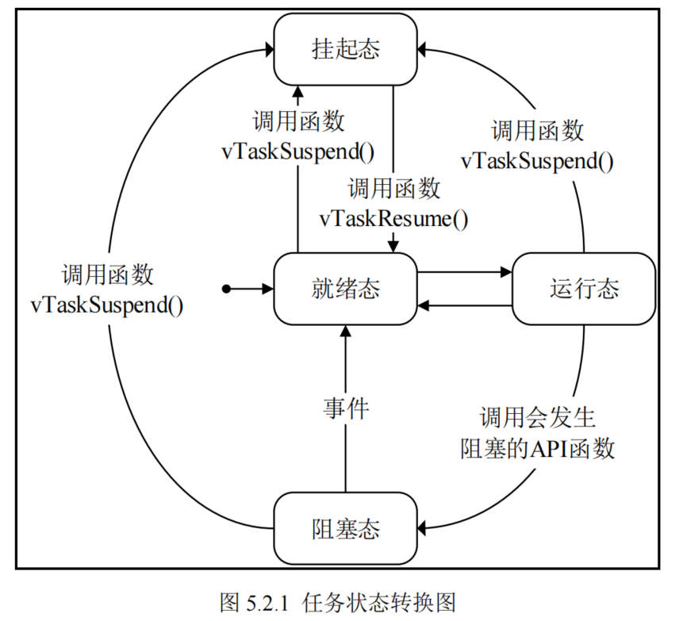

# 简介
- 可移植性强
- 可裁剪
- 支持多种任务通讯、同步机制
- 高效软件定时器
- 任务数量，优先级数量不限
- 运行效率高
- 支持抢占式、合作式调度
- 开源

## 移植
通过编写FreeRTOSconfig.h
文件对FREERTOS系统进行配置和裁剪  

### config配置项
- 调度
  1. 协程式调度 --正在运行的任务主动释放CPU后才能切换到下一个任务
  2. 抢占式调度 --切换时机取决于正在运行的任务
- 功耗
  - 低功耗模式
- 内核频率
- systick时钟频率
- 系统节拍中断频率
- 时间片调度
- 钩子函数
- 受freertos管理的最高优先级

### include配置项

## 中断
中断由硬件产生，ARM cortex-M的内核具有一个用于管理中断的    
嵌套向量中断控制器(NVIC)

ARM Cortex-M使用了8位的寄存器来配置中断的优先级，STM32只使用了高四位，也就是16级。
中断优先级配置寄存器的值越小，中断的优先等级就越高。    

- 抢占优先级
    >抢占优先级高的中断可以打断正在执行但抢占优先级低的中断，即中断嵌套
- 子优先级
    >抢占优先级相同的时候，子优先级高的中断不能打断正在执行的但子优先级低的中断，即子优先级不支持中断嵌套

配置时需要配置：优先级分组，抢占优先级，子优先级
使用优先级组4的时候，只需要配置4bit的抢占优先级，子优先级不需要配置    

## 内核
- 运行态    任务时刻只能有一个任务处理运行态
- 就绪态
- 阻塞态
- 挂起态

- 抢占式调度
  - 每个任务都有一个优先级
  - 高优先级的抢占低优先级
  - 只有高优先级被阻塞或者挂起，才能执行低优先级任务
- 时间片调度
  - 针对优先级相同的任务
  - 多个任务优先级相同的时候每次系统时钟节拍的时候切换任务
  - 每个任务运行的时间就是一个系统时钟节拍

在操作系统中，任务调度器决定是否切换任务，OS的内核有两种触发方式：
第一种：应用任务中通过SVC指令来触发     
第二种：sys周期性中断，在systick中断中触发  

## 调度方法

依赖硬件指令CLZ或软件遍历   

### 位图

- 查找最高优先级O(n)
- 更新任务状态O(1)

不使用硬件指令的话，使用纯C指令从优先级0开始向下扫描，直到找到第一个置1的位   
# 解析

## 链表与节点

freertos中的链表是双向链表

列表项 List Item 即节点  用于存放数据       

### 函数
- 初始化列表
- 初始化列表项
- 列表末尾插入列表项
- 列表插入列表项 //按照升序排序
- 列表移除列表项

## 系统启动流程

- 开启任务调度器    
  - 创建空闲任务
  - 创建定时器服务任务
  - 关闭中断
  - 初始化全局变量/设置任务调度器标志为已运行
  - 初始化任务运行时间统计功能的时基定时器
  - 调用配置函数
- 启动第一个任务

**MSP**:  
程序在运行时需要一定的栈空间来保存局部变量定一些信息，当有信息保存到栈中时，MCU会自动更新SP指针，使得SP指针指向最后一个入栈的元素，那么程序就可以根据SP指针来从栈中获取信息。       
ARM Cortex-M提供了两个栈空间,这两个栈指针分别是*MSP*主堆栈指针和*PSP*进程堆栈指针       
MSP给系统栈空间使用     
PSP给任务栈空间使用     

SVC:特权模式        

# 使用

## 任务

参数包括：
- 任务优先级
- 任务堆栈大小
- 任务句柄
- 任务函数

使用静态方式创建任务时，需要用户自行分配一块内存，作为任务的栈空间
使用动态方式创建任务时，系统则会自动从系统堆中分配一块内存，作为任务的栈空间        

