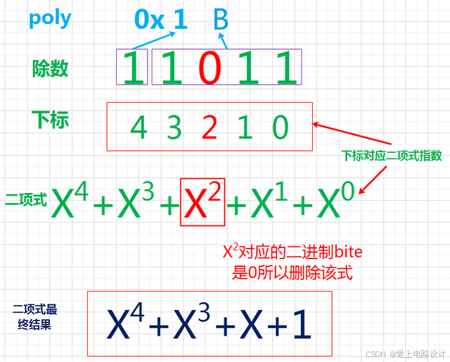
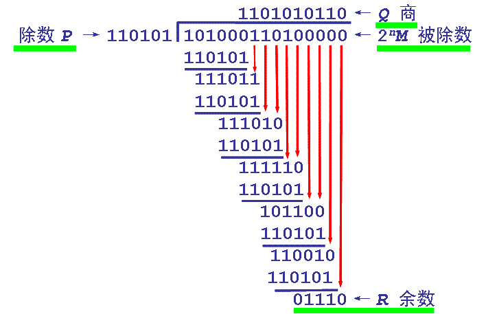

# 算法

## CRC校验
循环冗余校验和      
### 多项式公式
    

### 数据宽度
指的是CRC校验码的长度（二进制位数），始终比除数位数少1  

### 过程
在 K 位信息码(目标发送数据)后再拼接 R位校验码，使整个编码长度为 N位，因此这种编码也叫 (N,K) 码。

通俗的说，就是在需要发送的信息后面附加 1个数(即校验码)，生成 1个新的发送数据发送给接收端。这个数据要求能够使生成的新数据被 1个特定的数整除。此处整除需要引入模2 除法的概念。

CRC 校验的具体做法：

①选定一个标准除数(P 位二进制数据串)

②在要发送的数据(M 位)后面加上 P-1位0，然后将这个新数 (M+P-1位) 以模2 除法的方式除以上面这个标准除数，所得到的余数也就是该数据的 CRC 校验码(注：余数必须比除数少且只少一位，不够就补 0)  
③将这个校验码附在原 M位数据后面，构成新的 M+P-1位数据，发送给接收端。   
④接收端将接收到的数据除以标准除数，如果余数为 0 则认为数据正确。    
注意：CRC 校验中有两个关键点：  
①要预先确定一个发送端和接收端都用来作为除数的二进制比特串(或多项式)；   
②把原始帧与上面选定的除数进行二进制除法运算，计算出 FCS。   
前者可以随机选择，也可按国际上通行的标准选择，但最高位和最低位必须均为 “1”。    


### 代码
```cpp
/*
* 函数名 :CRC16
* 描述 : 计算CRC16
* 输入 : puchMsg---数据地址,usDataLen---数据长度
* 输出 : 校验值
*/
uint16_t CRC16_MudBus(uint8_t *puchMsg, uint8_t usDataLen){
	
	uint16_t uCRC = 0xffff;//CRC寄存器
	
	for(uint8_t num=0;num<usDataLen;num++){
		uCRC = (*puchMsg++)^uCRC;//把数据与16位的CRC寄存器的低8位相异或，结果存放于CRC寄存器。
		for(uint8_t x=0;x<8;x++){	//循环8次
			if(uCRC&0x0001){	//判断最低位为：“1”
				uCRC = uCRC>>1;	//先右移
				uCRC = uCRC^0xA001;	//再与0xA001异或
			}else{	//判断最低位为：“0”
				uCRC = uCRC>>1;	//右移
			}
		}
	}
	return uCRC;//返回CRC校验值
 
}
 
int main(void) {
	uint8_t x[]={0x01 ,0x03 ,0x61 ,0x00 ,0x00 ,0x02};
	while(1){
		uint16_t wCRC_16 = CRC16_MudBus(x,sizeof(x)); //获取CRC16校验值
		//输出校验值wCRC_16 即可（注意：CRC16-->低位在前，高位在后）
	}
}
```


# USB

## USB 协议概述
**USB**（Universal Serial Bus，通用串行总线）是现代化设备的标准有线连接方案，主要特点包括：
- **即插即用**（Plug-and-Play）
- **热插拔**（Hot-Swapping）
- **多设备级联**（通过 Hub 扩展）
- **供电与通信一体化**（5V 电源传输）

## USB 协议版本对比
| 版本      | 速率          | 推出时间 | 特性                          |
|-----------|--------------|----------|-------------------------------|
| USB 1.0   | 1.5 Mbps     | 1996     | 低速模式（Low Speed）          |
| USB 1.1   | 12 Mbps      | 1998     | 全速模式（Full Speed）         |
| USB 2.0   | 480 Mbps     | 2000     | 高速模式（High Speed）         |
| USB 3.0   | 5 Gbps       | 2008     | 超速模式（SuperSpeed）         |
| USB 3.2   | 20 Gbps      | 2017     | 多通道传输                     |

## USB 拓扑结构
### 典型层级架构
```
[Host Controller]
    |
    ├── [Hub]─[Device A]（如键盘）
    └── [Device B]（如U盘）
```
- **主机（Host）**：唯一控制总线的设备（如PC）
- **设备（Device）**：外设（如鼠标、U盘）
- **集线器（Hub）**：端口扩展设备

### 关键描述符
1. **设备描述符**：厂商ID（VID）、产品ID（PID）
2. **配置描述符**：供电模式（总线供电/自供电）
3. **接口描述符**：设备功能分类（HID/CDC/MSC等）
4. **端点描述符**：数据传输方向（IN/OUT）

## USB 数据传输类型
| 传输类型     | 特点                          | 典型应用场景          |
|--------------|-------------------------------|-----------------------|
| **控制传输** | 双向传输，保证带宽            | 设备枚举/配置         |
| **中断传输** | 周期性小数据量传输            | 键盘/鼠标            |
| **批量传输** | 大数据量传输，无固定延迟保证  | U盘/打印机           |
| **同步传输** | 固定带宽，不保证数据完整性    | 摄像头/音频设备      |

## 嵌入式 USB 开发要点
### 常用硬件方案
- **MCU 内置 USB 控制器**：STM32F4/F7系列、ESP32-S2
- **外置 PHY 芯片**：USB3300（用于高速USB）
- **USB OTG**（On-The-Go）：支持主机/设备模式切换

### 开发流程
1. 配置设备描述符（使用 USB IP 核或库函数）
2. 实现标准请求处理（`GET_DESCRIPTOR`, `SET_ADDRESS`等）
3. 编写类驱动程序（如HID/MSC/CDC）
4. 通过 USB-IF 兼容性测试（可选）

## 嵌入式 USB 协议栈组成
```plaintext
应用层
    ↓
USB 类驱动（HID/CDC/MSC...）
    ↓
USB 协议核心层（处理标准请求）
    ↓
USB 控制器驱动（DMA/中断处理）
    ↓
硬件层（PHY 芯片/MCU USB 外设）
```

## 优缺点分析
| **优点**                          | **挑战**                          |
|-----------------------------------|-----------------------------------|
| 标准化程度高，兼容性强            | 协议复杂度高，开发周期长          |
| 支持热插拔和即插即用              | 需要处理电源管理（如挂起/唤醒）   |
| 可同时传输数据与供电（5V/500mA）  | 高速信号需要严格阻抗控制          |

## 典型应用场景
- **人机接口设备（HID）**：游戏手柄/触摸屏
- **虚拟串口（CDC）**：替代传统UART通信
- **大容量存储（MSC）**：SD卡读写器
- **设备固件升级（DFU）**：通过USB刷写MCU程序

## 9. 开发注意事项
1. **协议栈选择**：推荐使用成熟方案（如STM32Cube USB库）
2. **端点分配策略**：合理分配控制/数据端点资源
3. **调试工具**：必备 USB 协议分析仪（如 Ellisys）
4. **电源设计**：注意浪涌电流抑制（< 2.5A 脉冲）

---

# CAN

## CAN 协议概述
**CAN**（Controller Area Network，控制器局域网）是广泛应用于工业控制与汽车电子的**多主串行通信协议**，核心特点包括：
- **高可靠性**：通过差分信号抗干扰（ISO 11898标准）
- **多主架构**：无中心控制器，节点可自主发起通信
- **实时性强**：采用非破坏性仲裁机制
- **错误检测**：CRC校验 + 帧格式校验 + 应答校验


## 物理层特性
| 参数            | 说明                          |
|-----------------|-------------------------------|
| **信号类型**    | 差分信号（CAN_H/CAN_L）       |
| **传输速率**    | 最高 1 Mbps（CAN FD 可达 8M） |
| **传输介质**    | 双绞线（推荐带屏蔽层）        |
| **终端电阻**    | 120Ω（必须两端匹配）          |
| **拓扑结构**    | 线性总线结构                  |

典型连接示意图：
```
[Node 1]----[Node 2]----[Node 3]
   |           |           |
 CAN_H      CAN_H      CAN_H
   |           |           |
 CAN_L      CAN_L      CAN_L
```

## 数据帧结构（标准帧）
| 字段             | 长度（bit） | 描述                          |
|------------------|-------------|-------------------------------|
| **SOF**          | 1           | 帧起始（显性电平）            |
| **ID**           | 11          | 消息标识符（决定优先级）       |
| **RTR**          | 1           | 远程传输请求标志               |
| **IDE**          | 1           | 标识符扩展位（标准/扩展帧）    |
| **DLC**          | 4           | 数据长度码（0-8字节）          |
| **Data Field**   | 0-64        | 实际数据（CAN FD支持更长数据） |
| **CRC**          | 15          | 循环冗余校验码                 |
| **ACK**          | 2           | 应答场                        |
| **EOF**          | 7           | 帧结束                        |

## 协议核心机制
### 非破坏性仲裁
- 基于**ID优先级**的总线竞争机制（ID值越小优先级越高）
- 仲裁失败节点自动转为接收模式，无需重发

### 错误处理
- **错误帧**：检测到错误的节点主动发送错误帧
- 错误计数器：每个节点维护`TEC`（发送错误计数）和`REC`（接收错误计数）
- 节点状态机：`Error Active` → `Error Passive` → `Bus Off`

## 嵌入式开发要点
### 硬件组成
- **CAN控制器**：集成于MCU（如STM32F4）或独立芯片（如MCP2515）
- **CAN收发器**：电平转换芯片（如TJA1050）
- **总线保护**：TVS二极管（防浪涌）、共模电感（抗干扰）

### 软件实现
```c
// 典型初始化流程
1. 配置MCU时钟（设置APB总线频率）
2. 初始化CAN控制器模式（正常模式/环回模式）
3. 配置波特率（同步段+传播段+相位缓冲段）
4. 设置过滤器（标识符掩码过滤）
5. 使能中断（接收中断/错误中断）
```

## 典型应用场景
- **汽车电子**：ECU通信（发动机控制、ABS系统）
- **工业控制**：PLC网络、传感器集群
- **医疗器械**：手术机器人实时控制
- **航空航天**：飞行控制系统

## 协议变种对比
| 类型       | 最大速率 | 数据长度 | 主要应用领域       |
|------------|----------|----------|--------------------|
| **CAN 2.0**| 1 Mbps   | 8字节    | 传统汽车电子       |
| **CAN FD** | 8 Mbps   | 64字节   | 新能源车/智能驾驶  |
| **CAN XL** | 10+ Mbps | 2048字节 | 工业物联网（开发中）|

## 开发注意事项
1. **布线规范**：
   - 总线长度与速率成反比（1Mbps时建议≤40米）
   - 避免星型拓扑，推荐直线型或短支线结构
2. **EMC设计**：
   - 使用屏蔽双绞线，屏蔽层单点接地
   - 收发器电源需增加π型滤波电路
3. **调试工具**：
   - CAN分析仪（如PCAN-USB Pro）
   - 逻辑分析仪（解码CAN协议）

## 优缺点分析
| **优势**                      | **局限性**                    |
|-------------------------------|-------------------------------|
| 多主架构支持分布式控制        | 协议栈实现复杂度较高          |
| 强抗干扰能力（工业环境适用）  | 数据负载率较低（对比Ethernet）|
| 高实时性与确定性传输          | 布线成本高于无线方案          |

---

# 跳转链接
[点这里跳转list](../list.md)