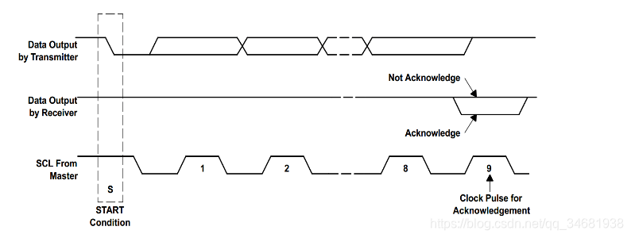
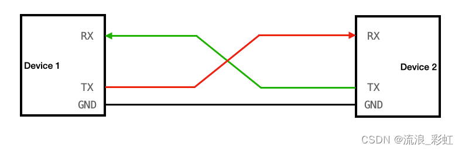

# 算法

## CRC校验
循环冗余校验和      
### 多项式公式
    

### 数据宽度
指的是CRC校验码的长度（二进制位数），始终比除数位数少1  

### 过程
在 K 位信息码(目标发送数据)后再拼接 R位校验码，使整个编码长度为 N位，因此这种编码也叫 (N,K) 码。

通俗的说，就是在需要发送的信息后面附加 1个数(即校验码)，生成 1个新的发送数据发送给接收端。这个数据要求能够使生成的新数据被 1个特定的数整除。此处整除需要引入模2 除法的概念。

CRC 校验的具体做法：

①选定一个标准除数(P 位二进制数据串)

②在要发送的数据(M 位)后面加上 P-1位0，然后将这个新数 (M+P-1位) 以模2 除法的方式除以上面这个标准除数，所得到的余数也就是该数据的 CRC 校验码(注：余数必须比除数少且只少一位，不够就补 0)  
③将这个校验码附在原 M位数据后面，构成新的 M+P-1位数据，发送给接收端。   
④接收端将接收到的数据除以标准除数，如果余数为 0 则认为数据正确。    
注意：CRC 校验中有两个关键点：  
①要预先确定一个发送端和接收端都用来作为除数的二进制比特串(或多项式)；   
②把原始帧与上面选定的除数进行二进制除法运算，计算出 FCS。   
前者可以随机选择，也可按国际上通行的标准选择，但最高位和最低位必须均为 “1”。    


### 代码
```cpp
/*
* 函数名 :CRC16
* 描述 : 计算CRC16
* 输入 : puchMsg---数据地址,usDataLen---数据长度
* 输出 : 校验值
*/
uint16_t CRC16_MudBus(uint8_t *puchMsg, uint8_t usDataLen){
	
	uint16_t uCRC = 0xffff;//CRC寄存器
	
	for(uint8_t num=0;num<usDataLen;num++){
		uCRC = (*puchMsg++)^uCRC;//把数据与16位的CRC寄存器的低8位相异或，结果存放于CRC寄存器。
		for(uint8_t x=0;x<8;x++){	//循环8次
			if(uCRC&0x0001){	//判断最低位为：“1”
				uCRC = uCRC>>1;	//先右移
				uCRC = uCRC^0xA001;	//再与0xA001异或
			}else{	//判断最低位为：“0”
				uCRC = uCRC>>1;	//右移
			}
		}
	}
	return uCRC;//返回CRC校验值
 
}
 
int main(void) {
	uint8_t x[]={0x01 ,0x03 ,0x61 ,0x00 ,0x00 ,0x02};
	while(1){
		uint16_t wCRC_16 = CRC16_MudBus(x,sizeof(x)); //获取CRC16校验值
		//输出校验值wCRC_16 即可（注意：CRC16-->低位在前，高位在后）
	}
}
```
# SPI

## 基本知识
同步串行通信协议           
**SPI**是一个同步的数据总线，也就是说它用单独的数据线和一个单独的时钟信号来保证发送端和接收端的完美同步     
时钟是一个振荡信号，它告诉接收机在确切的时机对数据线上的信号进行采样        

**全双工**:具有单独的发送和接收线路     
*因此可以在同一时间发送和接收数据*      
*SPI的接收硬件可以是一个简单的移位寄存器，这比异步串行通信所需的完整UART要简单的多，并且更加便宜*       
*SPI并未明确数据是高位在前还是低位在前，一般回采用高位在前（MSB）方式传传输*        

## 引脚
- SCLK:串行时钟信号，由主机产生发送给从机   
- MOSI(master output slave input):主机输出，从机输入，数据来自主机     
- MISO(master input slave output):主机输入，从机输出 ，数据来自于从机       
- SS/CS:片选信号:由主机发送，控制与哪个从机通信，通常是低电平有效信号。    

**主机**：产生时钟的一侧称为主机，另一侧称为从机        
总是只有一个主机（一般是MCU/微控制器），但是可以有多个从机      

## 数据传输过程
- 主机先将*NSS*信号拉低，这样可以保证开始接收数据   
- 当接收端检测到时钟的边沿信号（可以是上升沿也可以是下降沿，这个看配置）时，它将立即读取数据线上的信号，这样就得到了一位数据
- 主机发送到从机时：主机产生相应的时钟信号，然后数据一位一位得从MOSI信号线上进行发送到从机  
- 主机接收从机数据：如果从机需要将数据发送回主机，则主机将继续生成预定数量的时钟信号，并且从机会将数据通过MISO信号线发送    

## 配置     
### 时钟频率   

### 时钟极性 CPOL/CKP
它是指时钟信号在空闲状态下是高电平还是低电平，当时钟空闲时为低电平即 CPOL=0，反之则 CPOL=1。    
### 时钟相位 CPHA/CKE
它是指时钟信号开始有效的第一个边沿和数据的关系。当时钟信号有效的第一个边沿处于数据稳定期的正中间时定义CPHA=0，反之时钟信号有效的第一个边沿不处于数据稳定期的正中间定义CPHA=1。所以在时钟信号SCK的第一个跳变沿采样即CPHA=0，再时钟信号SCK的第二个跳变沿采样为CPHA=1。    

4种SPI通信操作模式

        
        

### 协议规定
    ```
    SPI协议规定一个SPI设备不能在数据通信过程中仅仅充当一个发送者（Transmitter）或者接受者（Receiver）。在片选信号CS为0的情况下，每个clock周期内，SPI设备都会发送并接收1bit数据，相当于有1bit数据被交换。

    MOSI及 MISO的数据在SCK的上升沿期间变化输出，在 SCK的下降沿时被采样。即在 SCK 的下降沿时刻，MOSI及 MISO 的数据有效，高电平时表示数据“1”，为低电平时表示数据“0”。在其它时刻，数据无效，MOSI 及 MISO为下一次表示数据做准备。

    SPI 每次数据传输可以 8 位或 16 位为单位，每次传输的单位数不受限制。
    ```
## 多从机模式   

### 多NSS

每个从机单独一个NSS线   

### 菊花链
数据信号串行传输    

## 优缺点

### 优点
- 全双工串行通信
- 告诉数据传输速率
- 简单的软件配置
- 机器灵活的数据传输，不限于8位，它可以是任意大小的字
- 非常简答的硬件结构，从站不需要唯一地址（与IIC不同）。从机使用主机时钟，不需要精密时钟振荡器/晶振（与UART不同），不需要收发器（与CAN不用）

### 缺点
- 没有硬件从机应答信号（主机可能在不知情情况下无处发送）
- 通常仅仅支持一个主设备
- 通常需要更多引脚
- 没有定义硬件级别的错误检查协议
- 与RS-232和CAN总线相比，只能支持非常短的距离

HAL库
```
static void MX_SPI1_Init(void)
{
    hspi1.Instance = SPI1;
    hspi1.Init.Mode = SPI_MODE_MASTER;				//主机模式
    hspi1.Init.Direction = SPI_DIRECTION_2LINES;	//全双工
    hspi1.Init.DataSize = SPI_DATASIZE_8BIT;		//数据位为8位
    hspi1.Init.CLKPolarity = SPI_POLARITY_LOW;		//CPOL=0
    hspi1.Init.CLKPhase = SPI_PHASE_1EDGE;			//CPHA为数据线的第一个变化沿
    hspi1.Init.NSS = SPI_NSS_SOFT;					//软件控制NSS
    hspi1.Init.BaudRatePrescaler = SPI_BAUDRATEPRESCALER_2;//2分频，32M/2=16MHz
    hspi1.Init.FirstBit = SPI_FIRSTBIT_MSB;			//最高位先发送
    hspi1.Init.TIMode = SPI_TIMODE_DISABLE;			//TIMODE模式关闭
    hspi1.Init.CRCCalculation = SPI_CRCCALCULATION_DISABLE;//CRC关闭
    hspi1.Init.CRCPolynomial = 10;					//默认值，无效
    if (HAL_SPI_Init(&hspi1) != HAL_OK)				//初始化
    {
        _Error_Handler(__FILE__, __LINE__);
    }
}
    
//发送数据
HAL_StatusTypeDef  
HAL_SPI_Transmit(SPI_HandleTypeDef *hspi, 
                 uint8_t *pData, 
                 uint16_t Size, 
                 uint32_t Timeout);
//接收数据
HAL_StatusTypeDef  
HAL_SPI_Receive(SPI_HandleTypeDef *hspi, 
                uint8_t *pData, 
                uint16_t Size, 
                uint32_t Timeout);

```

## 软件SPI
### 配置
这里模拟的时序是SPI的模式3（CPOL=1,CPHA=1），原因有两点：   

1、模式3的SCK空闲电平为高，有高电平向低电平翻转较为容易和快，       

2、模式3在偶数边沿采样，防止第一个信号没采到。      

🌘首先，对于软件模拟SPI的GPIO初始化，可以参考SPI的GPIO初始化的配置，我们不用使用复用功能就行，使用普通推挽输出和浮空输入。   

```
void SPI_GPIO_Config(void)
{
	GPIO_InitTypeDef GPIO_InitStruct;
	RCC_APB2PeriphClockCmd(RCC_APB2Periph_GPIOA|RCC_APB2Periph_GPIOC,ENABLE);
	/*SPI CS GPIO Confgi*/
	GPIO_InitStruct.GPIO_Mode	=	GPIO_Mode_Out_PP;
	GPIO_InitStruct.GPIO_Pin	=	EEPROM_SPI_CS_PIN;
	GPIO_InitStruct.GPIO_Speed	=	GPIO_Speed_50MHz;
	GPIO_Init(EEPROM_SPI_CS_PORT,&GPIO_InitStruct);
	
	/*SPI SCK GPIO Config*/
	GPIO_InitStruct.GPIO_Mode	=	GPIO_Mode_Out_PP;
	GPIO_InitStruct.GPIO_Pin	=	EEPROM_SPI_CLK_PIN;
	GPIO_InitStruct.GPIO_Speed	=	GPIO_Speed_50MHz;
	GPIO_Init(EEPROM_SPI_CLK_PORT,&GPIO_InitStruct);
	
	/*MISO GPIO Config*/
	GPIO_InitStruct.GPIO_Mode	=	GPIO_Mode_IN_FLOATING;
	GPIO_InitStruct.GPIO_Pin	=	EEPROM_SPI_MISO_PIN;
	GPIO_Init(EEPROM_SPI_MISO_PORT,&GPIO_InitStruct);
	
	/*MOSI GPIO Config*/
    GPIO_InitStruct.GPIO_Mode	=	GPIO_Mode_Out_PP;
	GPIO_InitStruct.GPIO_Pin	=	EEPROM_SPI_MOSI_PIN;
	GPIO_InitStruct.GPIO_Speed	=	GPIO_Speed_50MHz;
	GPIO_Init(EEPROM_SPI_MOSI_PORT,&GPIO_InitStruct);
 
	EEPROM_SPI_CS_HIGH(); //位选拉高
	EEPROM_SPI_CLK_HIGH();//时钟线拉高
}
```
### 接受发送函数       

其中注意，使用SPI时，发送和接收其实是同一个函数，通过判断RXNE来确认发送结束，此时也接收完数据，接收数据同样要主机产生时序，时序通过主机发送数据产生，所以会发送无用的Dummy数据。    
软件模拟不需要，直接接收自己本身会产生时序，不用发送DUMMY数据。Delay函数随便设置，不要小于手册的时间即可。      

```
void SPI_SendData(uint8_t data)
{
	uint8_t cnt;
	
	for(cnt=0;cnt<8;cnt++)
	{
		EEPROM_SPI_CLK_LOW();//拉低CLK
		SPI_Delay(10);//这个延时时间任意，但要大于芯片数据手册上的(纳秒级的)
		if(data &0x80)
		{
			EEPROM_SPI_MOSI_HIGH();
		}
		else
		{
			EEPROM_SPI_MOSI_LOW();
		}
		data <<= 1;
		EEPROM_SPI_CLK_HIGH();//拉高CLK
		SPI_Delay(10);
	}
 
}
```
# IIC

## 基本知识     
IIC,即I²C，全称 Inter-Integrated Circuit，字面上的意思是集成电路之间，它其实是I²C Bus简称，所以中文应该叫 集成电路总线 ，它是一种串行通信总线，使用多主从架构，由飞利浦公司在1980年代为了让主板、嵌入式系统或手机用以连接低速周边设备而发展。       

**一个IIC总线上，可以挂载多个外接设备。**
## 引脚     
接线：要搭建IIC的通信线路，出除去电源之外，还需要两条线，分别是SDA和SCLK        
SDA:数据信号线，用于传输数据        
SCLK:时钟信号线，用于产生时钟频率，控制时序，实现协议过程       
由此可以看出，由于是单总线进行数据传输，所以IIC协议是半双工的。     


## 时序     
    
     
协议规定，在数据的传输过程中，SCLK为高电平时，外设模块开始采集SDA数据线上的数据，此时要求SDA数据线上的电平状态必须稳定，当SCLK为低电平时才允许SDA线上的数据跳变成另外一种状态     
我们在发完开始信号之后，此时SDA数据线的电平状态为低电平，SCLK信号依然是高电平。难道这个时候外设就要开始读取数据了吗？这显然不是的，从发完开始信号到真正的数据传输之间，会有一段缓冲时间，让我们去准备数据，在准备数据阶段，先将SCLK信号拉低一段时间，在这期间将SDA数据线**拉高**一段时间（即数据1），然后再将SCLK信号拉高，此时这个时钟信号的高电平被外设检测到的话，外设就知道要读取数据了，从而SDA上的数据就会被外设读到了。依次类推，传输下一位数据。    
    
协议规定，主机每传完一个字节的数据即外设每收到一个字节的数据，外设就要在第9个时钟脉冲到来的时候，将SDA数据线拉低进行**应答**（ACK）,且必须是稳定的低电平，表示已经收到了一个字节的数据，拉高表示不进行应答      
    

## 信号
I2C 总线在传送数据过程中共有三种类型信号， 它们分别是：**开始信号**、**结束信号**和**应答信号**。
- 开始信号： SCL 为高电平时， SDA 由高电平向低电平跳变，开始传送数据。
- 结束信号： SCL 为高电平时， SDA 由低电平向高电平跳变，结束传送数据。
- 应答信号：接收数据的 IC 在接收到 8bit 数据后，向发送数据的 IC 发出特定的低电平脉冲，
   

## 性质     
IIC可以接多个主设备，多个从设备（外围 设备）。如下图，存在多个主机、多个从机。  
当多主机会产生总线裁决问题。当多个主机同时想占用总线时，企图启动总线传输数据，就叫做总线竞争。I2C通过总线仲裁，以决定哪台主机控制总线       
上拉电阻一般在4.7k~10k之间，默认拉高。  

### 最多挂载地址        
由IIC地址决定，8位地址，减去1位广播地址，是7位地址，2^7=128，但是地址0x00不用，那就是127个地址， 所以理论上可以挂127个从器件。

但是IIC协议没有规定总线上device最大数目，但是规定了总线电容不能超过400pF。
管脚都是有输入电容的，PCB上也会有寄生电容，所以会有一个限制。实际设计中经验值大概是不超过8个器件。

## 软件IIC
无名创新代码：
*宏定义*
```
#define I2C_READ_SDA  GPIOPinRead(GPIO_I2C,SDA_PIN)			//SDA 
#define I2C_SDA_H  		GPIOPinWrite(GPIO_I2C,SDA_PIN,SDA_PIN)//SDA 
#define I2C_SDA_L 		GPIOPinWrite(GPIO_I2C,SDA_PIN,0)			//SDA
#define I2C_SCL_H  		GPIOPinWrite(GPIO_I2C,SCL_PIN,SCL_PIN)//SCL
#define I2C_SCL_L  		GPIOPinWrite(GPIO_I2C,SCL_PIN,0)			//SCL

```
```
void I2C_GPIO_Config(void)
{	
  SysCtlPeripheralEnable(SYSCTL_PERIPH_GPIO_I2C);
	
	HWREG(GPIO_I2C + GPIO_O_LOCK) = GPIO_LOCK_KEY;//解锁
	HWREG(GPIO_I2C + GPIO_O_CR) |= 0x000000FF;//确认
	HWREG(GPIO_I2C + GPIO_O_LOCK) = 0;//重新锁定
	
  GPIOPinTypeGPIOOutput(GPIO_I2C, SCL_PIN);
  GPIOPinTypeGPIOOutput(GPIO_I2C, SDA_PIN);
	GPIOPadConfigSet(GPIO_I2C,SCL_PIN,GPIO_STRENGTH_I2C,GPIO_PIN_TYPE_STD);
	GPIOPadConfigSet(GPIO_I2C,SDA_PIN,GPIO_STRENGTH_I2C,GPIO_PIN_TYPE_STD);
	
  Delay_Ms(10);
  GPIOPinWrite(GPIO_I2C, SCL_PIN, SCL_PIN);//设置高
  GPIOPinWrite(GPIO_I2C, SDA_PIN, SDA_PIN);//设置高
}
void I2C_SDA_OUT(void)
{
	GPIOPinTypeGPIOOutput(GPIO_I2C, SDA_PIN);
	GPIOPadConfigSet(GPIO_I2C,SDA_PIN,GPIO_STRENGTH_I2C,GPIO_PIN_TYPE_STD);///GPIO_PIN_TYPE_STD);
}

void I2C_SDA_IN(void)
{
  GPIOPinTypeGPIOInput(GPIO_I2C, SDA_PIN);
	GPIOPadConfigSet(GPIO_I2C,SDA_PIN,GPIO_STRENGTH_I2C,GPIO_PIN_TYPE_STD_WPU);
}

// SCL高电平期间，SDA出现下降沿为起始信号
static bool i2cStart()
{
    SDA_OUT;
    SDA_H;
	  SCL_H;   
    i2cDelay();
    if (!sdaRead)  // 如果SDA为低电平，则总线忙，退出
        return false;
    SDA_L;
    if (sdaRead)  // 如果SDA为高电平，则总线忙，退出
        return false;
    SDA_L;
    return true;
}
 
// SCL高电平期间，SDA出现上升沿为停止信号
static void i2cStop(void)
{
    SDA_OUT;
    SDA_L;
	  SCL_L;  
    i2cDelay();  // STOP:when CLK is high DATA from low to high 
    //SCL_H;
    SDA_H;  
    i2cDelay();
}
 
static void i2cAck(void)
{
    SCL_L;
	  SDA_OUT; 
    SDA_L;
    i2cDelay();   
    SCL_H;
    i2cDelay();
    SCL_L;
}
 
static void i2cNoAck(void)
{
    SCL_L;
	  SDA_OUT;
    SDA_H;
    i2cDelay();
    SCL_H;
    i2cDelay();
    SCL_L;
}
 
// SCL高电平期间，SDA电平被从设备拉低表示应答
static bool i2cWaitAck(void)
{
    uint16_t errTimes = 0;
    SDA_H;
	  i2cDelay();
	  SDA_IN;
    SCL_H;
    i2cDelay();
    while (sdaRead) {
        if (errTimes++ > 200) //20
				{
            SCL_L;
            return false;
        }           
        i2cDelay();
    }
    SCL_L;
    return true;
}
 
// 发送数据，数据从高位到低位传输  
static void i2cSendByte(uint8_t byte)  
{
    uint8_t i = 8;
 
    SDA_OUT;
    while (i--) {      
        SCL_L;  // 时钟信号为低电平期间，允许数据线电平变化
        i2cDelay();
        if (byte & 0x80)
            SDA_H;
        else
            SDA_L; 
        byte <<= 1; 
        i2cDelay();
        SCL_H;
        i2cDelay();
    }
    SCL_L;
}
 
static uint8_t i2cReceiveByte()  
{
    uint8_t i = 8;
    uint8_t byte = 0;
    SDA_IN;
    SDA_H;
    while (i--) {
        byte <<= 1;
        SCL_H;
        i2cDelay();
        if (sdaRead) {
            byte |= 0x01;
        }
        SCL_L;
        i2cDelay();
    }
    SCL_L;
    return byte; 
}
 
 

 
/**
 * 通过I2C总线写一字节数据
 * @param[in] dev:设备I2C地址
 * @param[in] reg:寄存器地址
 * @param[in] data:要写入的数据
 */
bool i2cWriteOneByte(uint8_t dev, uint8_t reg, uint8_t data)
{
    if (!i2cStart())        
        return false;
    i2cSendByte(dev << 1);  // 从机地址由高7位+读写位构成   
    if (!i2cWaitAck()) {     
        i2cStop();
        return false;
    }
    i2cSendByte(reg);       
    i2cWaitAck();
    i2cSendByte(data);     
    i2cWaitAck();
    return true;
}
 

/**
 *  
 * @param[in] dev:设备I2C地址
 * @param[in] reg:寄存器地址
 * @param[in] len:字节数 
 * @param[in] data:待写入的数据 
 */
uint8_t i2cReadOneBytes(uint8_t dev, uint8_t reg)
{
	unsigned char REG_data;
  i2cStart();
  i2cSendByte(dev<<1);
	i2cWaitAck();
  i2cSendByte(reg);
	i2cWaitAck();
  i2cStart();
  i2cSendByte((dev << 1) | 0x01);
  i2cWaitAck();
	REG_data=i2cReceiveByte();
  i2cStop();
  return REG_data;	
} 


/**
 *  
 * @param[in] dev:设备I2C地址
 * @param[in] reg:寄存器地址
 * @param[in] len:字节数 
 * @param[in] data:待写入的数据 
 */
bool i2cWriteBytes(uint8_t dev, uint8_t reg, uint8_t len, uint8_t *data)
{
    uint8_t i;
 
    if (!i2cStart())        
        return false;
    i2cSendByte(dev << 1);          
    if (!i2cWaitAck()) {     
        i2cStop();
        return false;
    }
    i2cSendByte(dev);   
    i2cWaitAck();
    for (i = 0; i < len; i++) {
        i2cSendByte(data[i]);
        if (!i2cWaitAck()) {
            i2cStop();
            return false;
        }
    }
    i2cStop();
    return true;
}
 
 
/**
 * 从I2C设备中读取数据
 * @param[in] dev:设备I2C地址
 * @param[in] reg:寄存器地址
 * @param[in] len:数据字节数
 * @param[out] data:读出的数据
 */
bool i2cReadBytes(uint8_t dev, uint8_t reg, uint8_t len, uint8_t *data)
{
    if (!i2cStart())        
        return false;
    i2cSendByte(dev << 1);      
    if (!i2cWaitAck()) {     
        i2cStop();
        return false;
    }
    i2cSendByte(reg);     
    i2cWaitAck();
    i2cStart();           
    i2cSendByte((dev << 1) | 0x01);  // 器件地址+读命令    
    i2cWaitAck();
    while (len) {
        *data = i2cReceiveByte();
        if (len == 1)
            i2cNoAck();  // 最后一个字节不应答
        else
            i2cAck();
        data++;
        len--;
    }
    i2cStop();
    return true;
}


```

# UART

## 什么是 UART？
**UART**（Universal Asynchronous Receiver/Transmitter，通用异步收发器）是一种常见的串行通信协议，用于设备间的异步串行数据传输。它通过**两根信号线**（TX 和 RX）实现全双工通信。

## 数据帧结构
UART 数据以**帧（Frame）**为单位传输，每帧包含以下部分：

| 组成部分       | 描述                                                                 |
|----------------|----------------------------------------------------------------------|
| **起始位**     | 1 位低电平，标志数据帧的开始                                         |
| **数据位**     | 5-9 位（通常为 8 位），实际传输的数据                                |
| **校验位**     | 可选 1 位（奇校验/偶校验/无校验），用于错误检测                       |
| **停止位**     | 1、1.5 或 2 位高电平，标志数据帧的结束                               |

示例帧：`[起始位][数据位 D0-D7][奇校验][停止位]`

## 工作原理
### 异步通信
- 无需时钟信号同步，依靠**预定义波特率（Baud Rate）**匹配收发时序。
- 波特率 = 每秒传输的符号数（如 9600 Baud ≈ 9600 符号/秒）。

### 数据流示例
```plaintext
发送端 TX: 起始位 → 数据位 LSB 到 MSB → 校验位 → 停止位
接收端 RX: 检测起始位 → 采样数据位 → 验证校验位 → 确认停止位
```

## 硬件接口
- **物理层标准**：RS-232、RS-422、RS-485（电平与传输距离不同）
- **典型接口芯片**：MAX232（TTL ↔ RS-232 电平转换）
- **连接方式**：
  - 直连：设备 A 的 TX → 设备 B 的 RX
  - 交叉连接：设备 A 的 TX → 设备 B 的 RX，GND 相连

## 关键配置参数
| 参数         | 可选值                          | 说明                     |
|--------------|--------------------------------|--------------------------|
| 波特率       | 9600, 19200, 115200 等         | 通信速率需双方一致       |
| 数据位       | 5, 6, 7, 8, 9                  | 常用 8 位                |
| 校验位       | None（无）、Even（偶）、Odd（奇）| 错误检测机制             |
| 停止位       | 1, 1.5, 2                      | 常用 1 位               |


波特率：数据传输速率以波特率表示，即每秒传输的位数。例如，如果数据传输速率为120个字符/秒，每个字符为10位（1个起始位、7个数据位、1个校验位、1个停止位），则其传输的波特率为10×120 = 1200 个字符/秒 = 1200 波特率。 
    
## 典型应用场景
- **嵌入式系统**：MCU 与传感器/模块通信（如 GPS、蓝牙）
- **工业控制**：PLC 与 HMI 设备交互
- **调试与日志**：通过串口输出调试信息
- **老式设备**：调制解调器、POS 机等  

## 优缺点对比
| **优点**                     | **缺点**                     |
|------------------------------|------------------------------|
| 简单易实现，成本低           | 传输速率较低（通常 ≤ 115200）|
| 支持全双工通信               | 通信距离短（一般 < 15 米）   |
| 无需时钟线，节省硬件资源     | 无硬件流控（需软件实现）      |

## 注意事项
1. **波特率匹配**：收发双方必须使用相同的波特率。
2. **电平兼容性**：不同标准（如 TTL 与 RS-232）需电平转换芯片。
3. **抗干扰能力**：长距离通信建议使用 RS-485 或增加屏蔽措施。
4. **错误检测**：校验位可检测单比特错误，但无法纠正。


# USB

## USB 协议概述
**USB**（Universal Serial Bus，通用串行总线）是现代化设备的标准有线连接方案，主要特点包括：
- **即插即用**（Plug-and-Play）
- **热插拔**（Hot-Swapping）
- **多设备级联**（通过 Hub 扩展）
- **供电与通信一体化**（5V 电源传输）

## USB 协议版本对比
| 版本      | 速率          | 推出时间 | 特性                          |
|-----------|--------------|----------|-------------------------------|
| USB 1.0   | 1.5 Mbps     | 1996     | 低速模式（Low Speed）          |
| USB 1.1   | 12 Mbps      | 1998     | 全速模式（Full Speed）         |
| USB 2.0   | 480 Mbps     | 2000     | 高速模式（High Speed）         |
| USB 3.0   | 5 Gbps       | 2008     | 超速模式（SuperSpeed）         |
| USB 3.2   | 20 Gbps      | 2017     | 多通道传输                     |

## USB 拓扑结构
### 典型层级架构
```
[Host Controller]
    |
    ├── [Hub]─[Device A]（如键盘）
    └── [Device B]（如U盘）
```
- **主机（Host）**：唯一控制总线的设备（如PC）
- **设备（Device）**：外设（如鼠标、U盘）
- **集线器（Hub）**：端口扩展设备

### 关键描述符
1. **设备描述符**：厂商ID（VID）、产品ID（PID）
2. **配置描述符**：供电模式（总线供电/自供电）
3. **接口描述符**：设备功能分类（HID/CDC/MSC等）
4. **端点描述符**：数据传输方向（IN/OUT）

## USB 数据传输类型
| 传输类型     | 特点                          | 典型应用场景          |
|--------------|-------------------------------|-----------------------|
| **控制传输** | 双向传输，保证带宽            | 设备枚举/配置         |
| **中断传输** | 周期性小数据量传输            | 键盘/鼠标            |
| **批量传输** | 大数据量传输，无固定延迟保证  | U盘/打印机           |
| **同步传输** | 固定带宽，不保证数据完整性    | 摄像头/音频设备      |

## 嵌入式 USB 开发要点
### 常用硬件方案
- **MCU 内置 USB 控制器**：STM32F4/F7系列、ESP32-S2
- **外置 PHY 芯片**：USB3300（用于高速USB）
- **USB OTG**（On-The-Go）：支持主机/设备模式切换

### 开发流程
1. 配置设备描述符（使用 USB IP 核或库函数）
2. 实现标准请求处理（`GET_DESCRIPTOR`, `SET_ADDRESS`等）
3. 编写类驱动程序（如HID/MSC/CDC）
4. 通过 USB-IF 兼容性测试（可选）

## 嵌入式 USB 协议栈组成
```plaintext
应用层
    ↓
USB 类驱动（HID/CDC/MSC...）
    ↓
USB 协议核心层（处理标准请求）
    ↓
USB 控制器驱动（DMA/中断处理）
    ↓
硬件层（PHY 芯片/MCU USB 外设）
```

## 优缺点分析
| **优点**                          | **挑战**                          |
|-----------------------------------|-----------------------------------|
| 标准化程度高，兼容性强            | 协议复杂度高，开发周期长          |
| 支持热插拔和即插即用              | 需要处理电源管理（如挂起/唤醒）   |
| 可同时传输数据与供电（5V/500mA）  | 高速信号需要严格阻抗控制          |

## 典型应用场景
- **人机接口设备（HID）**：游戏手柄/触摸屏
- **虚拟串口（CDC）**：替代传统UART通信
- **大容量存储（MSC）**：SD卡读写器
- **设备固件升级（DFU）**：通过USB刷写MCU程序

## 9. 开发注意事项
1. **协议栈选择**：推荐使用成熟方案（如STM32Cube USB库）
2. **端点分配策略**：合理分配控制/数据端点资源
3. **调试工具**：必备 USB 协议分析仪（如 Ellisys）
4. **电源设计**：注意浪涌电流抑制（< 2.5A 脉冲）

---

# CAN

## CAN 协议概述
**CAN**（Controller Area Network，控制器局域网）是广泛应用于工业控制与汽车电子的**多主串行通信协议**，核心特点包括：
- **高可靠性**：通过差分信号抗干扰（ISO 11898标准）
- **多主架构**：无中心控制器，节点可自主发起通信
- **实时性强**：采用非破坏性仲裁机制
- **错误检测**：CRC校验 + 帧格式校验 + 应答校验


## 物理层特性
| 参数            | 说明                          |
|-----------------|-------------------------------|
| **信号类型**    | 差分信号（CAN_H/CAN_L）       |
| **传输速率**    | 最高 1 Mbps（CAN FD 可达 8M） |
| **传输介质**    | 双绞线（推荐带屏蔽层）        |
| **终端电阻**    | 120Ω（必须两端匹配）          |
| **拓扑结构**    | 线性总线结构                  |

典型连接示意图：
```
[Node 1]----[Node 2]----[Node 3]
   |           |           |
 CAN_H      CAN_H      CAN_H
   |           |           |
 CAN_L      CAN_L      CAN_L
```

## 数据帧结构（标准帧）
| 字段             | 长度（bit） | 描述                          |
|------------------|-------------|-------------------------------|
| **SOF**          | 1           | 帧起始（显性电平）            |
| **ID**           | 11          | 消息标识符（决定优先级）       |
| **RTR**          | 1           | 远程传输请求标志               |
| **IDE**          | 1           | 标识符扩展位（标准/扩展帧）    |
| **DLC**          | 4           | 数据长度码（0-8字节）          |
| **Data Field**   | 0-64        | 实际数据（CAN FD支持更长数据） |
| **CRC**          | 15          | 循环冗余校验码                 |
| **ACK**          | 2           | 应答场                        |
| **EOF**          | 7           | 帧结束                        |

## 协议核心机制
### 非破坏性仲裁
- 基于**ID优先级**的总线竞争机制（ID值越小优先级越高）
- 仲裁失败节点自动转为接收模式，无需重发

### 错误处理
- **错误帧**：检测到错误的节点主动发送错误帧
- 错误计数器：每个节点维护`TEC`（发送错误计数）和`REC`（接收错误计数）
- 节点状态机：`Error Active` → `Error Passive` → `Bus Off`

## 嵌入式开发要点
### 硬件组成
- **CAN控制器**：集成于MCU（如STM32F4）或独立芯片（如MCP2515）
- **CAN收发器**：电平转换芯片（如TJA1050）
- **总线保护**：TVS二极管（防浪涌）、共模电感（抗干扰）

### 软件实现
```c
// 典型初始化流程
1. 配置MCU时钟（设置APB总线频率）
2. 初始化CAN控制器模式（正常模式/环回模式）
3. 配置波特率（同步段+传播段+相位缓冲段）
4. 设置过滤器（标识符掩码过滤）
5. 使能中断（接收中断/错误中断）
```

## 典型应用场景
- **汽车电子**：ECU通信（发动机控制、ABS系统）
- **工业控制**：PLC网络、传感器集群
- **医疗器械**：手术机器人实时控制
- **航空航天**：飞行控制系统

## 协议变种对比
| 类型       | 最大速率 | 数据长度 | 主要应用领域       |
|------------|----------|----------|--------------------|
| **CAN 2.0**| 1 Mbps   | 8字节    | 传统汽车电子       |
| **CAN FD** | 8 Mbps   | 64字节   | 新能源车/智能驾驶  |
| **CAN XL** | 10+ Mbps | 2048字节 | 工业物联网（开发中）|

## 开发注意事项
1. **布线规范**：
   - 总线长度与速率成反比（1Mbps时建议≤40米）
   - 避免星型拓扑，推荐直线型或短支线结构
2. **EMC设计**：
   - 使用屏蔽双绞线，屏蔽层单点接地
   - 收发器电源需增加π型滤波电路
3. **调试工具**：
   - CAN分析仪（如PCAN-USB Pro）
   - 逻辑分析仪（解码CAN协议）

## 优缺点分析
| **优势**                      | **局限性**                    |
|-------------------------------|-------------------------------|
| 多主架构支持分布式控制        | 协议栈实现复杂度较高          |
| 强抗干扰能力（工业环境适用）  | 数据负载率较低（对比Ethernet）|
| 高实时性与确定性传输          | 布线成本高于无线方案          |

---

# 跳转链接
[点这里跳转list](../list.md)