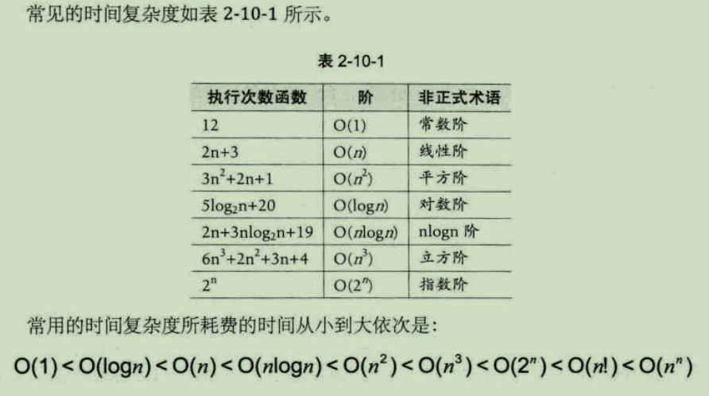
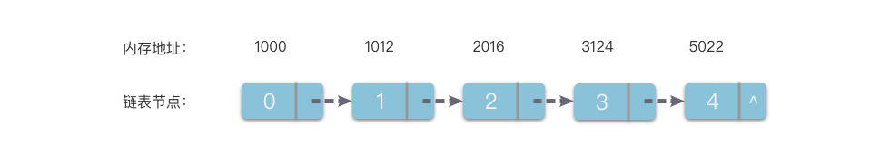

# 知识点

## 序言
数据结构：数据的组织结构，用来组织，存储数据    
对于数据结构可以分为：
```  
逻辑结构    
    集合结构：数据元素同属于一个集合。  
    线性结构：数据元素是一对一关系。    
    树形结构：数据元素之间是一对多的层次关系。
    图形结构：数据元素之间是多对多的关系
物理结构
    顺序存储结构：将数据元素存放在一片地址连续的存储单元里，数据元素之间的逻辑关系通过数据元素的存储地址来直接反映  
    链式存储结构：将数据元素存放在任意的存储单元里，存储单元可以连续也可以不连续    

```

## 算法
### 衡量

---

#### 时间复杂度
*定义*
时间复杂度所需要消耗的时间即基本操作执行次数    

*计算*
1.用常数1取代运行时间中国所有的加法常数 
2.在修改后的运行次数函数中，只保留最高阶项  
3.如果最高阶项存在且不是1，则去除这个项相乘的常数.如下  
` O(2n^2) = O(n^2) `    
  

#### 空间复杂度
*定义*
 算法的空间复杂度通过计算算法所需的存储空间实现，即运行完一个程序所需的内存的大小    

***算法的时间复杂度和空间复杂度是可以相互转化的***

*计算*
设一个算法所需的存储空间用f(n)表示
```
空间复杂度的计算公式记作：S(n)=O(f(n))　　
其中n为问题的规模
S(n)表示空间复杂度
```
```
一般情况下，一个程序在机器上执行时：    
除了需要存储程序本身的指令，常数，变量和输入数据外  
还需要存储对数据操作的存储单元的辅助空间    
若输入数据所占空间只取决于问题本身，和算法无关      
这样就只需要分析该算法在实现时所需要的辅助单元即可，    
若算法执行时所需的辅助空间相对于输入数据量而言是个常数，则称此算法为原地工作，空间复杂度为O(1)  

```


---


## 线性表
用一段地址连续的存储单元依次存储线性表的数据元  

*编号地址*
存储器中的每个存储单元都有自己的编号，这个编号称为地址

*存储位置公式*
每个数据元素，不管它是整型，实型还是字符型，它都是需要占用一定的存储单元空间的。    

*存取操作时间性能*  
   
计算出线性表中任意位置的地址    
这时对于线性表每个位置的存入或者取出数据都是相等的时间，所以线性表的存取操作时间性能都是**O(1)**    
    
*随机存储结构*  

### 顺序存储结构

#### 数组
*一种线性表数据结构，它使用一组连续的内存空间，来存储一组具有相同类型的数据*    
数组的一大特点就是可以进行**随机访问**：    
访问原理：  
计算机给一个数组分配了一组连续的存储空间，其中第一个元素开始的地址被称为**首地址**。每个数据元素都有对应的下标索引和内存地址，计算机通过地址来访问数据元素。当计算机需要访问数组的某个元素时，会通过**寻址公式**计算出对应元素的内存地址，然后访问地址对应的数据元素。  
___寻址公式:___ 下标 i 对应的数据元素地址 = 数据首地址 + i × 单个数据元素所占内存大小。 

##### 多维数组

可以将二维数组看成一个矩阵，并处理矩阵的相关问题。  

##### 访问
超出范围的访问为非法访问    

##### 查找元素    

##### 插入元素    
*尾部插入：*    ·
例如python的list列表，append
*中间插入：*    
将后续元素依次后移  

改变，访问数组元素的时间复杂度为O(1),在数组尾部插入，删除的时间复杂度是O(1),普通情况下插入。删除的时间复杂度为O(n)  

##### 数组双指针

### 链式存储结构
*优点*：存储空间不用事先分配，需要存储空间时临时申请，不会造成空间的浪费，一些操作的时间效率要比数组高（插入，移动）    
*缺点*：指针也占空间，链表结构比数组结构的空间开销大。

#### 链表   
如图：  
    
每个数据元素占用若干存储单元的组合称为一个链节点。  
其中指针被称为[后继指针]    

#### 双向链表   
每个链节点中有两个指针，分别指向直接后继和直接前驱。    
双向链表特点：从双链表的任意一个节点开始，都可以很方便的访问它的前驱节点和后继节点。    


#### 循环链表
它的最后一个链节点指向头节点，形成一个环    
从循环链表的任何一个节点出发都能找到任何其他节点    


### 堆栈
#### 简介
*堆栈*：简称栈，是一种线性表数据结构，是一种只允许在表的一端进行插入和删除操作的线性表    

栈顶TOP:栈中允许插入和删除的一端称为*栈顶*；    
栈底:表中没有任何数据元素时成为*空栈*； 
栈的插入操作称为 *入栈*或者*进栈*   
栈的删除操作称为 *出栈*或者*退栈*

**LIFO结构** 栈是一种*后进先出*的线性表 
    


#### 堆栈的顺序存储与链式存储   

*顺序栈*：堆栈的顺序存储结构
利用一组地址连续的存储单元依次存放自栈底到栈顶的元素，同时使用指针top指示栈顶元素在顺序栈中的位置。     

---

*链式栈*：堆栈的链式存储结构
利用单链表的方式来实现

>栈中元素按照插入顺序依次插入到链表的第一个节点之前，并使用栈顶指针top指示栈顶元素，top永远指向链表的头节点位置  

#### 操作   
*入栈*：相当于在线性表的最后元素后插入新元素  **push**  
*出栈*：相当于在线性表的最后元素后删除新元素  **pop**   

**基本操作**：    
- *初始化空栈：*  创建一个空栈，大小为size，以及栈顶元素为top 
- *判空：* 堆栈空时返回True，用于删除元素  
- *判满：* 堆栈满时返回True，用于添加元素  
- *删除元素：* push,并且改变top位置 


