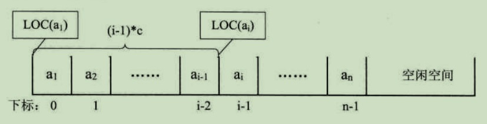

# 知识点

## 序言
数据结构：数据的组织结构，用来组织，存储数据    
对于数据结构可以分为：
```  
逻辑结构    
    集合结构：数据元素同属于一个集合。  
    线性结构：数据元素是一对一关系。    
    树形结构：数据元素之间是一对多的层次关系。
    图形结构：数据元素之间是多对多的关系
物理结构
    顺序存储结构：将数据元素存放在一片地址连续的存储单元里，数据元素之间的逻辑关系通过数据元素的存储地址来直接反映  
    链式存储结构：将数据元素存放在任意的存储单元里，存储单元可以连续也可以不连续    

```

## 算法
### 衡量

---

#### 时间复杂度
*定义*
时间复杂度所需要消耗的时间即基本操作执行次数    

*计算*
1.用常数1取代运行时间中国所有的加法常数 
2.在修改后的运行次数函数中，只保留最高阶项  
3.如果最高阶项存在且不是1，则去除这个项相乘的常数.如下  
` O(2n^2) = O(n^2) `    
  

#### 空间复杂度
*定义*
 算法的空间复杂度通过计算算法所需的存储空间实现，即运行完一个程序所需的内存的大小    

***算法的时间复杂度和空间复杂度是可以相互转化的***

*计算*
设一个算法所需的存储空间用f(n)表示
```
空间复杂度的计算公式记作：S(n)=O(f(n))　　
其中n为问题的规模
S(n)表示空间复杂度
```
```
一般情况下，一个程序在机器上执行时：    
除了需要存储程序本身的指令，常数，变量和输入数据外  
还需要存储对数据操作的存储单元的辅助空间    
若输入数据所占空间只取决于问题本身，和算法无关      
这样就只需要分析该算法在实现时所需要的辅助单元即可，    
若算法执行时所需的辅助空间相对于输入数据量而言是个常数，则称此算法为原地工作，空间复杂度为O(1)  

```


---


## 线性表
用一段地址连续的存储单元依次存储线性表的数据元  

*编号地址*
存储器中的每个存储单元都有自己的编号，这个编号称为地址

*存储位置公式*
每个数据元素，不管它是整型，实型还是字符型，它都是需要占用一定的存储单元空间的。    

*存取操作时间性能*  
   
计算出线性表中任意位置的地址    
这时对于线性表每个位置的存入或者取出数据都是相等的时间，所以线性表的存取操作时间性能都是**O(1)**    
    
*随机存储结构*  

### 顺序存储结构

#### 数组
*一种线性表数据结构，它使用一组连续的内存空间，来存储一组具有相同类型的数据*    
数组的一大特点就是可以进行**随机访问**：    
访问原理：  
计算机给一个数组分配了一组连续的存储空间，其中第一个元素开始的地址被称为**首地址**。每个数据元素都有对应的下标索引和内存地址，计算机通过地址来访问数据元素。当计算机需要访问数组的某个元素时，会通过**寻址公式**计算出对应元素的内存地址，然后访问地址对应的数据元素。  
___寻址公式:___ 下标 i 对应的数据元素地址 = 数据首地址 + i × 单个数据元素所占内存大小。 

##### 多维数组

可以将二维数组看成一个矩阵，并处理矩阵的相关问题。  

##### 访问
超出范围的访问为非法访问    

##### 查找元素    

##### 插入元素    
*尾部插入：*    ·
例如python的list列表，append
*中间插入：*    
将后续元素依次后移  

改变，访问数组元素的时间复杂度为O(1),在数组尾部插入，删除的时间复杂度是O(1),普通情况下插入。删除的时间复杂度为O(n)  

##### 数组双指针

### 链式存储结构
*优点*：存储空间不用事先分配，需要存储空间时临时申请，不会造成空间的浪费，一些操作的时间效率要比数组高（插入，移动）    
*缺点*：指针也占空间，链表结构比数组结构的空间开销大。

#### 链表   
如图：  
    
每个数据元素占用若干存储单元的组合称为一个链节点。  
其中指针被称为[后继指针]    

#### 双向链表   
每个链节点中有两个指针，分别指向直接后继和直接前驱。    
双向链表特点：从双链表的任意一个节点开始，都可以很方便的访问它的前驱节点和后继节点。    


#### 循环链表
它的最后一个链节点指向头节点，形成一个环    
从循环链表的任何一个节点出发都能找到任何其他节点    


### 堆栈
#### 简介
*堆栈*：简称栈，是一种线性表数据结构，是一种只允许在表的一端进行插入和删除操作的线性表    

栈顶TOP:栈中允许插入和删除的一端称为*栈顶*；    
栈底:表中没有任何数据元素时成为*空栈*； 
栈的插入操作称为 *入栈*或者*进栈*   
栈的删除操作称为 *出栈*或者*退栈*

**LIFO结构** 栈是一种*后进先出*的线性表 
    


#### 堆栈的顺序存储与链式存储   

*顺序栈*：堆栈的顺序存储结构
利用一组地址连续的存储单元依次存放自栈底到栈顶的元素，同时使用指针top指示栈顶元素在顺序栈中的位置。     

---

*链式栈*：堆栈的链式存储结构
利用单链表的方式来实现

>栈中元素按照插入顺序依次插入到链表的第一个节点之前，并使用栈顶指针top指示栈顶元素，top永远指向链表的头节点位置  

#### 操作   
*入栈*：相当于在线性表的最后元素后插入新元素  **push**  
*出栈*：相当于在线性表的最后元素后删除新元素  **pop**   

**基本操作**：    
- *初始化空栈：*  创建一个空栈，大小为size，以及栈顶元素为top 
- *判空：* 堆栈空时返回True，用于删除元素  
- *判满：* 堆栈满时返回True，用于添加元素  
- *删除元素：* push,并且改变top位置 

顺序存储代码
---
```
class Stack:
    # 初始化空栈
    def __init__(self, size=100):
        self.stack = []
        self.size = size
        self.top = -1     
    # 判断栈是否为空
    def is_empty(self):
        return self.top == -1
    # 判断栈是否已满
    def is_full(self):
        return self.top + 1 == self.size
    # 入栈操作
    def push(self, value):
        if self.is_full():
            raise Exception('Stack is full')
        else:
            self.stack.append(value)
            self.top += 1
    # 出栈操作
    def pop(self):
        if self.is_empty():
            raise Exception('Stack is empty')
        else:
            self.stack.pop()
            self.top -= 1
    # 获取栈顶元素
    def peek(self):
        if self.is_empty():
            raise Exception('Stack is empty')
        else:
            return self.stack[self.top]

```
链式存储代码
---
```
class Node:
    def __init__(self, value):
        self.value = value
        self.next = None
        
class Stack:
    # 初始化空栈
    def __init__(self):
        self.top = None
    # 判断栈是否为空
    def is_empty(self):
        return self.top == None
    # 入栈操作
    def push(self, value):
        cur = Node(value)
        cur.next = self.top
        self.top = cur
    # 出栈操作
    def pop(self):
        if self.is_empty():
            raise Exception('Stack is empty')
        else:
            cur = self.top
            self.top = self.top.next
            del cur
    # 获取栈顶元素
    def peek(self):
        if self.is_empty():
            raise Exception('Stack is empty')
        else:
            return self.top.value

```


## 队列
一种线性表数据结构，是一种只允许在表的一端进入插入操作，而在表的另一端进行删除操作的线性表。    

**队尾**： 队列中允许插入的一端     
**队头**： 队列中允许删除的一端     

队列是一种**先进先出**[FIFO]的线性表    


### 队列的应用  
- 解决计算机的主机与外部设备之间速度不匹配的问题    
- 解决由于多用户引起的系统资源竞争的问题    **并发问题**

## 哈希表
也叫散列表，是更具关键码值(key value)直接进行访问的数据结构     
哈希表通过[键key]和[映射函数Hash(key)]计算出对应的[值value]，把关键码值映射到表中一个位置来访问记录，以加快查找的速度。这个映射函数叫做[哈希函数],存放记录的数组叫做[哈希表]    


### 算法思想
     
在哈希表中插入一个关键码值；    

```
通过哈希函数解析关键字，并将对应值存放到该区块中。
比如：
0138//0138 通过哈希函数Hash(key)=0138//1000=0
Hash(key)=0138//1000=0，得出应将0138//0138分配到0所在的区块中。
```

在哈希表中搜索一个关键码值：    
```
通过哈希函数解析关键字，并在特定的区块搜索该关键字对应的值。 
比如：查找 2321 2321，通过哈希函数，得出 2321 2321 应该在 2 2 所对应的区块中。然后我们从 2 2 对应的区块中继续搜索，并在 2 2 对应的区块中成功找到了 2321 2321。 
比如：查找 3214 3214，通过哈希函数，得出 3214 3214 应该在 3 3 所对应的区块中。然后我们从 3 3 对应的区块中继续搜索，但并没有找到对应值，则说明 3214 3214 不在哈希表中。
```
### 哈希函数
将哈希表中元素中元素的关键键值映射为元素存储位置的函数  

哈希函数满足的条件：    

- 哈希函数应该易于计算，并且尽量使计算出来的索引值均匀分布。 
- 哈希函数计算得到的哈希值是一个固定长度的输出值。 
- 如果 𝐻𝑎𝑠ℎ(𝑘𝑒𝑦1)≠𝐻𝑎𝑠ℎ(𝑘𝑒𝑦2)Hash(key1)≠Hash(key2),那么key1、𝑘𝑒𝑦2key2一定不相等。
- 如果 𝐻𝑎𝑠ℎ(𝑘𝑒𝑦1)==𝐻𝑎𝑠ℎ(𝑘𝑒𝑦2)Hash(key1)==Hash(key2)，那么key1、key2可能相等，也可能不相等（会发生哈希碰撞）。


*关键字*的类型除了数字类，还有可能是字符串类型，浮点数类型，整数类型，甚至还有可能是几种类型的组合      

*就是python***字典**：  
使用开放寻址法      

# 跳转
[跳转链接list点这里](../list.md)


