- [嵌入式](#嵌入式)
  - [概述](#概述)
    - [问答](#问答)
      - [什么是嵌入式系统](#什么是嵌入式系统)
      - [为什么要提出嵌入式](#为什么要提出嵌入式)
      - [嵌入式系统的特点](#嵌入式系统的特点)
      - [结构](#结构)
      - [从系统的角度定义：](#从系统的角度定义)
      - [**系统架构**](#系统架构)
      - [嵌入式系统编程技巧](#嵌入式系统编程技巧)
      - [从代码到可执行文件](#从代码到可执行文件)
    - [知识点](#知识点)
      - [嵌入式微处理器](#嵌入式微处理器)
      - [实时系统概念](#实时系统概念)
      - [嵌入式系统发展与应用](#嵌入式系统发展与应用)
      - [嵌入式系统编程技巧](#嵌入式系统编程技巧-1)
      - [嵌入式系统软硬件IP核](#嵌入式系统软硬件ip核)
      - [操作系统分类](#操作系统分类)
      - [前后台系统](#前后台系统)
      - [多任务](#多任务)
      - [任务优先级](#任务优先级)
      - [调度](#调度)
      - [非占先式/占先式](#非占先式占先式)
      - [可重入函数](#可重入函数)
    - [课堂补充](#课堂补充)
      - [嵌入式分层](#嵌入式分层)
      - [内联函数和带参宏](#内联函数和带参宏)
    - [嵌入式微处理器硬件原理](#嵌入式微处理器硬件原理)
      - [层级](#层级)
  - [ARM](#arm)
    - [指令](#指令)
    - [ARM体系架构及指令集](#arm体系架构及指令集)
      - [指令集](#指令集)
        - [架构](#架构)
        - [ARM和Thumb指令集](#arm和thumb指令集)
      - [流水线](#流水线)
      - [大小端模式](#大小端模式)
    - [模式](#模式)
      - [处理器模式](#处理器模式)
      - [多模式的好处](#多模式的好处)
      - [异常](#异常)
      - [模式的切换](#模式的切换)
        - [异常的切换/异常的处理](#异常的切换异常的处理)
        - [说明](#说明)
    - [Load-Store指令](#load-store指令)
      - [指令分类](#指令分类)
      - [指令格式](#指令格式)
      - [如何设计CPU（如何扩展）](#如何设计cpu如何扩展)
      - [怎么使用Load-store指令](#怎么使用load-store指令)
    - [指令码及状态字](#指令码及状态字)
      - [指令码](#指令码)
    - [ARM的初始化](#arm的初始化)
      - [启动代码](#启动代码)
      - [Boot Block 引导块](#boot-block-引导块)
      - [启动代码](#启动代码-1)
      - [初始化堆栈](#初始化堆栈)
    - [ARM核](#arm核)
      - [ARM编程模型](#arm编程模型)
      - [请你用ARM和IP核设计一个CPU](#请你用arm和ip核设计一个cpu)
      - [LPC芯片内部结构](#lpc芯片内部结构)
      - [LPC芯片的中断扩展](#lpc芯片的中断扩展)
    - [汇编使用](#汇编使用)
      - [预定义寄存器](#预定义寄存器)
      - [寄存器补充知识](#寄存器补充知识)
    - [汇编指令](#汇编指令)
    - [存储器](#存储器)
      - [存储器种类](#存储器种类)
      - [存储器映射](#存储器映射)
    - [相互调用](#相互调用)
      - [ARM和Thumb的调用](#arm和thumb的调用)
      - [汇编中调用C函数](#汇编中调用c函数)
      - [C语言中调用汇编](#c语言中调用汇编)
    - [嵌入式C的编程规范](#嵌入式c的编程规范)
      - [排版](#排版)
      - [注释](#注释)
      - [标识符](#标识符)
      - [可读性](#可读性)
      - [变量、结构](#变量结构)
      - [函数、过程](#函数过程)
    - [嵌入式C语言相关知识点](#嵌入式c语言相关知识点)
      - [volatile关键字](#volatile关键字)
      - [字节-字-比特](#字节-字-比特)
  - [ucos操作系统](#ucos操作系统)
    - [相关](#相关)
      - [高效](#高效)
      - [临界区](#临界区)
    - [RTOS](#rtos)
      - [分类](#分类)
    - [初始化](#初始化)
    - [任务控制块TCB](#任务控制块tcb)
      - [相关数据结构](#相关数据结构)
      - [优先级算法](#优先级算法)
        - [优先级反转](#优先级反转)
      - [任务队列](#任务队列)
    - [事件控制块 ECB](#事件控制块-ecb)
      - [信号量实现机制](#信号量实现机制)
    - [一些tips](#一些tips)
      - [什么是任务](#什么是任务)
      - [任务状态](#任务状态)
      - [任务切换](#任务切换)
      - [事件](#事件)
      - [事件操作](#事件操作)
    - [UCOS内核](#ucos内核)
      - [内核](#内核)
      - [调度](#调度-1)
        - [时间片轮转调度](#时间片轮转调度)
        - [中断](#中断)
      - [优先级算法](#优先级算法-1)
      - [idle任务](#idle任务)
    - [信号量](#信号量)
      - [信号量](#信号量-1)
    - [死锁](#死锁)
    - [PV操作](#pv操作)
    - [互斥](#互斥)
      - [互斥机制](#互斥机制)
      - [如何分辨](#如何分辨)
    - [同步](#同步)
      - [如何分辨](#如何分辨-1)
      - [生产消费问题/进餐问题](#生产消费问题进餐问题)
    - [消息机制](#消息机制)
      - [消息机制的意义](#消息机制的意义)
      - [概述](#概述-1)
      - [邮箱](#邮箱)
        - [函数](#函数)
      - [消息队列](#消息队列)
        - [函数](#函数-1)
        - [环形缓冲](#环形缓冲)
      - [内存管理](#内存管理)
        - [基础知识](#基础知识)
        - [原始内存管理](#原始内存管理)
        - [内存碎片](#内存碎片)
        - [动态内存管理](#动态内存管理)
        - [函数](#函数-2)
  - [ucos函数解析](#ucos函数解析)
    - [任务管理](#任务管理)
    - [时间管理](#时间管理)
  - [DARTS流图](#darts流图)
    - [基本图形符号解析](#基本图形符号解析)
    - [数据流图示例](#数据流图示例)
    - [任务划分](#任务划分)
    - [rtos相关](#rtos相关)
  - [rtos扩展](#rtos扩展)
    - [文件系统](#文件系统)
      - [FLASH读写](#flash读写)
      - [日志文件系统](#日志文件系统)
    - [GUI](#gui)
    - [linux](#linux)
  - [UCOS总结](#ucos总结)
  - [题型](#题型)
- [跳转](#跳转)

# 嵌入式

## 概述

### 问答

#### 什么是嵌入式系统

嵌入到应用对象中的专用的计算机系统

以应用为中心，以计算机技术为基础、软硬件可裁剪、功能、可靠性、成本、体积、功耗严格要求的专用计算机系统

#### 为什么要提出嵌入式

#### 嵌入式系统的特点

- 可以裁剪
- 小而实时
- 专用性 -- 为特定应用定制的计算机系统
- 裁剪性 -- 软、硬件小而精，够用即可
- 实用性 -- 程序和数据都在存储器中，既满足逻辑正确性，也要满足时间正确性
- 可靠性 -- 无人值守。自动化
- 低功耗 -- 便携式应用的要求
- 高性价比 -- 家用的应用要求

对于功能、可靠性、成本、体积、功耗严格要求的专用计算机系统

#### 结构

一般由嵌入式微处理器、外围硬件设备、嵌入式操作系统以及用户应用程序等四个部分组成

#### 从系统的角度定义：

嵌入式系统是设计完成复杂功能的硬件和软件，并使其紧密耦合在一起的计算机系统
嵌入式反映了：这些系统通常是更大系统中的一个完整的部分，称为嵌入的系统，嵌入的系统重可以共存多个嵌入式系统

#### **系统架构**

- 硬件
- 驱动
- 程序
- 操作系统
- 中间件 -- 第三方设计的函数包，库，层次结构
- 应用程序
  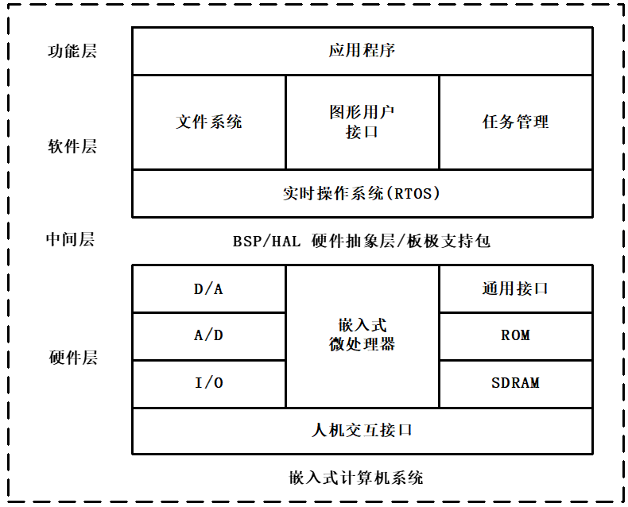  

#### 嵌入式系统编程技巧

1. 时间和空间的效率：更快更省更好
   1. 硬件的支持：特殊的指令集 thumb-空间效率
   2. 软件的技巧：查表 指针 初始化的提前定义
2. 省电
   1. 时钟的处理：时钟的变频，功能模块的时钟可选择关闭
   2. 操作系统的切换：一个任务等待时另一个任务可以运行，减少无意义的NOP指令的功率耗费
   3. idle任务可以进入CPU的低功耗模式
   4. 事件机制：减少原轮询机制的运行功耗，大部分时间可处于低功耗模式

#### 从代码到可执行文件
以为ARM工具链为例子(keil使用的工具链)
  工具链有：
  - armcc C/C++编译器
  - armasm 汇编编译器
  - armlink 链接器
1. 预处理
  - 输入.c/h文件，输出.i文件
  - 工具：armcc
2. 编译
  - 输入.i文件，输出 **.s文件**（汇编文件）
3. 汇编
  - 输入.s文件，输出 **.o文件**（目标文件）
3. 链接
  - 输入.o文件，输出 **.axf文件**（可执行文件）
  - axf文件包含了程序代码，数据，符号表，**调试**信息，导入导出表，内存映射表，程序入口地址等信息，用于调试，可以直接烧录到嵌入式设备 
  - 将多个目标文件生成一个可执行文件
4. 生成烧录文件（有bin和hex两种固件烧录格式）
  - 生成.bin文件
  - 可选生成hex文件，hex文件带有地址信息
  - bin即纯二进制文件，不带有地址信息

---

### 知识点

#### 嵌入式微处理器

32位以上的处理器，在实际嵌入式应用中，只保留与嵌入式应用紧密相关的功能硬件，去除其他的冗余功能部分，这样就以最低的功耗和资源实现嵌入式应用的特殊要求。和工业控制计算机项相比，其体积小，重量轻，成本低，可靠性高的优点

#### 实时系统概念

双规
*实时操作系统*：能够在指定或者确定的时间内完成系统功能以及对外部或内部事件在同步或异步时间内做出响应的系统

#### 嵌入式系统发展与应用

发展趋势：

1. 嵌入式硬件集成化
2. 嵌入式环境网络化
3. 嵌入式软件构件化
4. 应用模式普适化
5. 行业应用标准化


#### 嵌入式系统编程技巧
- 时间和空间效率：更快，更省，更好
  - 硬件支持：特殊指令集 - Thumb
  - 软件技巧：查表 指针 初始化提前定义
- 省电
  - 时钟处理：时钟变频，功能模块的时钟选择关闭
  - 操作系统切换：多任务避免无意义的NOP指令
  - idle任务可以进入CPU的低功耗
  - 事件机制：减少原轮询机制的运行功耗  
- 多任务：PV操作


#### 嵌入式系统软硬件IP核

知识产权（IP）电路或核是一种预先设计好的，甚至已经验证过的具有某种确定功能的集成电路、器件或部件。它有行为、结构、物理3种设计，对应的种类是软核、固核和硬核

#### 操作系统分类

- 顺序执行系统 如DOS
- 分时操作系统 如UNIX
- 实时操作系统
  - 强实时系统，其系统响应时间在毫秒或微妙级
  - 一般实时系统，其系统响应时间在毫秒-几秒的数量级
  - 弱实时系统，其系统响应时间约为数十秒

**软件结构**

- 循环轮询系统
- 事件驱动系统

#### 前后台系统

是中断驱动系统的一种

- 后台是一个轮询系统一直在运行
- 前台是由一些中断处理过程组成的
- 当有一前台事件（外部事件）发生时，引起中断，进行前台处理，处理完成后又回到后台（通常称为主程序）

需要考虑的是中断的现场保护和恢复，中断嵌套，中断处理过程与主程序的协调（共享资源）问题

**后台循环，前台中断**
系统的性能主要由中断延迟时间，响应时间和恢复时间来刻画

#### 多任务

多任务运行的实现实际上是靠CPU(中央处理单元)在许多任务之间转换、调度
CPU只有一个，轮番服务于一系列任务中的某一个，多任务运行使CPU的利用率得到最大的发挥，并使应用程序模块化

#### 任务优先级

每个任务都有优先级

- 静态优先级
  应用程序执行过程中，任务的优先级是不变的，在春旭编译时是已知的
- 动态优先级
  任务的优先级是可变的，实时内核应当避免出现优先级反转问题

#### 调度

调度是内核的主要职责之一，调度就是决定该轮到哪个人物运行了，多数实时内核是基于优先级调度法的，分为非占先式和占先式两种

#### 非占先式/占先式

- 非占先式：也称为合作型多任务，中断服务可以使一个高优先级的任务由挂起状态变为就绪态，但中断服务以后控制权还是回到原来被中断了的那个任务，直到改任务主动放弃CPU的使用权，那个高优先级的任务才能获得CPU的使用权

  - **一个特点**是不需要信号量保护共享数据，运行着的任务占有CPU
  - **最大缺陷**是响应高优先级的任务慢，内核的响应时间也是不确定的，因为需要等任务执行完
- 占先式：最高优先级的任务一旦就绪，总能得到CPU的控制权

  - 当一个运行着的任务使一个比它优先级高的任务进入了就绪态，当前任务的CPU使用权就被剥夺了，或者挂起，高优先级的任务立马得到了CPU的控制权
  - 使用占先式内核时，应用程序应直接使用可重入型函数

**ucos是可抢占的**
（占先式内核）

#### 可重入函数

可以被一个以上的任务调用，而不必担心数据的破坏
可重入型函数或者只使用局部变量，即局部变量保存在CPU寄存器中或堆栈中

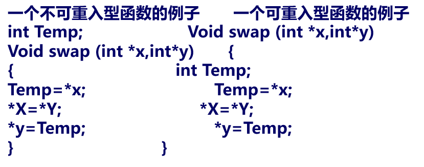

### 课堂补充
#### 嵌入式分层
|||
|-|-|
|APP|应用层|
|middle ware|中间件|
|OS|RTOS|
|BSP/HAL|驱动层/硬件抽象层|
|HW|硬件|

#### 内联函数和带参宏

**带参宏：**    
- 没有现场切换，但是会代码膨胀。
- 直接文本替换
- 在预处理阶段执行
- 不支持递归
- 无开销
**内联函数：**    
- inline关键字修饰 强类型检查
- 在编译阶段执行
- 支持递归

### 嵌入式微处理器硬件原理

#### 层级
|英文|解释|
|-|-|
|Core||
|Instruction Set Architecture|ISA:指令集架构|
|Registers Transfer Lenel|RTL：寄存器传输级|
|Physical Hardware and Environment|物理硬件与环境|

## ARM

### 指令

- 存储器访问指令
- ARM数据处理类指令
- 程序状态寄存器访问指令
- ARMf分支转移类指令
- ARM协处理器类指令
- 软件中断和断点指令

### ARM体系架构及指令集

#### 指令集

**CISC指令集**
复杂指令集，指令条数多，是不等长的指令集，复杂功能有硬件实现，效率高，但是功耗巨大

- 具有大量的指令和寻址方式
- 8/2原则
- 大多数程序只使用少量的指令就能够运行

编码长度可变 1-15 字节
寻址方式多样

可以对存储器和寄存器进行算数和逻辑操作

**RISC指令集**
精简指令集，指令条数少，简单，是等长指令集，浮渣功能用多条指令组合完成（软件），再使用流水线降低指令的执行周期数

- 在通道中只包含最有用的指令
- 确保数据通道快速执行每一条指令
- 使CPU硬件结构设计变得更为简单

只能对寄存器对行算术和逻辑操作，Load/Store体系结构

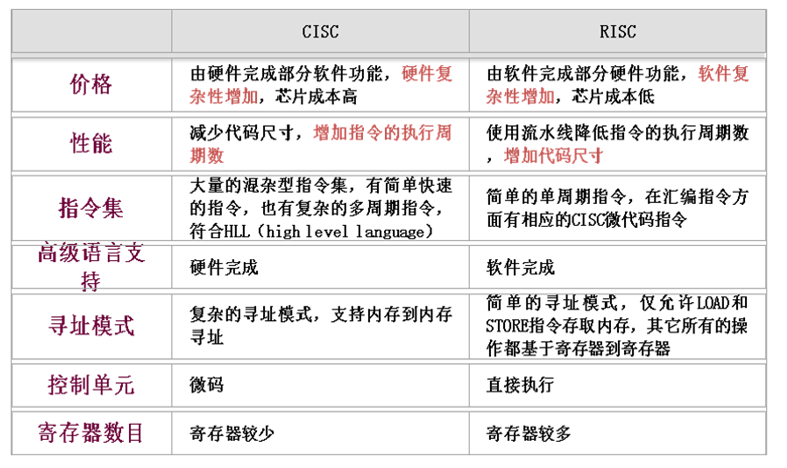

##### 架构

**冯洛伊曼结构**
指令和数据**混合**存储

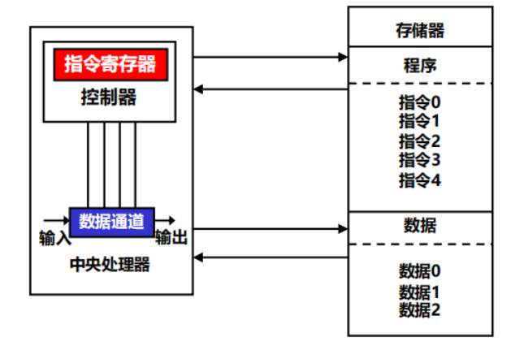

**哈佛结构**
指令运算处理上和数据存储上采用并行结构
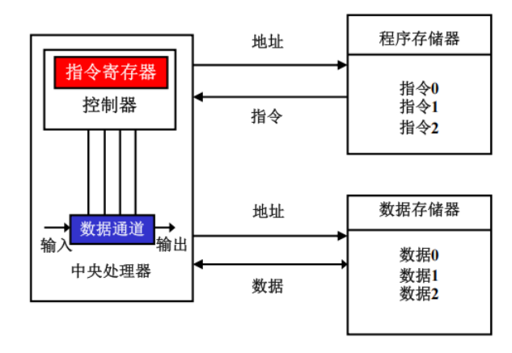

**ARM**指令集数据RISC指令，具有RISC指令的特点：
指令少，且等长，标语充分利用流水线技术，使用多寄存器，且多为简单的Load/Store指令（内存取值，执行完再放回内存）

##### ARM和Thumb指令集

**ARM7TDMI**处理器中有两种工作状态：

- ARM - 32 -bit 按字排列的ARM指令集
- Thumb - 16 -bit 按半字排列的Thumb指令集

**切换** 使用BX指令（分支和交换指令）切换指令集状态。
从ARM状态切换到Thumb状态

```
LDR R0, = Label +1
BX R0
```

从Thumb状态切换到ARM状态

```
LDR R0, = Label
BX R0
```

Thumb指令集可以看成是ARM指令压缩形式的子集，它是为减小代码量而提出的，提高代码密度，具有16位的代码密度

Thumb指令体系不完整，只支持通用功能，必要时仍需要ARM指令，如进入异常时.
ARM指令为32位，Thumb指令为16位，thumb指令集与等价的ARM代码相比较，可节省30%-40%以上的存储空间，同时具备32位代码的所有优点

#### 流水线
流水线技术：几个指令可以并行执行
- 取指 从存储器装载一条指令
- 译码 识别将要被执行的语句
- 执行 处理指令并将结果写回寄存器
ARM7系列使用3级流水线，允许多个操作同时处理，比逐条指令执行要快

PC指向**正被取指**的指令，而非正在执行的指令

#### 大小端模式

- 大端模式
  - 字数据的高位字节存储在低地址中
  - 字数据的低位字节存储在高地址中
- 小端模式
  - 字数据的高位字节存储在高地址中
  - 字数据的低位字节存储在低地址中

一般是小端模式  

### 模式

#### 处理器模式

ARM体系架构支持7种处理器模式，分别为

- 用户模式USR
- 快中断模式FIQ
- 中断模式IRQ
- 管理模式SVC
- 中止模式abt
- 未定义模式und
- 系统模式SYS
  *上电时候的模式为：管理模式（SVC）*


#### 多模式的好处
- 用户模式限制-特权级硬件隔离
- 高效的上下文切换，开销小

#### 异常

**异常** 内部或外部中断源产生并引起处理器处理一个事件异常类型：

- **FIQ**快速中断请求，CPSR:l = 1
- **IRQ**外部中断请求，CPSR:F = 0 ,系统外设
- 未定义指令：ARM处理器或协处理器遇到不能处理的指令。     
- 中止
  - 预取中止
  - 数据中止
- 复位
- 软件中断：执行SWI指令产生，可用于用户模式下的程序调用特权操作指令，
  - 通过软件中断产生
  - 进行管理模式中获得
  - 通常要求特殊的管理功能，如操作系统支持

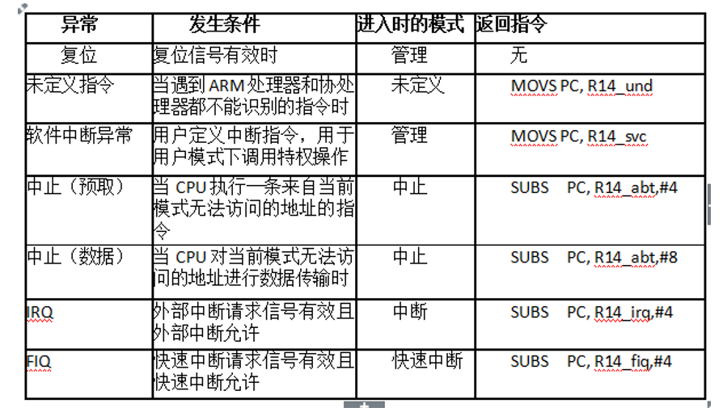

在处理异常的时候，当前的处理器状态必须被保存，以便处理程序完成后，最后的程序可以被恢复。

---


#### 模式的切换
- 程序状态寄存器PSR
  - CPSR： 当前状态寄存器
  - SPSR:  程序状态保护寄存器 
  - 保存ALU当前操作信息
  - 控制允许和禁止中断
  - 设置处理器操作模式
- PC指针：程序指针，指向下一条待执行指令**地址**的指针  
    - PC指向**正被取指**的指令，而非正在执行的指令    
- SWI指令
  - 使用SWI指令切换到特权模式，
  - SWI指令强迫处理器从用户模式进入SVC管理模式

##### 异常的切换/异常的处理
当异常产生时，ARM core
- 拷贝CPSR到SPSR
- 设置适当的CPSR
- 保存返回地址到LR
- 设置PC为相应的异常向量
返回时，异常处理需要
- 从SPSR中恢复CPSR
- 从LR中恢复PC
- ARM态中执行 

---

##### 说明

1. ARM文档中不严格区分中断和异常，都使用术语exception异常从CPU的角度描述，中断从外部事件的角度描述
2. 异常处理程序的重要性
   设备驱动/中断处理
   操作系统进程调度和切换

### Load-Store指令
在通用寄存器中执行  
解释：从存储器中读某个值，操作完后再将其放回存储器中

#### 指令分类

- 数据处理指令 - 使用和改变寄存器的值

  - 算术操作
  - 按位逻辑操作
  - 寄存器移位操作
  - 比较操作
- 数据传送指令 - 把存储器的值拷贝到寄存器中 **load** or  把寄存器中的值拷贝到存储器中 **store**
- 控制流指令

  - 分支
  - 分支和链接
  - 陷入系统代码

#### 指令格式

- 3地址指令格式
- 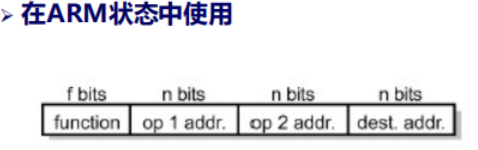
- 2地址指令格式
- 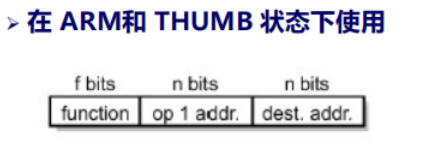

#### 如何设计CPU（如何扩展）

数据交换（读/写）采用Load-store指令
由arm来扩展CPU的基本方法是把所有功能部件全部映射成内存，然后每个功能部件的寄存器映射成内存的地址（或一个变量）ARM最大只能对本地的寄存器进行操作，但是它可以通过Load-store指令让它自己的寄存器更功能部件的寄存器进行数据交换，交换完数据进行操作，操作完再交换回去，这样就可以对其他功能部件的数据进行操作了

#### 怎么使用Load-store指令

- 第一部分：把外部功能部件的所有控制寄存器和状态寄存器都映射到RAM空间上统一编址
- 第二部分：ARM通过load或store指令实现内部寄存器和外部映射RAM的空间的数据交换，来达到控制和读取外部功能部件的目的
  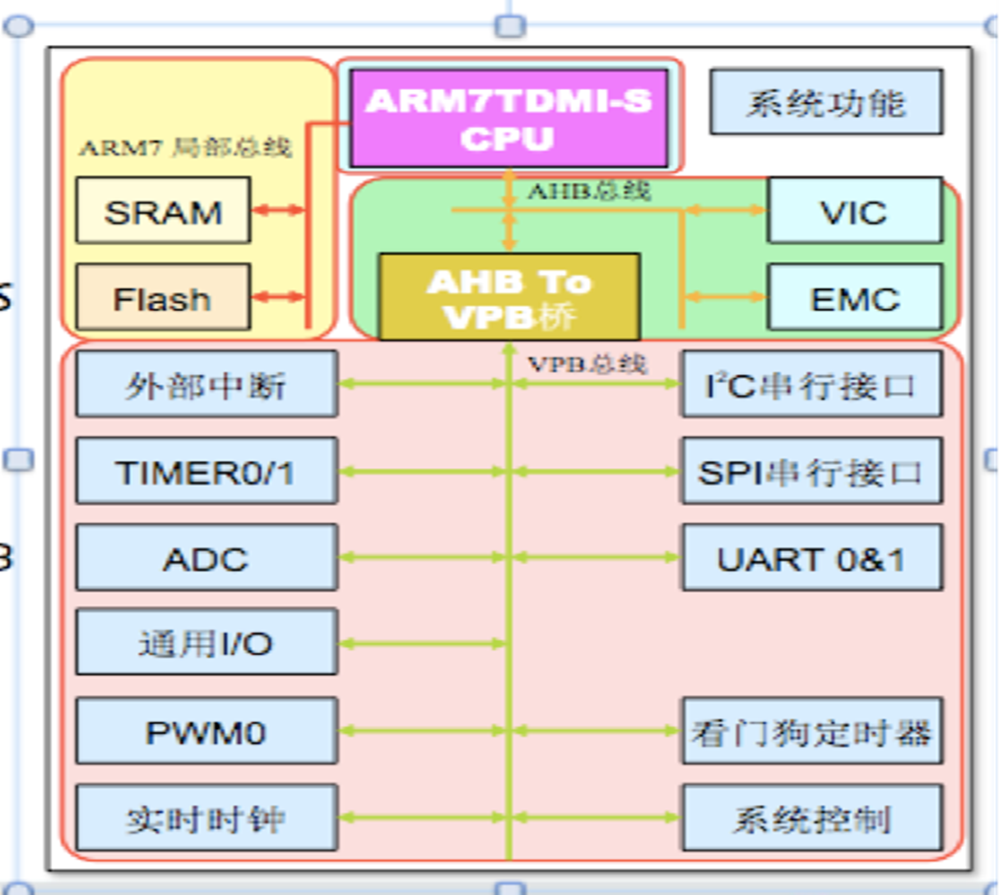

### 指令码及状态字

#### 指令码

**特点** 每条语句都可以有一条键码，每条语句的第二操作数都可以是以为操作数，每条语句都可以有一个状态位

### ARM的初始化

1. 中断向量表
2. 初始化存储器系统

   - 存储器的类型和时序配置
   - 存储器的地址分布
3. 初始化堆栈

   - ARM有7种执行状态，每一种状态堆栈指针寄存器（SP）都是独立的，对每一种模式都要定义SP寄存器的堆栈地址
4. 初始化有特殊要求的端口、设备
5. 初始化应用程序执行环境
   - 完成必要的从ROM到RAM的数据传输
6. 改变处理器模式
   - 管理员模式 - 多种特权模式  - 用户运行模式
   - 复位后缺省模式- 堆栈初始化阶段 - 用户选择
7. CALL主程序
   - 系统初始化工作完成后，程序流程转入主应用程序执行
   - 可以直接从启动代码跳到应用程序的主函数入口

#### 启动代码

系统启动流程：

- **上电/复位**
- **引导代码**（bootblock）
- **启动代码**
  - 向量表定义
  - 堆栈初始化
  - 系统变量初始化
  - 中断系统初始化
  - I/O初始化
  - 外围初始化
  - 地址重映射
- **用户main函数**

#### Boot Block 引导块

boot block中的复位后运行的代码被称为引导代码

#### 启动代码

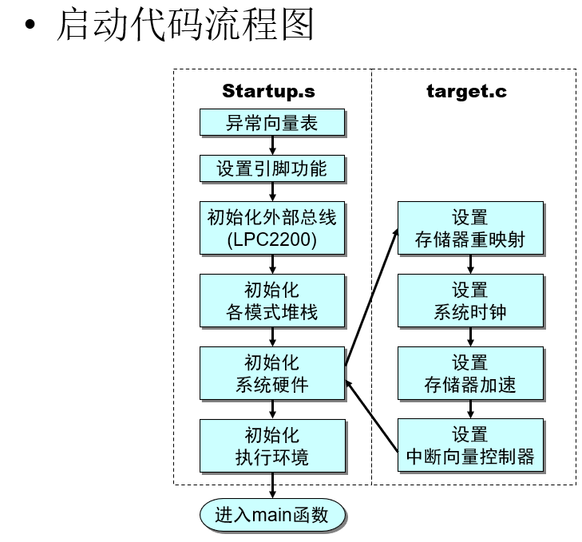

#### 初始化堆栈

ARM有7种执行状态，每一种状态堆栈指针寄存器（SP）都是独立的
对每一种模式都要定义SP寄存器的堆栈地址

**初始化应用程序执行环境**
完成必要的从ROM到RAM的数据传输
**改变处理器模式**
**呼叫主应用程序**

### ARM核

#### ARM编程模型
- ARM处理器的工作状态
- ARM处理器工作模式
- ARM内部寄存器
- 数据的存储格式
- 流水线和异常处理

#### 请你用ARM和IP核设计一个CPU

由arm来扩展CPU的基本方法是把所有功能部件全部映射成内存（把挂在总线上的所有功能部件统一编址）然后每个功能部件的寄存器映射成内存的地址（或一个变量）ARM最多只能对本地的寄存器进行操作，但是它可以通过Load-store指令让自己的寄存器跟功能部件的寄存器进行数据交换，交换完数据进行操作，操作完再交换回去，这样就可以对其他地址部件的数据进行操作

```
LDR R0,[R1]
STR R0,[R1]
```

#### LPC芯片内部结构

内部总线、AHB总线、VPB总线
ARM局部总线、AHB高性能总线、VHB外设总线
AHB to VPB 的桥 将VPB总线和AHB总线相连，起缓冲作用（以空间换时间）    

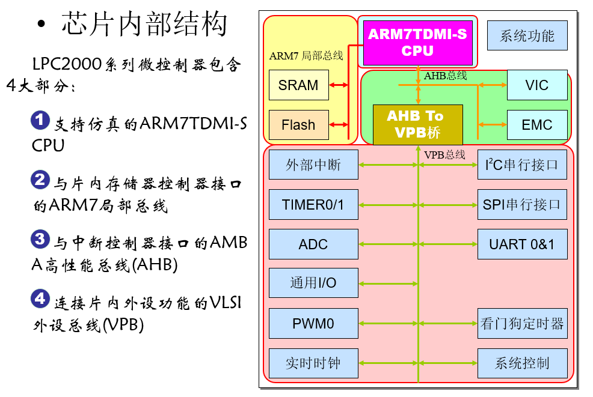

**VIC**： 向量中断控制器

> NVIC 嵌套向量中断控制器

**EMC**: 外部存储器控制器

#### LPC芯片的中断扩展

LPC的中断扩展，ARM只有两根中断线
IRQ中断、FIQ中断

需要用到硬件机构（电路），对外部的中断源进行仲裁，找出相应的中断源，再把该中断源的中断服务程序地址送给IRQ或FIR中断地址

### 汇编使用

#### 预定义寄存器 
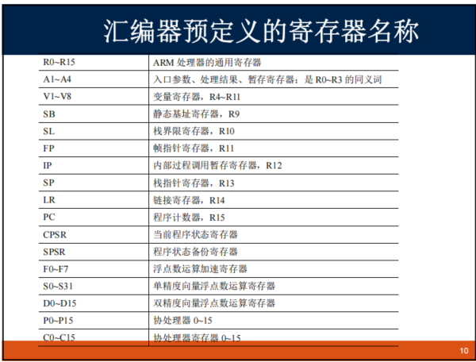 

#### 寄存器补充知识
ALU:算术逻辑单元，是CPU的核心执行部件，负责数学运算和逻辑判断等     

**寄存器：**  

### 汇编指令
1. 寄存器寻址
ADD  R0, R1, R2    ;  R0=R1+R2
2. 立即寻址
ADD  R3, R3, #1    ;    R3=R3+1
3. 寄存器移位寻址
ADD  R3,  R2, R1, LSL #3     ； R3=R2+8*R1
LSL：逻辑右移
LSR：逻辑左移
ASR：算术有移（保持符号位不变）
ROR：循环右移
RRX：带标志位循环右移
4. 寄存器间接寻址
LDR  R0, [R1]               ;   R0=*R1;
R1存有某一寄存器的地址，操作数存放在访问的寄存器中，R1这里相当于地址指针
5. 变址寻址
LDR  R0, [R1, R2]   ;  R0=*(R1+R2);
LDR  R0, [R1, #4]    ; R0=*(R1+4);
LDR  R0, [R1, #4]!    ; R0 =*(R1+4) ; R1=R1+4;
LDR  R0, [R1], #4     ; R0=*R1; R1=R1+4;
6. 多寄存器寻址
LDMIA  R1, {R0,R2,R5}      ;   R0=*R1;  R2=*(R1+4);   R5=*(R1+8)
表示R1指的连续存储的3个字的内容送到R0、R2、R5
7. 堆栈寻址
Push R0
Pop  R0
8. 基址寻址方式
LDR  R1,{R2,#4} 


### 存储器

#### 存储器种类

**SRAM** ：静态随机存取存储器
不需要刷新电路即能保存它内部存储的数据（体积大，容量小）
高速访问

**DRAM** :

- 只能将数据保持很短的时间（大容量）
- 每个一段时间要刷新充电一次，否则内部数据会消失(周期性刷新)低速访问
- ROM 只读存储器
- PROM 可编程只读存储器
- EPROM 可擦写可编程只读存储器
- EEPROM 电可擦写只读存储器
- OTPORM 一次可编程只读存储器
- flash 闪存

  - NOR-flash
  - NAND-flash

#### 存储器映射

给物理地址分配逻辑地址的过程称为存储器映射

（上电时先运行Boot Block）

异常向量表从片外存储器中重映射

**片内Flash编程**

- JTAG下载程序
- 系统编程技术（ISP）通过串口下载程序
- 应用编程技术（IAP）在用户程序运行时对Flash进行擦除和/或编程操作，实现数据的存储和固件的现场升级

**片外Flash映射**


### 相互调用

#### ARM和Thumb的调用

**ARM指令例程代码：** 
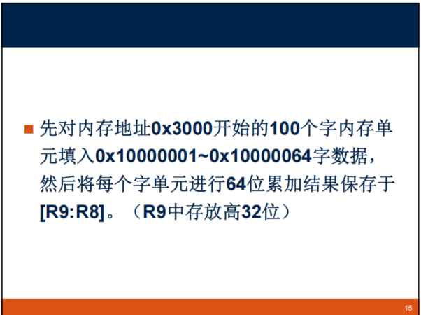 
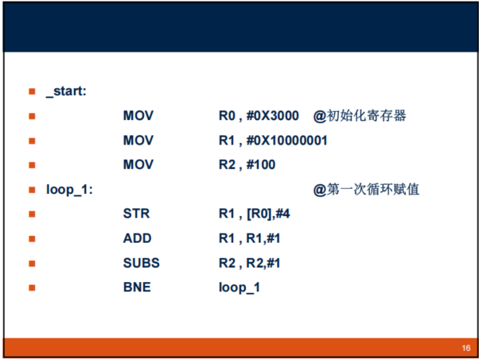 
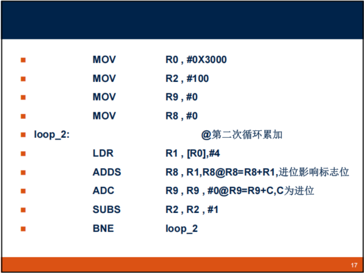 


#### 汇编中调用C函数

**声明：**  
- *在GUN ARM编译环境中，汇编程序中要使用.extern伪操作声明将要调用的C程序* 
- 在ARM开发工具编译环境下，汇编程序中要使用**IMPORT**伪操作声明将要调用的C程序  
**PPT实例：**   
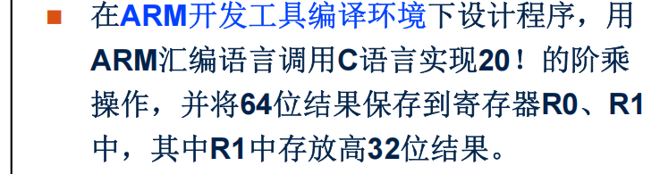 
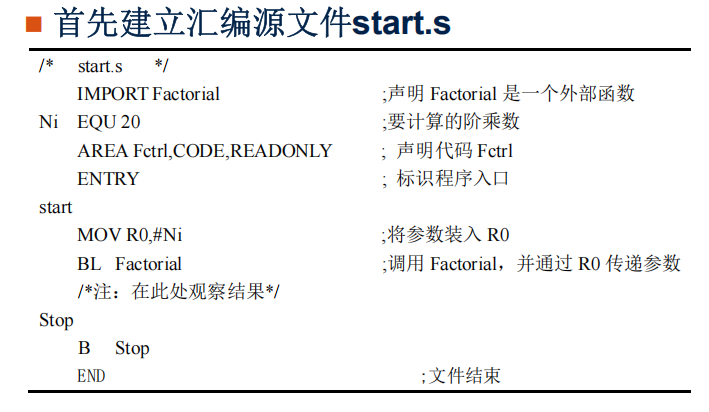 
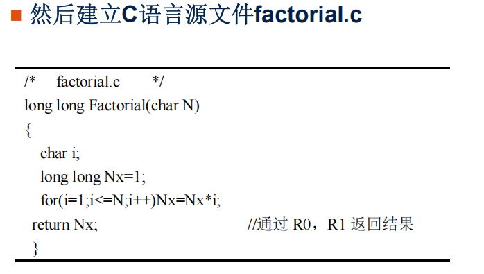 
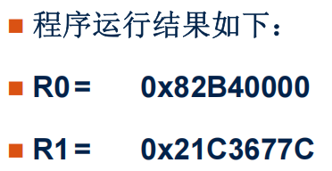 

**个人代码实现:** 
```代码结构
-source group
  -factorial.c
  -start.s
```
factorial.c   

```
long long factorial(char N) {
    char i;
    long long Nx = 1;
    for(i = 1;i <= N;i++)
    {
        Nx = Nx * i;
    }
    return Nx;
}

```
start.s     
```
    IMPORT factorial    ; 导入外部函数

Ni  EQU 5              ; 定义常量

    AREA fctrl, CODE, READONLY  ; 定义代码段
    ENTRY               ; 声明程序入口点
    EXPORT __main       ; 导出入口符号（如果需被链接器识别）

__main                   ; 标签必须顶格


    MOV R0, #Ni         ; 传递参数
    BL factorial        ; 调用阶乘函数

Stop                    ; 标签必须顶格
    B Stop              ; 无限循环

    END                 ; 汇编结束
```
#### C语言中调用汇编  
**声明：**  
- 在GUN ARM编译环境下，在汇编程序中要使用.global伪操作声明汇编程序为全局的函数，可被外部函数调用，同时在C程序中要用关键字extern声明要调用的汇编语言程序。   
- 在ARM开发工具编译环境上，汇编程序中要使用**EXPORT**伪操作声明本程序可以被其他程序调用。同时也要在C程序中要用关键字**extern**声明要调用汇编语言程序。  
**PPT例子：** 
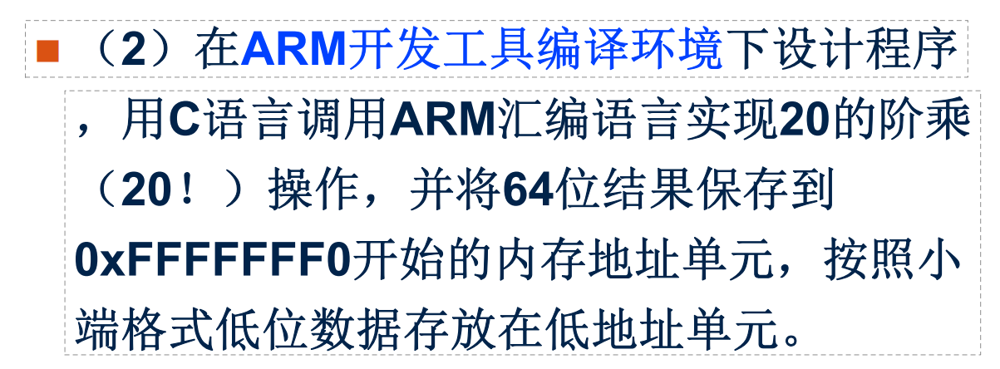 
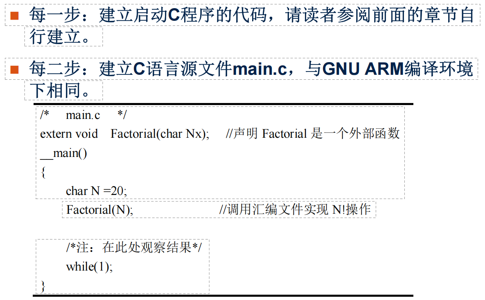 
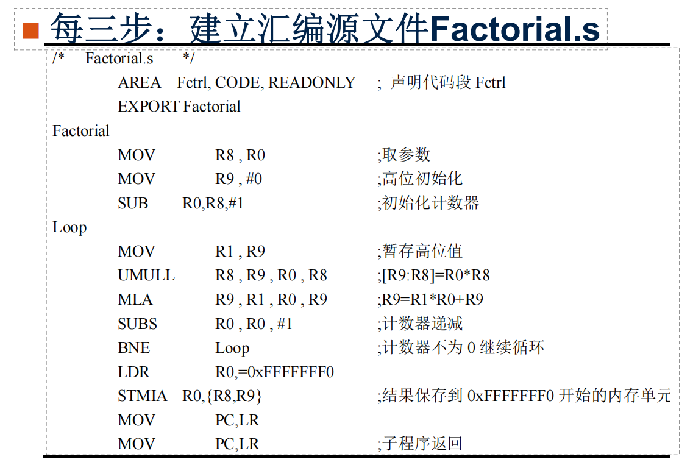 
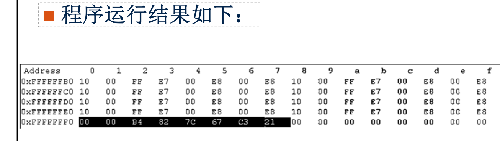 

**个人代码：**  

```代码结构
-source group
  -factorial.s
  -main.c
```
main.c
```

extern void factorial(char Nx);
void __main()
{
    char N = 5;
    factorial(N);

    while (1)
    {s
        /* code */
    }
    
}
```

factorial.s
```
    AREA    FactorialCode, CODE, READONLY
    EXPORT  factorial      ; 导出符号供外部调用

; 阶乘函数: 计算 R0 的阶乘，结果通过 R0 返回（32位）
; 输入: R0 = n (非负整数)
; 输出: R0 = n!
factorial
    PUSH    {R4-R5, LR}   ; 保存需要使用的寄存器和返回地址（LR）

    ; 初始化变量
    MOVS    R4, R0         ; R4 = n（当前乘数）
    MOVS    R5, #1         ; R5 = 累积结果（初始为1）

    ; 处理 n=0 的特殊情况
    CMP     R4, #0
    BEQ     return

loop
    ; 计算乘积: R5 = R5 * R4
    MUL     R5, R5, R4     ; Thumb-2 指令（等同于 UMULL 但更高效）

    ; 递减乘数并检查是否继续循环
    SUBS    R4, R4, #1     ; R4 -= 1，同时更新标志位
    BGT     loop            ; 如果 R4 > 0，继续循环

return
    ; 返回结果到 R0
    MOVS    R0, R5

    ; 恢复寄存器并返回
    POP     {R4-R5, PC}    ; 直接弹出 PC（等效于 BX LR）

    END                   ; 汇编结束
```

### 嵌入式C的编程规范
大致关键字：
#### 排版
- 空格缩进  
- 变量前后带空格
- 程序块前后带空行  
- 长语句分多行书写，低优先级处划分新行，操作符在新行之首，新行要适当缩进
- 不能把多个短句写在一行
- 条件，循环语句应该单独在一行，而且无论其执行语句有多少都应有{}  
- 函数或过程的开始、结构的定义及循环、判断等语句中的代码都要采用缩进风格，case语句也要有缩进
- 一行程序应小于80字符为准，不要写的过长

#### 注释
- 一般情况下，程序的有效注释量必须在20%以上
- 文件头部应该进行注释，注释必须列出：版权说明，版本号，生成日期，作者，内容，功能，修改日志等
- 函数头部应进行注释，列出；函数的目的/功能，输入参数，输出参数，返回值，调用关系等
- 保证注释与代码的一致性
- 防止注释二义性
- 注释应临近相关代码，放在上方或者右方
- 对于不能自注释的命名变量，常量，说明其物理含义，变量、常量、宏的注释应放在其上方相邻位置或右方  
- 数据结构声明，同样应该给予注释
- 全局变量要有较详细的注释，包括功能，取值范围，哪些函数存取，注意事项等等
- 注释与所描述内容进行同样的缩排
- 避免在一行代码或表达式中间插入注释
- 通过对函数或过程。变量。结构的正确命名和结构使得代码自注释
- 注释格式尽量统一

#### 标识符
- 标识符的命名要清晰，明了，有明确含义，使用公认缩写比如：
  - temp       tmp
  - flag       flg
  - statistic  stat
  - increment  inc
  - message    msg
- 命名中如果有特殊约定或缩写，则要有注释说明
- 自己特有的命名风格，要自始至终保持一致，不可来回变化
- 对于变量命名，禁止区单个字符（除非作局部循环命名）
- 非必要不要使用数字或奇怪的字符定义标识符
- 使用正确的反义词来命名互斥的变量动作
- 除了编译开关，头文件，应避免使用下划线开始结尾的定义

#### 可读性
- 注意运算符的优先级，并用括号明确表达式的操作顺序
- 代码中尽量使用有意义的枚举或宏来代替
- 源程序中关系紧密的代码应可能相邻
- 不要使用难懂的写法

#### 变量、结构
- 去掉没必要的公共变量
- 仔细定义并明确公共变量的含义，作用，取值范围，变量间关系
- 当向公共变量传递数据时，要十分小心，防止赋予不合理的值或越界
- 防止局部变量与公共变量
- 严禁使用未经初始化的变量作为右值
- 数据结构的功能要单一
- 不要涉及面面俱到，非常灵活的数据结构
- 不同结构的关系不要过于复杂
- 结构中的元素个数应适中，可以考虑使用子结构
- 设计结构中的元素的布局与排列顺序，使结构容易理解，节省占用空间
- 注意数据类型的强制转换
- 对编译系统默认的数据类型转换要有认识
- 合理设计自定义数据类型
- 合理命名以自注释


#### 函数、过程
- 对所调用函数的错误返回码要仔细，全面的处理
- 明确函数功能，精确实现函数设计
- 编写可重入函数，注意局部变量（避免static）
- 编写可冲入函数时，使用中断，信号量等来使用全局变量
- 函数规模限制在200行以内
- 一个函数仅仅完成一个功能
- 函数的功能应该是可以预测的（尽量）
- 避免使用BOOL参数，因为返回值含义模糊且不利于扩充
- 对于有返回值的函数，引用时最好使用其返回值

### 嵌入式C语言相关知识点

#### volatile关键字

#### 字节-字-比特
|单位|符号|大小|
|:--:|:--:|:--:|
|字节|B|8bit|
|字||CPU架构决定|
|比特|b|1bit|

字长由CPU架构决定，如32位CPU字长 = 4字节    


## ucos操作系统

### 相关

#### 高效

- 能做的事情先做（初始化，数据结构）
- 查表操作
- 大量位运算
- ucosii就绪表的三个算法

#### 临界区

代码的临界段也称为临界区，指处理时不可分割的代码

一旦这部分代码开始执行，则不允许任何中断打断，为确保临界区段代码的执行，在进入临界区前需要关中断，而临界区代码执行完以后要立即开中断

### RTOS

实时操作系统：能够在指定或者确定的时间内完成系统功能以及对外部或内部事件在同步或异步时间内做出响应的系统

#### 分类

- 软实时系统
  各个任务运行的 越快越好，不要求限定某一任务必须在多长时间内完成
- 硬实时系统
  各个任务不仅要执行无误而且要做到准时。系统对系统响应时间有严格的以要求，如果系统响应时间不满足，就会引起系统崩溃或致命的错误
- 硬实时系统

### 初始化

上电初始化工作：


OSinit初始化所有的变量和数据结构
OSinit建立空闲任务idle task，这个任务总是处于就绪态
还初始化了4个空数据结构缓冲区，每个缓冲区都是单向链表，允许os从缓冲区中迅速得到或释放一个缓冲区中的元素

### 任务控制块TCB

任务控制块 OS_TCB 是一个数据结构，保存该任务的相关参数，包括任务堆栈指针，状态，优先级，任务表位置，任务链表指针等
所有任务控制块分为两条链表，空闲链表和使用链表

--- 
所有的任务控制块都被放置在任务控制块列表数组OSTCBTbl[]中，系统初始化后，所有控制块被链接到空任务控制块的单向链表，任务建立后  
空任务控制块指针OSTCBFreeList指向的任务控制块就赋给该任务   
OSTCBFreeList的值调整为指向链表中的下一个空任务控制块 


#### 相关数据结构

包含了任务执行过程中所需要的所有信息

- 任务的名字
- 任务执行的起始地址
- 任务的优先级
- 任务的状态
- 任务的硬件上下文（堆栈指针，PC,寄存器等）
- 任务的队列指针等

**任务的组成**：

- 代码 一段可执行的程序
- 数据 程序所需要的相关数据（变量、工作空间、缓冲区）
- 堆栈
- 程序执行的上下文环境
  - 包含了实时内核管理任务，以及处理器执行任务所需要的所有信息
  - 任务优先级
  - 任务的状态等实时内核所需要的信息
  - 以及处理器的各种寄存器的内容，程序计数器、堆栈指针、通用寄存器等的内容
  - 任务的上下文环境通过任务控制块（TCB）来体现

#### 优先级算法

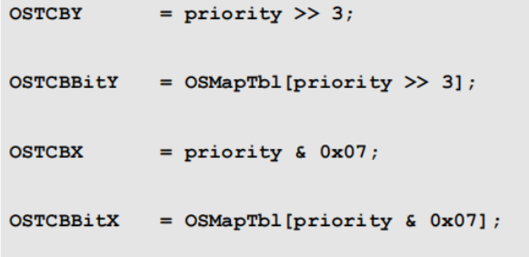

##### 优先级反转
*理想情况下，高优先级就绪后，能够立刻抢占低优先级任务而得到执行*

---
但在有多个任务需要使用共享资源的情况下，可能会出现高优先级任务被低优先级任务阻塞，并等待低优先级任务执行完毕，从而导致高优先级任务无法得到执行

优先级反转：高优先级在等待低优先级释放资源，而低优先级任务又在等待中优先级任务的情况

直接应用这些同步互斥机制将导致系统中出现不定时间长度的优先级反转和比较低的任务可调度性

---

**解决：**
1. 优先级继承
   1. 当一个任务阻塞了高优先级任务的时候，使用被阻塞的所有任务的最高优先级作为其执行临界区的优先级  
   2. 他不能避免死锁问题
2. 优先级天花板
   1. 优先级天花板访问临界资源的信号量的优先级天花板（使用该信号量的任务的最高优先级）

#### 任务队列

任务队列通过任务控制块实现对系统中所有任务的管理
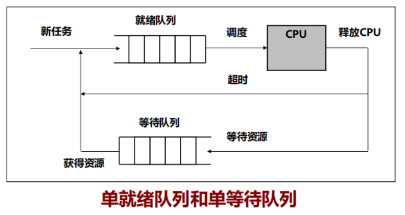

### 事件控制块 ECB

所有的通信信号都被看成是事件event,一个称为事件控制块ECB *event control block* 的数据结构来表征每一个具体事件。ECB的结构如下：
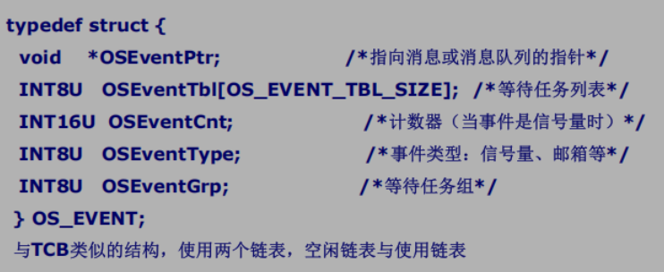

#### 信号量实现机制   
类似任务就绪表

**将任务插入等待事件的任务列表中：** 

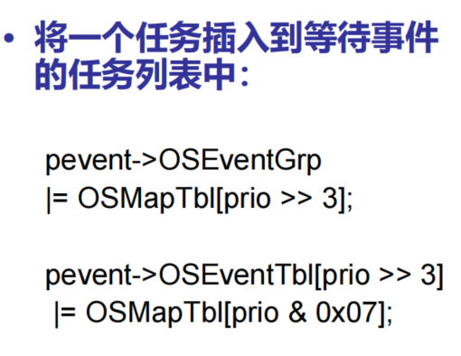

**从等待事件的任务列表中使任务脱离等待状态**
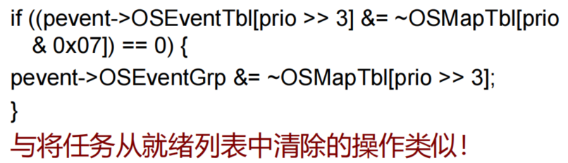

### 一些tips

#### 什么是任务

任务包括：程序体、堆栈（内存区）、TCB（控制块）


**任务基本信息**

- CPU中的PC寄存器：任务（程序）当前执行的位置
- CPU种的通用寄存器：惹怒我当前执行代码所涉及的临时数据
- CPU中的状态寄存器：存储当前CPU的状态

#### 任务状态

- DORMANT(睡眠态)
  - 任务已创建但未被激活，或者执行完毕被删除
  - OSTaskCreate()后进入READY态
- READY(就绪态)
  - 任务已经准备好，等待被调度器调度使用
  - 已经在就绪表 就绪队列中登记
  - OSTaskDel()后进入DORMANT态 
  - OSStart()后进入RUNNING态
- RUNNING(运行态)
  - 被调度器调度使用--最高优先级就绪的任务
  - CPU正在运行
  - OSTimedly()后进入WAITING态
- WAITING(等待态)
  - **现场保存到堆栈，TCB被保存到等待队列中**
  - 任务被挂起后，进入WAITING态，TCB放入等待队列
  - OSTimeDlyResume()后进入READY态
- ISR(中断服务态)
  - 软件中断 - SWI指令
  - 硬件中断 - GPIO,定时器中断


  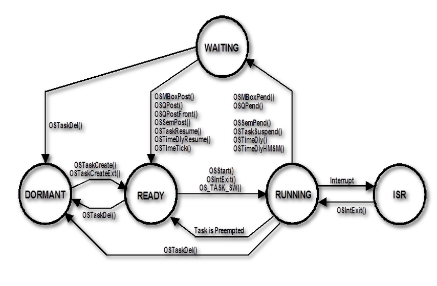

#### 任务切换

1. 保存任务上下文
2. 更新当前运行任务的控制块内容，将其状态改为就绪或等待状态
3. 将任务控制块移到相应队列（就绪队列/等待队列）
4. 选择另一个任务进行执行（调度）
5. 改变另一个任务进行执行的控制块内容，将其状态变为运行状态
6. 恢复需投入运行任务的上下文环境


- 被挂起的任务寄存器入栈
- 将较高优先级任务的寄存器出栈


**需要切换的情况**：

- 中断、自陷
  - 如当IO中断发生时候
    - 如果IO活动是一个或多个任务正在等待的事件，内核就把相应的处于等待状态的任务转换为就绪状态
    - 同时内核还将确定是否继续执行当前处于运行状态的任务，或是用高优先级的就绪任务抢占该任务
  - 自陷
    - 由于执行任务中当前指令所引起，将导致实时内核处理相应的错误或异常事件，并根据事件类型，确定是否进行任务切换  查询信号量的当前状态（计数值、等待任务列表等）
- 运行任务因缺乏资源而被阻塞
  - 如有别的资源需要
- 时间片轮转调度时
  - 内核将在时钟中断处理程序中确定当前正在运行的任务的执行时间是否已经操作了设定的时间片
  - 如果超过了时间片，实时内核将停止当前任务的运行，把当前任务的状态变为继就绪状态，并把另一个任务投入运行
- 高优先级任务处于就绪时
  - 如果采用基于优先级的抢占式调度算法，将导致当前任务停止运行，使更高优先级的任务处于运行状态
    **任务状态转换**：
- OSTaskDly() 删除任务，进入休眠态
- OSTimeDly() OSMboxPend等进入等待态
- OSIntExit() 进入中断服务状态
- OSStart() 让睡眠态的任务进入就绪态
- OSTaskSuspend() 挂起任务，进入等待态
- OSTaskResume() 恢复任务，进入就绪态


#### 事件
- 事件指的是一种表面预先定义的系统事件已经发生的机制    
- 事件用于任务间，任务与ISR之间的同步
- 一个事件就是一个标志
- 一个及以上事件构成一个事件集


#### 事件操作
- OSFlagCreate() 创建事件集
- OSFlagDel() 删除事件集
- OSFlagPend() 接受事件集
  - WAIT 接受事件集可等待
  - NO_WAIT 接受事件集不可等待
  - EVENT_ALL 与 事件集
  - EVENT_ANY 或 事件集 
- OSFlagPost() 发送事件集
- OSFlagQuery() 查询事件集
- OSFlagAccept() 接受事件集


---


### UCOS内核
#### 内核
提供的基本服务是任务切换

#### 调度

是内核的主要职责之一，决定该轮到哪个任务执行了。

*基于优先级的调度法指的是，CPU总是让处在就绪态的优先级最高的任务先执行*

任务级的任务调度：

- ucos是占先式实时多任务内核，优先级最高的任务一旦准备就绪，则拥有CPU的所有权开始投入运行
- ucos不支持时间片轮转法，每个任务的优先级要求不一样且是唯一的，所以任务调度的工作是：
  > 查找准备就绪的最高优先级并进行上下文切换
- ucos任务调度所花的时间为常数，与应用程序中建立的任务数无关

--- 
##### 时间片轮转调度
当多个就绪任务具有相同优先级，则先后执行一段时间片，当时间片用完时，任务被调度到就绪队列的末尾，并重新开始执行

##### 中断
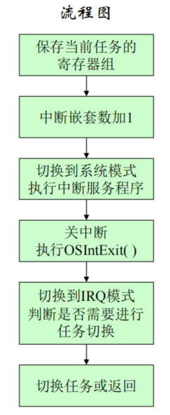

#### 优先级算法

**两个关键**：

> 优先级分解为高三位和低三位分别确定
> 高优先级有着小的优先级号

就绪表：
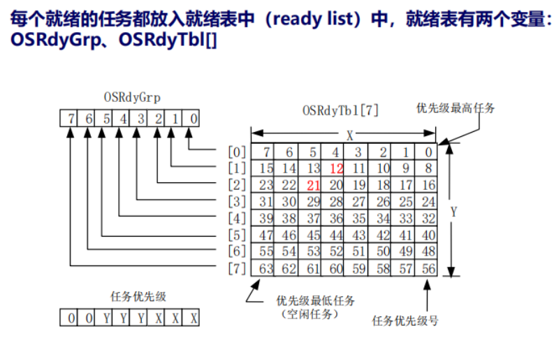

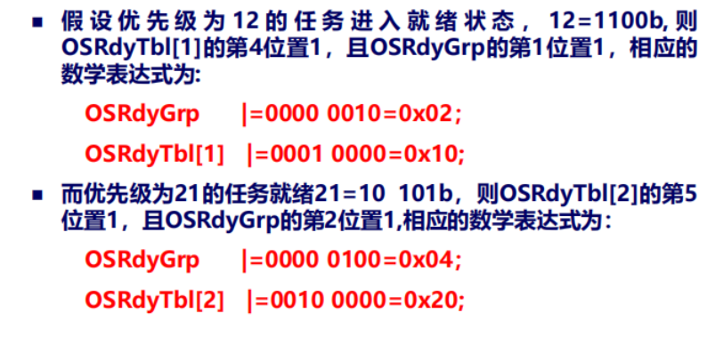

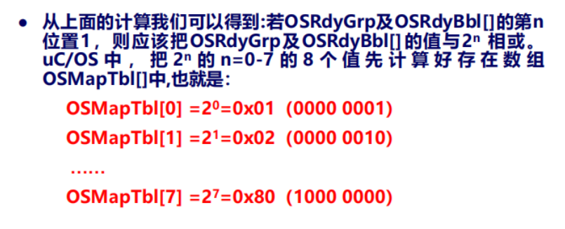

**查表法：**
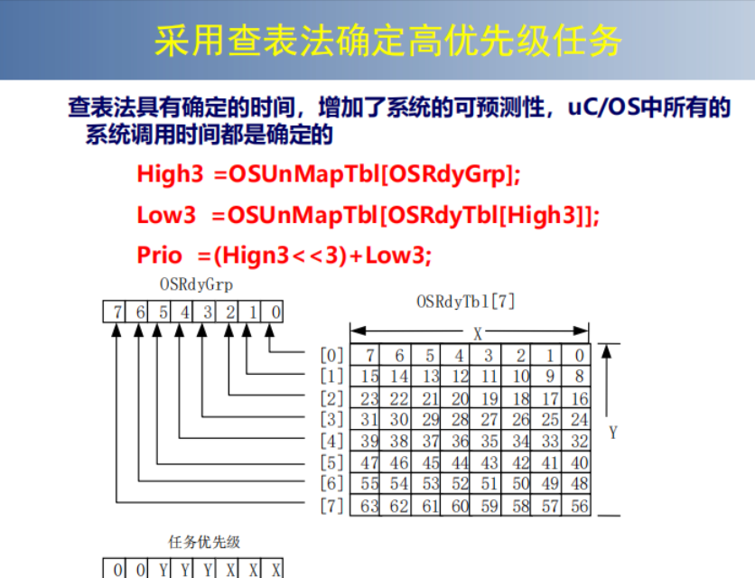

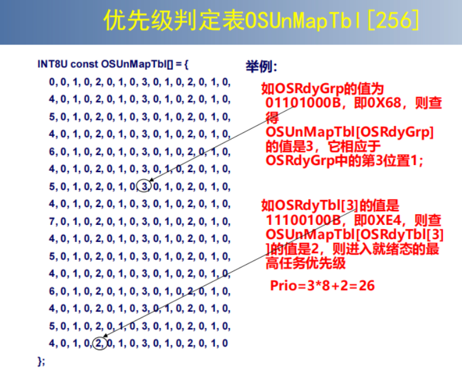


位图算法：  
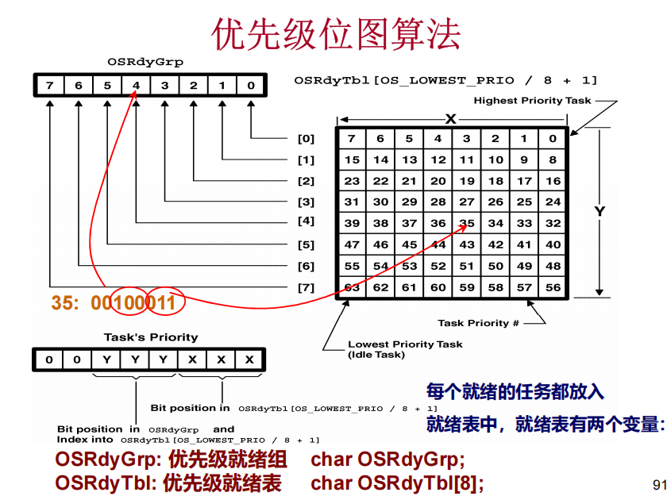

代码：

```
char const table[] = {
    0,0,1,0,2,0,1,0,3,0,1,0,2,0,1,0,
    4,0,1,0,2,0,1,0,3,0,1,0,2,0,1,0,
    5,0,1,0,2,0,1,0,3,0,1,0,2,0,1,0,
    4,0,1,0,2,0,1,0,3,0,1,0,2,0,1,0,
    6,0,1,0,2,0,1,0,3,0,1,0,2,0,1,0,
    4,0,1,0,2,0,1,0,3,0,1,0,2,0,1,0,
    5,0,1,0,2,0,1,0,3,0,1,0,2,0,1,0,
    4,0,1,0,2,0,1,0,3,0,1,0,2,0,1,0,
    7,0,1,0,2,0,1,0,3,0,1,0,2,0,1,0,
    4,0,1,0,2,0,1,0,3,0,1,0,2,0,1,0,
    5,0,1,0,2,0,1,0,3,0,1,0,2,0,1,0,
    4,0,1,0,2,0,1,0,3,0,1,0,2,0,1,0,
    6,0,1,0,2,0,1,0,3,0,1,0,2,0,1,0,
    4,0,1,0,2,0,1,0,3,0,1,0,2,0,1,0,
    5,0,1,0,2,0,1,0,3,0,1,0,2,0,1,0,
    4,0,1,0,2,0,1,0,3,0,1,0,2,0,1,0,
};


/**
 * @brief 获取就绪表中最高优先级任务的索引
 * @param rdyTBL 就绪表数组，每个元素代表一个优先级组的就绪状态（非0表示有就绪任务）
 * @return 最高优先级任务的索引（0~63），若无就绪任务返回-1
 */
int getHighestPrioritytable(char rdyTBL[8]) {
    // 初始化就绪组（RdyGrp），每个bit表示一个优先级组是否有就绪任务
    // 初始值0b11111111表示假设所有组都有任务（后续会修正）
    unsigned char RdyGrp = 0b11111111;

    // 遍历就绪表，构建真实的RdyGrp值
    // 从最高优先级组（rdyTBL[7]）开始检查
    for (int i = 7; i >= 0; i--) {
        if (rdyTBL[i] == 0)
            RdyGrp = (RdyGrp << 1) | 0;  // 左移并补0：表示该组无就绪任务
        else
            RdyGrp = (RdyGrp << 1) | 1;  // 左移并补1：表示该组有就绪任务
            // 等效于 RdyGrp = (RdyGrp*2 + 1);
    }

    // 通过查表法快速获取最高优先级组号（高3位）
    char high3 = table[RdyGrp];  // table为预定义的查找表，映射RdyGrp到最高优先级组号

    // 计算高优先级部分的基值（组号*8）
    char high = (char)(high3 << 3);  // 左移3位等价于乘以8

    // 获取该组内最高优先级任务的偏移量（低3位）
    char low = table[rdyTBL[high3]]; // 再次查表，获取组内最高优先级位

    // 如果RdyGrp非零（表示存在就绪任务）
    if (RdyGrp)   
        return high + low;  // 组合高3位和低3位得到完整优先级索引
    else
        return -1;  // 无就绪任务时返回-1
}

```

#### idle任务

空闲任务：
OSTaskIdle,只通过计数器统计CPU时间

任务总是建立一个空闲任务，这个任务在没有其他任务进入就绪态的时候投入运行，这个空闲任务为最低优先级

### 信号量
#### 信号量

**相关函数：**

```
OSSemCreate()
//创建并初始化一个信号量

OSSemPend()
//请求信号量（P操作），若信号量不可用则任务阻塞

OSSemPost()
//释放信号量（V操作），唤醒等待任务

OSSemAccept()
//非阻塞方式尝试获取信号量，立即返回结果。

OSSemQuery()
//查询信号量的当前状态（计数值、等待任务列表等）

```
---

**信号量种类**：

1. Binary Semaphore 二进制信号量
2. Counting Semaphore 计数信号量
3. Mutex Semaphore 互斥信号量


### 死锁
多个任务在运行中因争夺资源而造成的一种僵局
原因：竞争资源，任务推进非法

举例：
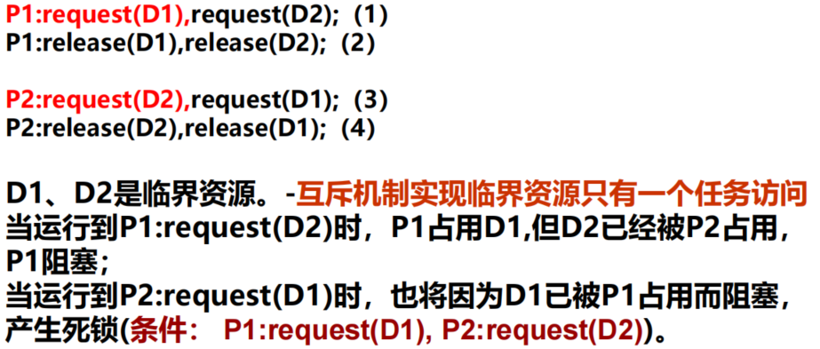
说明：P1先占有D1资源，P2先占有D2资源，然后P1申请D2资源，P2申请D1资源，P1和P2都等待D1和D2资源，造成死锁  
### PV操作

PV操作的信号量是全局的

P:pend 等待

> OSSemPend()
> 减少信号量的值
> 如果新的信号量的值不大于0，则操作阻塞

V:post 释放

> OSSempost()
> 增加信号量的值


### 互斥
一个任务持有信号量时候，其他不能获取该信号量，释放之后，其他任务可以获取该信号量    

#### 互斥机制
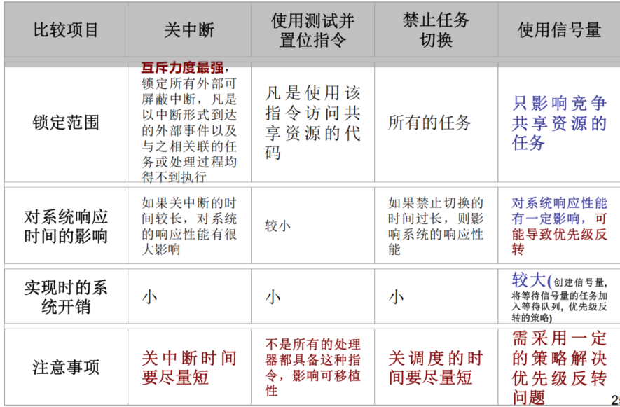     

#### 如何分辨
任务等待和发送的信号量是同一个，就是互斥  

一般使用互斥信号量    

### 同步
协调多个任务之间的执行顺序  

二值信号量主要用于任务与任务之间、任务与中断服务程序之间的同步  

#### 如何分辨
一个任务释放信号量，另外一个任务等待该信号量，就是同步

一般使用二值信号量  

ucos中使用邮箱作为二值信号量  

---


#### 生产消费问题/进餐问题
指若干进程通过有限的共享缓冲区交换数据时的缓冲区资源使用问题    
PPT举例：
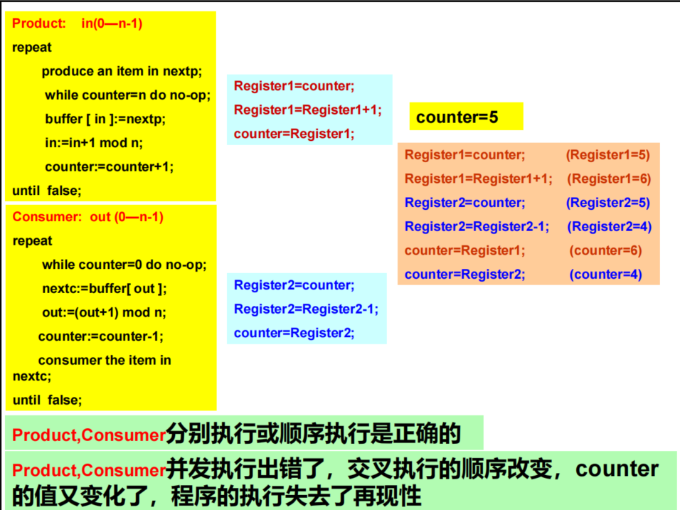   
解决办法：  
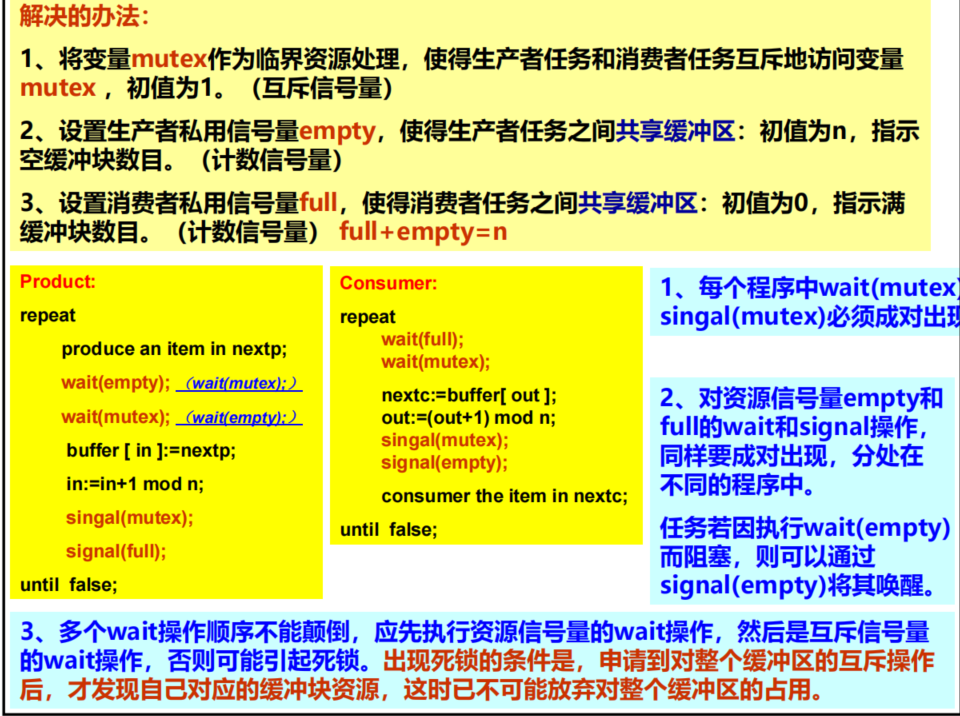 
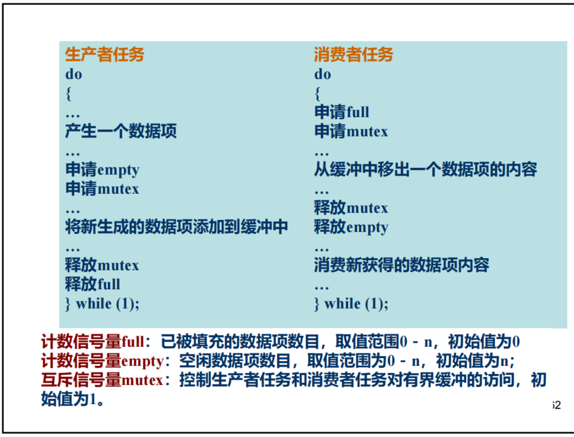 
个人理解：
首先，要注意每个数据是块，一次操作要完成整个数据的搬运，不能搬运到一半  
系统中有一组生产者进程和消费者进程，生产者每次生成一个产品放入缓冲区，消费者每次从缓冲区取出一个产品进行处理，处理不当就会产生死锁问题。
缓冲区没满，生产者才能把产品放入缓冲区，否则必须等待    
缓冲区没空，消费者才能从缓冲区取出产品，否则必须等待      

### 消息机制

#### 消息机制的意义

使得两个任务独立性增强，耦合比较松散
消息机制在任务和任务之间，任务和中断服务之间提供消息传送（通信）机制

应用可以只把消息当成一个标志，这时消息机制用于实现同步

邮箱仅能存放单条消息，它提供了一种低开销的机制来传送消息
消息队列可存放若干消息，提供了一种任务间缓冲通信的方法

#### 概述
- 共享数据结构（全局变量，指针等）
- 消息系统
  - 消息队列
  - 邮箱
- 管道通信


#### 邮箱
- 仅能存放单条消息
- 区别于信号量
  - 消息邮箱可以存放一条完整的内容信息
  - 信号量进行同步时候不能提供内容信息

##### 函数
- OSMboxcreate()
- OSMboxPost()
- OSMboxPend()

#### 消息队列
任务等待消息时的排列方式：FIFO或优先级    

##### 函数
- OSQAccept() 非阻塞方式检查消息队列中是否有消息，立即返回消息指针或 NULL
- OSQDel()   删除消息队列并释放资源
- OSQCreate()  初始化一个消息队列，返回事件控制块指针
- OSQpost()   将消息插入队列尾部（FIFO）
- OSQPend()  阻塞当前任务，直到队列中有消息或超时
- OSQPostFront() 将消息插入队列头部（LIFO），优先被接收
- OSQQuery()  获取队列信息（如消息数、等待任务数等），存入 OS_Q_DATA 结构体：
- OSQFlush()  清空队列中所有消息，**重置为空状态**  

##### 环形缓冲


#### 内存管理

##### 基础知识
- 堆--编译器自动分配释放
- 栈--程序员手动申请释放


##### 原始内存管理  
C语言中,堆（heap）和栈（stack）： 
- malloc() 分配
- free()  释放    

##### 内存碎片
- 频繁分配和释放不同大小的内存块后，剩余的内存块被分割为多个不连续的小块，无法满足较大内存块的分配需求，尽管总空闲内存足够    
- 内存分配对其和固定块大小的浪费（强制内存对其，比如4字节对齐）  

##### 动态内存管理
ucos的内存管理
以块为单位，一种大小的（1，2，4）个字节的数据分配到同一个块

垃圾回收  

##### 函数
- OSMemCreate()  动态创建一个内存分区，将其划分为多个固定大小的块
- OSMemPut()   将不再使用的内存块归还到分区，供后续分配
- OSMemGet()  从分区中获取一个空闲内存块，返回其指针
- OSMemQuery()   得到内存区的信息


## ucos函数解析

### 任务管理
- OSTaskCreate() 建立任务
- OSTaskDel() 删除任务
- OSTaskSuspend() 暂停任务 
- OSTaskResume() 恢复任务
- OSTaskChangePrio() 修改任务优先级
- OSTaskDelReq() 删除任务请求

### 时间管理

OSTimeDly()

> 任务调用
> 进入延时，同时发生任务调度
> 延时时间到
> 任务进入就绪状态
> 当前任务优先级为就绪态中最高
> 任务进入运行状态

OSTimeDlyHMSM()

> 小时H：分M：秒S：毫秒MS

OSTimeDlyResume()

> 让延时的任务结束延时
> 通过取消其他任务的延时来使自己处于就绪态
> 注意，因为OSTimeDlyHMSM()通过多次或一次调用OSTimeDly(),所以可能需要调用多次OSTimeDlyResume()才能恢复延时的任务

OStimeGet()

> 获取当前(系统)时间
> ucos有一个32位的计数器，会按照时钟节拍递增

OSTimeSet()

> 设置当前(系统)时间

## DARTS流图

### 基本图形符号解析
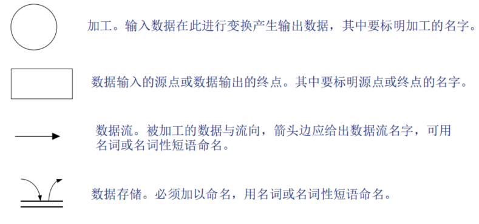 


### 数据流图示例

  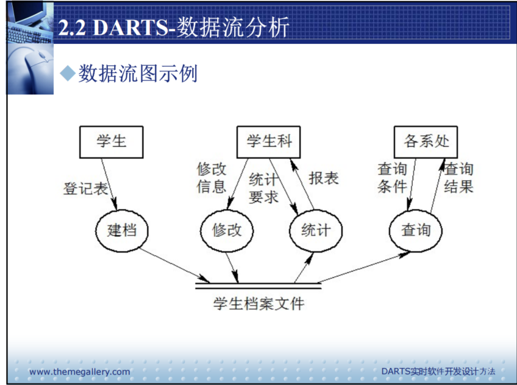 

  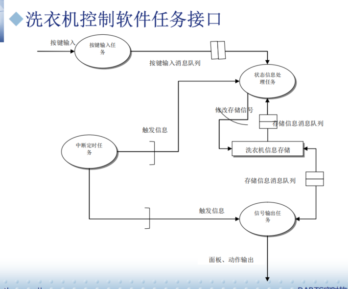

  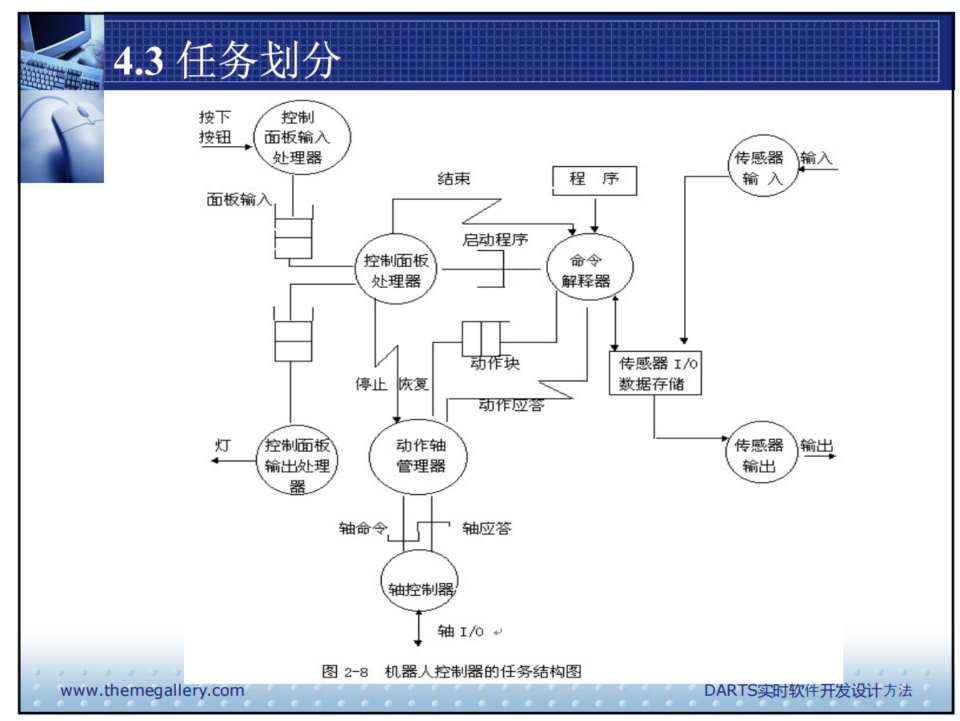
    
### 任务划分
- I/O依赖性
  - 依赖，受限于I/O，则独立成任务
  - I/O设备创建等数量的I/O任务
  - I/O任务只实现设备相关
  - 其速度取决于I/O设备速度，而非处理器
- 功能的时间关键性
- 计算需求
- 功能内聚
- 时间内聚
- 功能的周期执行

### rtos相关
- 松耦合（消息队列）
  - 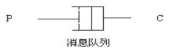  
- 任务
  -  
- 消息
  - 
- 总
  - 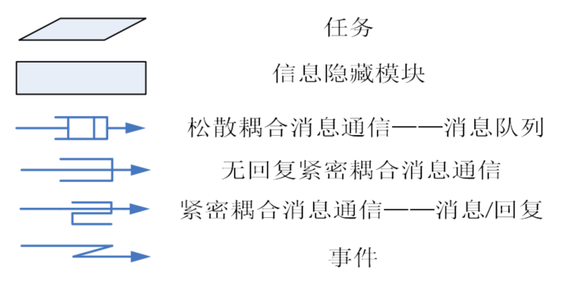

## rtos扩展

### 文件系统

#### FLASH读写
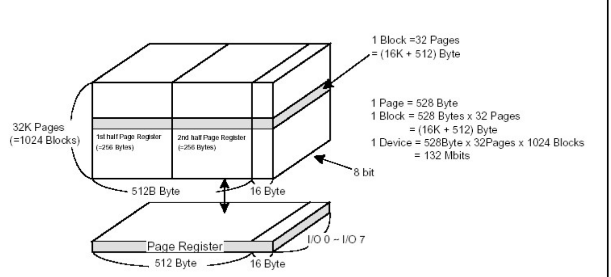   
- 以page为单位读写  
- 写之前必须擦除原有内容  
- 擦写操作必须对block进行，即一次至少擦写一个block（块擦除）  
- 将flash的一个page定为一个扇区，将其32个扇区定为一个簇（block）


#### 日志文件系统
BIOS信息    


### GUI
图形用户界面    


### linux


## UCOS总结
- 占先式/抢占式  实时操作系统
- 基于优先级的多任务
- 通信方式
  - 信号量
  - 消息机制  
    - 消息邮箱  
    - 消息队列
  - 事件标志
- 就绪算法 -- 查表法


## 题型


# 跳转
[跳转链接list点这里](../list.md)
