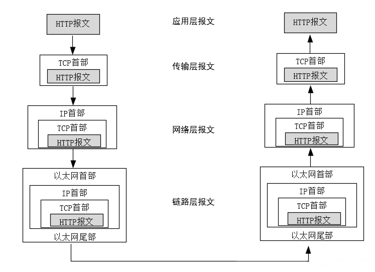

# 基本知识  
## 万物皆文件
是unix和类unix系统的核心设计哲学之一。
它并非字面意义上的“所有东西都是文件”，而是通过统一的文件接口抽象，将系统的各种资源(如硬件设备，进程，网络连接等)以文件的形式呈现和管理，这种设计简化了系统的复杂性，提供了高度一致的编程和操作体验。    

**用简单统一的规则解决复杂问题**    

### 核心思想 
- 抽象统一接口  
    ```
    所有资源(磁盘，键盘，内存，还是网络套接字)都通过文件描述符(file descriptor)进行访问，
    使用相同的系统调用如read(),write(),open(),close()
    ```
- 命名与路径
    ```
    资源在文件系统中被赋予路径(如/dev/sda 表示硬盘，
    /proc/cpuinfo表示CPU信息)，用户可以通过文件路径直接访问。
    ```

### 具体表现    

#### 硬件设备即文件 
- 磁盘和分区：/dev/sda,/dev/sdal        
- 键盘和鼠标：/dev/input/event*     
- 终端设备：/dev/tty*
- 实例
  ```
    # 向终端发送数据（写入文件）
    echo "Hello" > /dev/tty1
    
    # 读取磁盘的 MBR（前512字节）
    dd if=/dev/sda of=mbr.bin bs=512 count=1
  ```

#### 进程和系统信息即文件
- 进程信息：/porc/PID/目录
- 系统参数：/sys/---
- 实例：
    ```
    # 查看 CPU 信息
    cat /proc/cpuinfo
    
    # 动态修改内核参数（如开启 IP 转发）
    echo 1 > /proc/sys/net/ipv4/ip_forward
    ```

#### 网络和通信即文件   
- Unix域套接字：通过文件路径如 /tmp/my_socket 通信
- 管道(pipe):通过文件描述符传递数据 
- 示例：
  ```
    # 创建命名管道
    mkfifo my_pipe
    # 进程A写入
    echo "data" > my_pipe
    # 进程B读取
    cat my_pipe
  ```
#### 特殊文件类型   
- 块设备文件(如硬盘)：支持随机访问，以块为单位操作。    
- 字符设备文件(如串口)：按字节流顺序访问    

## shell脚本编程    

在win中就是批处理文件    .bat   .cmd   
linux是shell脚本文件    .sh 


都是用于自动化任务的脚本文件    

### 关键点
**约定头**
`#！/bin/bash`      
#!是一个约定的标记，它告诉系统这个脚本需要什么解释器来执行，即使用哪一种shell;后面的/bin/bash就是指明了解释器的具体位置        

**权限**
`chmod +x xxx.sh`   
为文件添加可执行权限    

**执行**
- ./xxx.sh :先按照 文件中#!指定的解析器解析，如果#！指定指定的解析器不存在 才会使用系统默认的解析器

- bash xxx.sh:指明先用bash解析器解析，如果bash不存在 才会使用默认解析器

- . xxx.sh 直接使用默认解析器解析（不会执行第一行的#！指定的解析器，但是第一行还是要写的

**添加环境变量**    
常见语句:   
`echo $PATH` 查看当前环境变量   
`source ~/.bashrc` 重新加载bashrc的内容(比如环境变量)   
`echo 'export MY_VAR="my_value"' >> ~/.bashrc`永久添加环境变量  
`export MY_VAR="my_value"`  临时添加环境变量    

### 语句
#### 输入语句   
`read -p 'input name:' name`    
运行结果：
`input name:`   

-p就是显示其中内容，不加就是直接读取

*读取多个值*
`read data1 data2`

#### 输出语句   
`echo $name`    

### 变量
*定义：*
变量名等于变量值    
`num = 10`  
*引用变量：*    
`$num`
*清楚变量名*    
`unset num` 

#### 控制语句   

**if控制语句**：    
```
格式一：
if [条件1]; then
    执行第一段程序
else
    执行第二段程序
fi
格式二：
if [条件1]; then
    执行第一段程序
elif [条件2]；then
执行第二段程序
else
    执行第三段程序
fi

比如：
if[$num = 1];then
    

```


**for循环语句**：   
```
#格式：for name [ [ in [ word ... ] ] ; ] do list ; done
  for 变量名 in 取值列表; do
    语句 1
  done

```

**while循环语句**： 
while
```
# While循环语句与for循环功能类似，主要用于对某个数据域进行循环读取、对文件进行遍历，通常用于需要循环某个文件或者列表，满足循环条件会一直循环，不满足则退出循环，其语法格式以while…do开头，done结尾与 
#while 关联的还有一个 until 语句，它与 while 不同之处在于，是当条件表达式为 false 时才循环，实际使用中比较少，这里不再讲解。

while  (表达式)
do
  语句1
done

```
break和continue 
```
# break 和 continue 语句
  break 是终止循环。
  continue 是跳出当前循环。
#示例 1：在死循环中，满足条件终止循环
while true; do
  let N++
  if [ $N -eq 5 ]; then
    break
fi
  echo $N
done
输出： 1 2 3 4

#示例 2：举例子说明 continue 用法
N=0
while [ $N -lt 5 ]; do
  let N++
if [ $N -eq 3 ]; then
  continue
fi
  echo $N
done

输出： 1 2 4

# 打印 1-100 数字
i=0
while ((i<=100))
do
        echo  $i
        i=`expr $i + 1`
done


```

# 基本操作  

## apt包管理器

##  一些常用命令行  

## 线程操作 

### 线程通信   

# TCP/IP协议  

TCP/IP协议
**应用层**主要协议有：HTTP（万维网服务）、FTP（文件传输）、SMTP（电子邮件）、SSH（安全远程登陆）、DNS（域名解析）
    ```
    利用基础网络交换应用程序的业务数据的协议
    是用来读取来自传输层的数据或者将数据传输写入传输层
    ```
**传输层**主要协议有: TCP传输控制协议和UDP用户数据报协议
    ```
    其中TCP是典型的可靠传输，而UDP则是不可靠传输
    解决了诸如端到端可靠性问题，能确保数据可靠的到达目的地，甚至能保证数据按照正确的顺序到达目的地
    ```

**网络层**的主要协议有:ICMP、IP、IGMP,主要负责网络中数据包的传输等***目标地址***
    ```
    是在复杂的网络环境中为要发送的数据报找到一个合适的路径进行传输
    网络层负责将数据传输到目标地址，目标地址可以是多个网络通过路由器连接而成的某一个地址
    ```
**链路层**的主要协议有：ARP、RARP等         
    ```
    链路层有时也称作数据链路层或网络接口层，用来处理连接网络的硬件部分。该层既包括操作系统硬件的设备驱动、NIC（网卡）、光纤等物理可见部分，还包括连接器等一切传输媒介。
    ```


## HTTP

### 分层传输过程


## TCP协议的报文格式    

## TCP的三次握手

## TCP的四次挥手    

# socket套接字
[CSDN来源](https://blog.csdn.net/Edward_Asia/article/details/127412092)	
## 网络     
网络分层	

7层模型	


## socket

### 源IP和目的IP    
*报文的来源*    
*报文的目的地*  

### 端口号
port	
是传输层协议的内容      	
- 是一个2字节16位的整数	
- 用来表示一个进程，告诉操作系统当前的这个数据要交给哪个进程来处理  	
- IP地址 + 端口号能够标识网络上的某一台主机的某个进程   	
- 一个端口号只能被一个进程占用  	
  
### 端口号和进程ID
pid表示唯一一个进程，此外我们的端口号也是唯一一个进程   
一个进程可以绑定多个端口号，但是一个端口号不能被多个进程绑定    
IP + port端口号 = 互联网中的唯一的一个进程  

*要先通信，本质为：*    
- 先找到目标主机
- 再找到该主机上的服务（进程）

**所以互联网中的通信实际上是进程间通信**    


### TCP/UDP协议 
TCP协议：
  - 传输层协议
  - 有链接
  - 可靠传输
  - 面向字节流

UDP协议：
  - 传输层协议
  - 无连接
  - 不可靠传输
  - 面向数据报  
  
### 网络字节序  

内存中的多字节数据相对内存地址有大端和小端之分，磁盘文件中的多字节数据相对于文件中的偏移地址也有大端小端之分，网络数据流同样有大端小端之分  
  - 发送主机通常将发送缓冲区中的数据按内存地址从低到高的顺序发出;
  - 接收主机把从网络上接到的字节依次保存在接收缓冲区中,也是按内存地址从低到高的顺序保存;
  - 因此,网络数据流的地址应这样规定:先发出的数据是低地址,后发出的数据是高地址
  - TCP/IP协议规定,网络数据流应采用大端字节序,即低地址高字节
  - 不管这台主机是大端机还是小端机, 都会按照这个TCP/IP规定的网络字节序来发送/接收数据;
  - 如果当前发送主机是小端, 就需要先将数据转成大端; 否则就忽略, 直接发送即可;

为使网络程序具有可移植性,使同样的C代码在大端和小端计算机上编译后都能正常运行,可以调用以下库函数做网络字节序和主机字节序的转换
```
#include <arpa/inet.h>
uint32_t htonl(uint32_t hostlong);
uint16_t htons(uint16_t hostshort);
uint32_t htohl(uint32_t netlong);
uint16_t htons(uint16_t netshort);
```
*h*：host   
*n*: network  
*l*：32位长整数  
*s*: 16位短整数 

## socket 编程接口

### socket 常见API  
```
// 创建 socket 文件描述符 (TCP/UDP, 客户端 + 服务器)
int socket(int domain, int type, int protocol);
// 绑定端口号 (TCP/UDP, 服务器)
int bind(int socket, const struct sockaddr *address,socklen_t address_len);
// 开始监听socket (TCP, 服务器)
int listen(int socket, int backlog);
// 接收请求 (TCP, 服务器)
int accept(int socket, struct sockaddr* address,socklen_t* address_len);
// 建立连接 (TCP, 客户端)
int connect(int sockfd, const struct sockaddr *addr,socklen_t addrlen);
```

### sockaddr结构

通用接口：sockaddr


## 基于UDP的套接字  
### 服务器

**创建套接字接口**：
```
#include <sys/types.h>          
#include <sys/socket.h>
int socket(int domain, int type, int protocol);
// domain: 套接字种类 AF_INET AF_UNIX (通信服务)
// type: 套接字类型 SOCK_STREAM(tcp:流式套接) SOCK_DGRAM(udp:用户数据报)
// protocol：套接字协议类型(tcp、udp下为0)
// 返回值为文件描述符，出错返回-1
```

**完全代码：**
```
#include<iostream>
#include<cerrno>
#include<sys/types.h>
#include<sys/socket.h>
using namespace std;
 
int main()
{
    int sock = socket(AF_INET, SOCK_DGRAM, 0);
    if(sock<0)
    {
        cerr << "socket create error:" << errno << endl;
        return 1;
    }
    cout << sock << endl;
    return 0;
}
```

**提供服务**：
就是读取客户端发送的数据，进行处理，并且返回处理结果  
UDP接口：
```
#include <sys/types.h>
#include <sys/socket.h>
 
// 接收数据
ssize_t recvfrom(int sockfd, void *buf, size_t len, int flags,struct sockaddr *src_addr, socklen_t *addrlen);
// sockfd：套接字
// buf：读取的数据存放的缓冲区
// len：缓冲区大小
// flags：读取方式，这里默认为0
// src_addr、addrlen：输入输出型参数，表示客户端socket信息(将数据处理结果返回给客户端时，需要用到)
// 返回值 ssize_t：读取信息的大小
 
// 返回数据
ssize_t sendto(int sockfd, const void *buf, size_t len, int flags,
              const struct sockaddr *dest_addr, socklen_t addrlen);
// 参数与上面相同
```

**UDP_server整体代码：**
```
#include<iostream>
#include<cerrno>
#include<string>
#include<sys/types.h>
#include<sys/socket.h>
#include<netinet/in.h>
#include<arpa/inet.h>
using namespace std;
 
 
string Usage(string proc)
{
    cout << "Usage: " << proc << "port" << endl;
}
 
int main(int argc, char*argv[])
{
    if(argc != 2)
    {
        Usage(argv[0]);
        return -1;
    }
    uint16_t port = atoi(argv[1]);
    // 1.创建套接字
    int sock = socket(AF_INET, SOCK_DGRAM, 0);
    if(sock<0)
    {
        cerr << "socket create error:" << errno << endl;
        return 1;
    }
    cout << sock << endl;
 
    // 2.给该服务器绑定ip和端口
    struct sockaddr_in local;
    local.sin_family = AF_INET; // 协议家族使用网络套接字
    local.sin_port = htons(port); // 此处的端口号，是我们计算机上的变量，是主机序列，需要转换成网络序列
    // a.需要将点分十进制，字符串IP地址，转化成四字节整数IP
    // b.需要考虑大小端
    // in_addr_t inet_addr(const char *cp); 能完成上面的两个工作
    // 但是云服务器上不允许用户直接bind公网IP，而且实际编写时也不会指明IP
    // 如果bind的是确定的IP(主机)，意味着只有发送到该IP主机上面的数据，才会交给你的网络进程
    // 但是一般服务器可能有多张网卡，配置多个IP，我们需要的不是某个IP上面的数据，而是所有发送到该主机的数据
    local.sin_addr.s_addr = INADDR_ANY; // (INADDR_ANY：0)
 
    if(bind(sock, (struct sockaddr*)&local, sizeof(local)) < 0)
    {
        cerr << "bind error : " << errno << endl;
        return 2;
    }
 
    // 3. 提供服务
    bool quit = false;
    #define NUM 1024
    char buffer[NUM] ;
    while (!quit) // 对于服务器来说，应该是24小时都能提供服务，所以这里是死循环
    {
        // 客户端信息
        struct sockaddr_in peer;
        socklen_t len = sizeof(peer);
        // 注意：我们默认认为通信的数据是双方在互发字符串
        ssize_t cnt = recvfrom(sock, buffer, sizeof(buffer) - 1, 0, (struct sockaddr *)&peer, &len);
        if(cnt > 0)
        {
            // 在网络通信过程中，只有报文大小，或者是字节流中字节的个数，没有字符串这样的概念
            buffer[cnt] = 0;
            cout << "client# " << buffer << endl;
            string echo_hello = buffer;
            echo_hello += "...";
            sendto(sock, echo_hello.c_str(), echo_hello.size(), 0, (struct sockaddr *)&peer, len);
 
        }
        else
        {
            cout << "recvfrom error" << errno << endl;
            return 3;
        }
        
    }
 
    return 0;
}
```

### 客户端  
**操作代码**
```
#include<iostream>
#include<cerrno>
#include<string>
#include<sys/types.h>
#include<sys/socket.h>
#include<netinet/in.h>
#include<arpa/inet.h>
using namespace std;
 
void Usage(string proc) // 使用手册 (使用方式为：./udp_client ip port)
{
    cout << "Usage: \n\t" << proc << " server_ip serverport" << endl;
}
int main(int argc, char*argv[])
{
    if(argc != 3)
    {
        Usage(argv[0]);
        return 1;
    }
    // 1. 创建套接字
    int sock = socket(AF_INET, SOCK_DGRAM, 0);
    if(sock<0)
    {
        cout << "socket error : " << errno << endl;
    }
 
    // 客户端不需要显式bind，一旦显式bind，就必须明确client要和哪一个port关联
    // client指明的端口号，可能在client端被占用，导致客户端无法使用。
    // server的port必须明确，而且不能改变，但client只要有就行，一般由OS自动bind
    // 在client正常发送数据的时候，OS自动bind，采用随机端口的方式
    
     // 数据发送给谁
    struct sockaddr_in server;
    server.sin_family = AF_INET;
    server.sin_port = htons(atoi(argv[2])); 
    // 传入的第三个参数为端口号，但是类型为char，需要转化成整型；但这个整型是主机序列，再将这个整型转化成网络序列
    server.sin_addr.s_addr = inet_addr(argv[1]); 
    // 这里的目的IP不能是INADDR_ANY,需要给出具体ip，而传入的第二个参数就是ip地址，所以直接使用inet_addr转化成四字节整型即可
    
    // 2.使用服务
    while(1)
    {
        // a.数据从哪里来
        string message;
        cout << "输入# ";
        cin >> message;
        
         // 发送数据
        sendto(sock, message.c_str(), message.size(), 0, (struct sockaddr *)&server, sizeof(server));
 
        // 此处tmp只是占位符的作用
        struct sockaddr_in tmp;
        socklen_t len = sizeof(tmp);
        char buffer[1024];
 
        // 接收数据
        ssize_t cnt = recvfrom(sock, buffer, sizeof(buffer), 0, (struct sockaddr *)&tmp, &len);
        if(cnt > 0)
        {
            buffer[cnt] = 0;
            cout << "server echo#" << buffer << endl;
        }
        else
        {
            cout << "recvfrom error" << errno << endl;
            return 2;
        }
    }
    return 0;
}

```

## 基于TCP的套接字  
### 服务端

#### 创建套接字
区别在于socket第二个参数为流式套接，就直接放代码  
```
int sock = socket(AF_INET, SOCK_STREAM, 0); // ipv4 , 流式套接c
if(sock<0)
{
    cerr << "socket error: " << errno << endl;
    return 2;
}
```


#### 绑定 bind

udp 一样  
```
struct sockaddr_in local;
memset(&local, 0, sizeof(local)); // 将local清0
local.sin_family = AF_INET;
local.sin_port = htons(atoi(argv[1]));
local.sin_addr.s_addr = INADDR_ANY;
if(bind(sock, (struct sockaddr*)&local, sizeof(local)) < 0)
{
    cerr << "bind error" << errno << endl;
    return 3;
}
```
#### 监听  （建立连接）（listen、accept）

udp通信前不需要于客户端建立连接，而tcp是需要连接的，这里的服务器端是被动接受客户端的连接  


**监听**：
因为服务器需要再任何时候都能为客户端提供服务，所以这一过程应该是周而复始的等待客户的到来，所以这一过程被称为监听    

监听接口
```
#include <sys/types.h>          
#include <sys/socket.h>
 
int listen(int sockfd, int backlog);  // 将套接字设为监听状态
 
// sockfd: 监听套接字
// backlog: 后面解释， 现在先设置为5
// 返回值: 成功返回0， 失败返回-1
```

接受连续接口
```
#include <sys/types.h>          
#include <sys/socket.h>
 
int accept(int sockfd, struct sockaddr *addr,socklen_t*addrlen); // 接受客户端发起的连接
// sockfd: 监听套接字，用于监听客户端发起的连接 
// addr: 监听套接字协议
// addrlen: 监听套接字大小
// 返回值: 成功返回非0整数，是一个文件描述符，是提供服务的套接字
```

**code**  
```
// 监听
const int back_log = 5;
if (listen(listen_sock, back_log) < 0)
{
    cerr << "listen error" << errno << endl;
    return 4;
}
while(true) // 一直循环接受客户端发起的连接
{
    struct sockaddr_in peer;
    socklen_t len = sizeof(peer);
    int new_sock = accept(listen_sock, (struct sockaddr *)&peer, &len); 
    // 上面创建的监听套接字只起到监听作用
    // accept接口返回的套接字，才能为客户端提供服务
    if(new_sock < 0) // 如果未收到套接字，则继续循环接收
    {
        continue;
    }
 }
```

#### 提供服务  
tcp协议中的数据是以字节流的方式传输，所以服务器可以使用read,write,recv,send等方式接受数据   

**read,write**  
```
#include<iostream>
#include<string>
#include<sys/socket.h>
#include<sys/types.h>
#include<netinet/in.h>
#include<arpa/inet.h>
#include<cstring>
#include<unistd.h>
using namespace std;
 
void Usage(string proc)
{
    cout << "Usage: " << proc << "port" << endl;
}
int main(int argc, char* argv[])
{
    if(argc != 2)
    {
        Usage(argv[0]);
        return 1;
    }
    // 1.创建监听套接字
    int listen_sock = socket(AF_INET, SOCK_STREAM, 0); // ipv4 , 流式套接
    if(listen_sock < 0)
    {
        cerr << "socket error: " << errno << endl;
        return 2;
    }
    // bind
    // 填充套接字信息
    struct sockaddr_in local;
    memset(&local, 0, sizeof(local));
    local.sin_family = AF_INET;
    local.sin_port = htons(atoi(argv[1]));
    local.sin_addr.s_addr = INADDR_ANY;
    if(bind(listen_sock, (struct sockaddr*)&local, sizeof(local)) < 0)
    {
        cerr << "bind error" << errno << endl;
        return 3;
    }
    // 监听
    const int back_log = 5;
    if (listen(listen_sock, back_log) < 0)
    {
        cerr << "listen error" << errno << endl;
        return 4;
    }
    while(true)
    {
        struct sockaddr_in peer;
        socklen_t len = sizeof(peer);
        int new_sock = accept(listen_sock, (struct sockaddr *)&peer, &len); 
        // 上面创建的监听套接字只起到监听作用
        // accept接口返回的套接字，才能为客户端提供服务
        if(new_sock < 0)
        {
            continue;
        }
	    cout<<"get a new link..."<< endl;
        // 提供服务
        while(true) //同样也是循环读取数据
        {
            char buffer[1024];
            memset(buffer, 0, sizeof(buffer));
            ssize_t cnt = read(new_sock, buffer, sizeof(buffer) - 1); 
            // 从new_sock套接字中读取数据，存放在buffer中
            if(cnt > 0)
            {
                buffer[cnt] = 0;
                // 在数据末尾添加'\0'
                cout << "client# " << buffer << endl;
                string echo_string = "server--> ";
                echo_string += buffer;
                write(new_sock, echo_string.c_str(), echo_string.size());
                //将数据写回给客户端
            }
            else if(cnt == 0) //如果读到的个数为0，则表示客户端已经停止发送数据，则退出服务
            {
                cout << "client quit..." << endl;
                break;
            }
            else //如果读取的个数小于0，则表示读取失败，退出服务
            {
                cerr << "read error" << endl;
                break;
            }
        }
    }
    return 0;
}
```


## 总结
- 创建socket的过程(socket())，本质是打开文件。(仅有系统相关的内容)
- bind()，struct sockaddr_in -> ip，port，本质是ip+port和文件信息进行关联
- listen()，本质是设置该socket文件的状态，允许别人来连接我
- accpet()，获取新链接到应用层，是以fd为代表的；所谓的连接，在OS层面，本质其实就是一个描述连接的结构体(文件)
- read/write，本质就是进行网络通信，对于用户来讲就相当于在进行正常的文件读写
- close(fd)，关闭文件；系统层面，释放曾经申请的文件资源，连接资源等；网络层面，通知对方，我的连接已经关闭了
- connect()，本质是发起连接，在系统层面，就是构建一个请求报文发送过去；网络层面，发起tcp连接的三次握手
- close()，client、server，本质在网络层面就是在进行四次挥手
