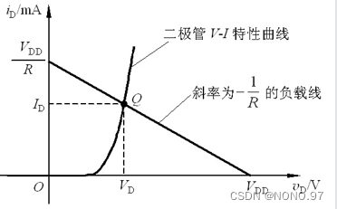
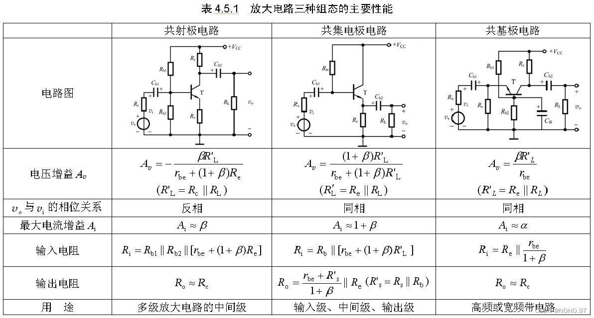
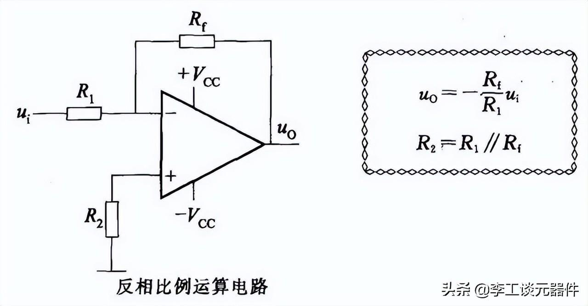
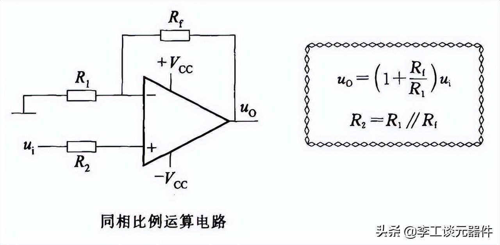
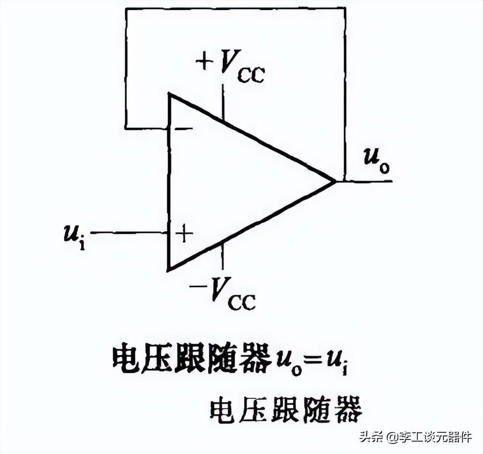
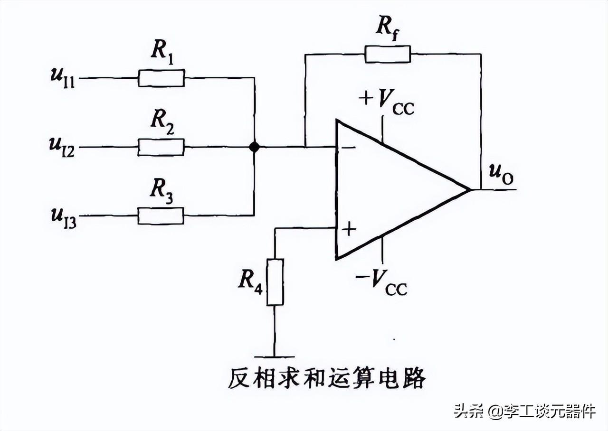
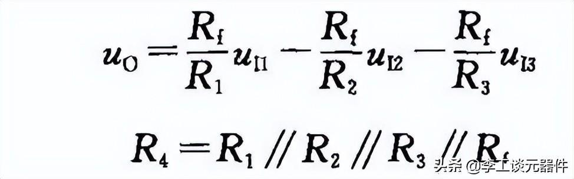
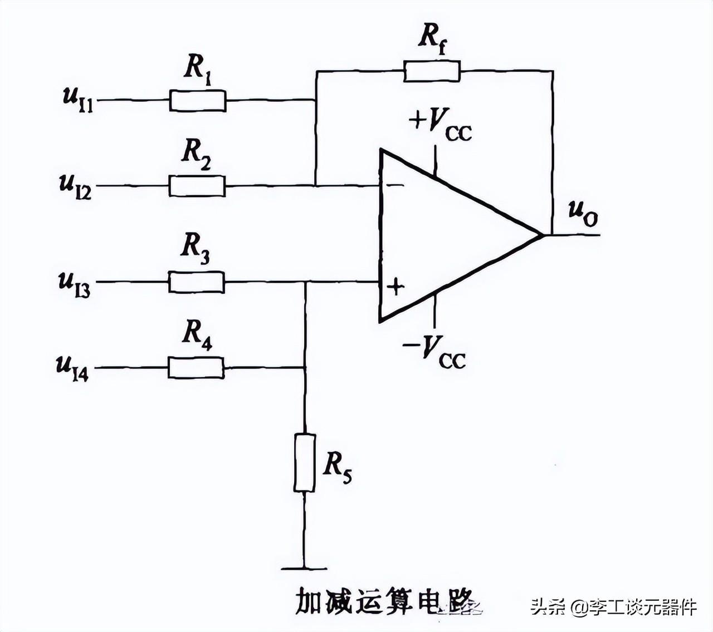
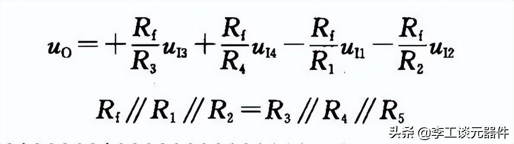
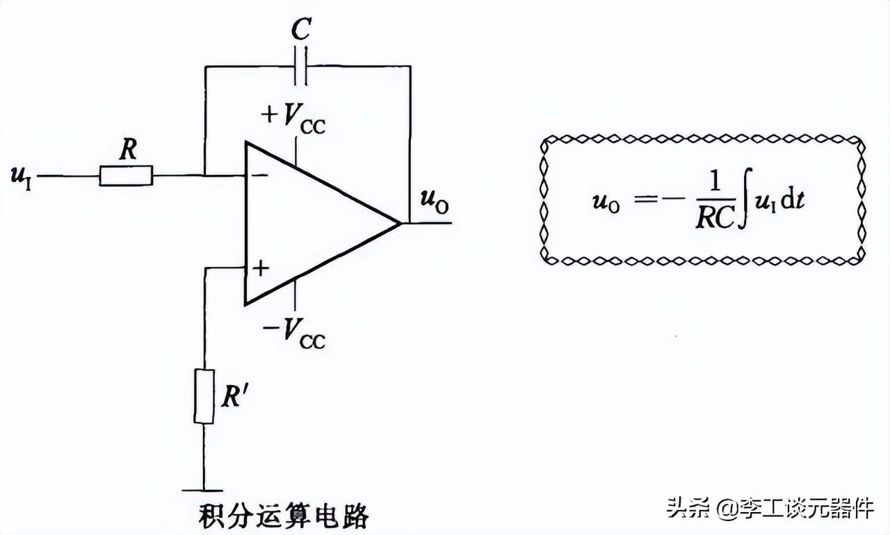

<!--
 * @Author: ygh && “ygh2048009576@outlook.com”
 * @Date: 2025-03-09 20:13:30
 * @LastEditors: ygh && “ygh2048009576@outlook.com”
 * @LastEditTime: 2025-03-29 22:18:24
 * @FilePath: \makedown\模电\模电.md
 * @Description: 
 * 
 * Copyright (c) 2025 by ygh, All Rights Reserved. 
-->
# 二极管
## 关键参数 

最大整流电流 IF     
反向击穿电压 Vbr
反向电流 Ir 
极间电容 Cd 
反向恢复时间        

二极管伏安特性曲线      

      

# 三极管
        

Ic = BIb

Ie = Ic + Ib        

## NPN

## PNP

## 工作区间
- 截止状态
- 饱和状态
- 放大状态
  - 发射结正偏
  - 集电结反偏

## 三种组态

### 共基极
信号由基极输入，集电极输出      

只有电压放大作用，没有电流放大，有电流跟随      

输入电阻小，输出电阻看集电极电阻        

适合高频或宽频带低输入阻抗      

### 共射极
信号由基极输入，发射极输出  

电压电流增益大于1，输入电阻始终，输出电阻取决于集电极电阻，适合低频下的多级放大电路中间级       

### 共集电极    
信号由发射极输入，集电极输出        

只有电流放大作用，没有电压放大，有电压跟随作用，输入电阻大，输出电阻小，频率特性好  

用于输入，输出级，后缓冲极      

## 直流分析

## 小信号分析

小信号等效电路      

# MOS管

## N MOS

### 增强型

## P MOS

### 耗尽型  

# 差分放大电路
   

## 作用
共模抑制        
差模放大     

## 指标

共模抑制比      

# 运放
## 性质 

虚短    

虚断        

## 放大器
### 反向比例放大器

        

### 同相比例放大器

        

### 电压跟随器
输入电阻高，输出电阻小      

## 电压跟随器

## 运算器

### 反向求和运算电路

### 加减运算电路

### 积分运算电路

# 反馈

## 正反馈
输入量不变，反馈后输出量变大

## 负反馈
输入量不变，反馈后输出量变小

# 功放

## 甲类功放

## 乙类功放

## 甲乙类功放

# 跳转链接
[点这里跳转list](../list.md)

