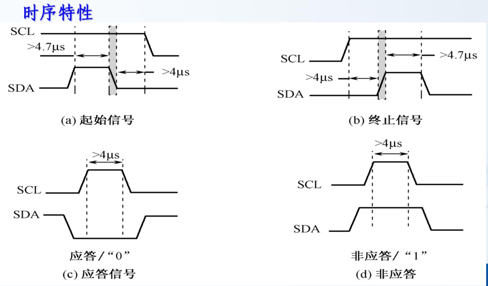
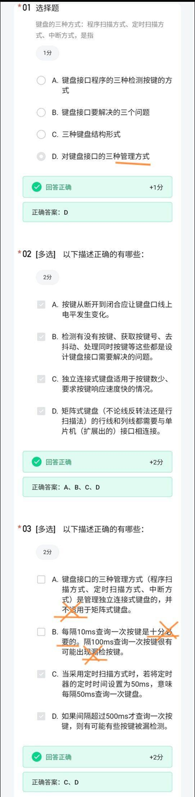
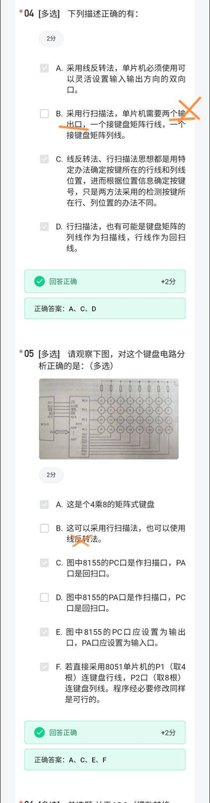
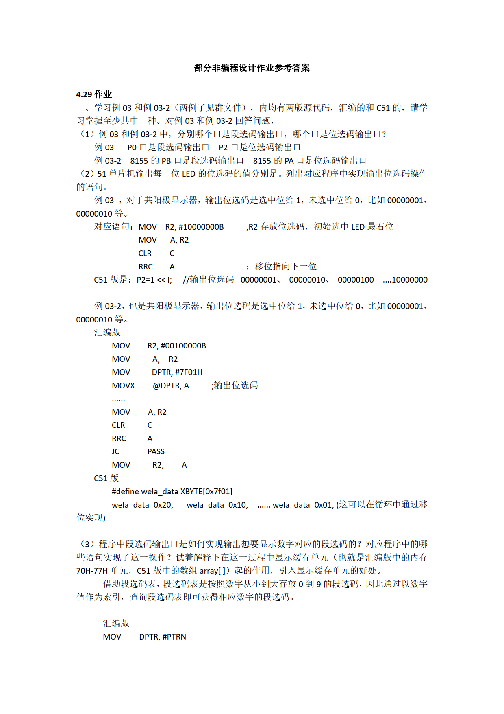
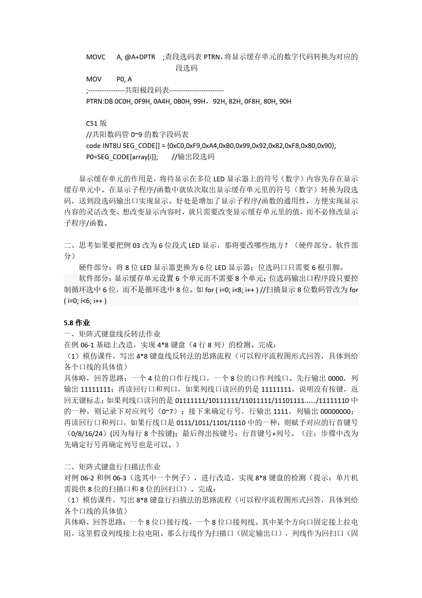
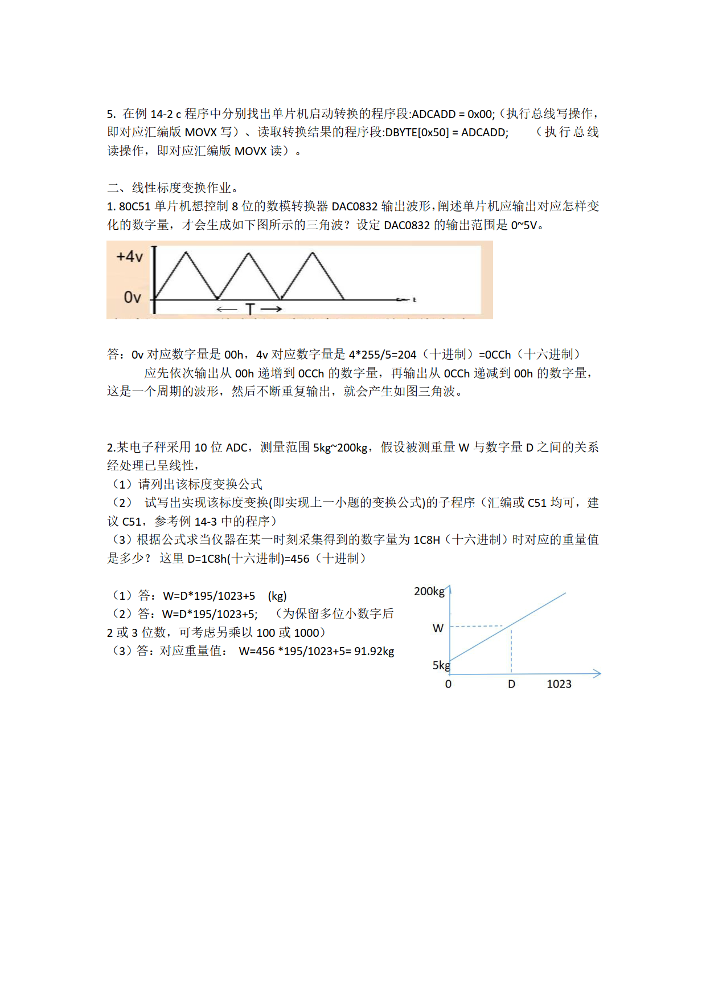

# 并行接口
## 数码管

段式LED显示器   

段码格式：


|D7|D6|D5|D4|D3|D2|D1|D0|
|-|-|-|-|-|-|-|-|
|dp|g|f|e|d|c|b|a|

### 种类

#### 共阴级
```
//共阴数码管0~9的数字段码表
code INT8U SEG_CODE[] = {0x3f,0x06,0x5b,0x4f,0x66,0x6d,0x7d,0x07,0x7f,0x6f};
```
#### 共阳级
```
//共阳数码管0~9的数字段码表
code INT8U SEG_CODE[] = {0xC0,0xF9,0xA4,0xB0,0x99,0x92,0x82,0xF8,0x80,0x90};

```
### 显示

#### 静态扫描技术
同时点亮
---

#### 动态扫描技术
分时轮流点亮
--- 

有位 - 段 - 位  
段 - 位 - 段    
两种扫描方式    

#### 关键概念

**位选码：** 输出位选信号，某个时刻只能选中其中一位LED显示器    
**段选码：** 输出段选信号，某个时刻只能选中LED显示器中的相应段      

##### 显示缓冲区     
每LED对应显示缓冲区的一个单元（8位）                 


## 点阵LED显示器    

8*8 矩阵    

### 动态显示：

采用列 - 点阵 - 列      
或  点阵- 列 - 点阵     


### 扫描方法    
列选码 + 按列点阵码     
段选码 + 按行点阵码     


## 键盘

### 独立式键盘
#### 按键去抖动

软件去抖 - 延时     
硬件去抖 - 滤波 

### 键盘管理方式

- 查询
  - 程序扫描  -- 在主循环中程序调用
  - 定时扫描  -- 定时中断中程序调用
- 中断
  

### 键盘阵列


#### 线反转法   
- 同时作为输入和输出口，进行交替
- 已知4 pin电平，借此推断剩下 4 pin电平高低，对比得出哪个按键被按下     
#### 行扫描法   
- 扫描口输出，回扫口输入
- 已知扫描口电平，推断回扫口电平高低，对比得出哪个按键被按下        


## LCD屏幕      

### 显示控制

一般具有显示控制器，通过数据总线与MCU进行通信       

## 并行总线扩展
### 三总线
- 地址总线 AB
- 数据总线 DB
- 控制总线 CB


### 扩展结构

- P0口作为低8位地址/数据总线
  - 分时复用
- 控制信号线
  - P3口的第二功能

### 控制分配

**线选法**  
片选信号控制，地址不唯一            

**译码法**  
译码器对高位地址译码作为片选信号        

# 串行接口

## IIC总线

### 硬件

- 串行数据线SDA
- 串行时钟线SCL     


特点
- 总线上必须有上拉电阻，一般可选5-10K   
- IIC上器件，理论上7位寻址可以挂接2^7 -1 个，但是由于等效电容应该小于400pF
- 一个时钟周期传递一位数据  

### 软件
有主从和多主两种方式        

一般使用 主从   
唯一主机，多个从机。        

#### 数据协议：
##### 器件地址：
|D7|D6|D5|D4|D3|D2|D1|D0|
|-|-|-|-|-|-|-|-|
|DA3|DA2|DA1|DA0|A2|A1|A0|R/W|
固定位|固定位|固定位|固定位|可编程位|可编程位|可编程位|方向位|

|固定位|可编程位|方向位|
|-|-|-|
|厂商给出|器件地址管脚确定|决定读写。0写1读|

写 -- 主机给从机    
读 -- 从机给主机    
### 协议解析

起始信号：  
SCL高电平时，SDA从高电平变为低电平  

终止信号：  
SCL高电平，SDA从低电平变为高电平    

时钟信号：
- 时钟信号高电平传递读取总线上数据
- 时钟信号低电平总线上切换下一位数据

数据信号：
- 以字节为单位传递数据，先传递高位字节，再传递低位字节
- 每传递一位字节，必须跟随一位应答位
- 应答位由接受信号产生，低电平表示应答  
- 主器件接受到从器件发出的最后一个数据后，给从器件发送一个NACK,从器件释放SDA信号线，结束通信        

信号图例    

## SPI总线

### 硬件

#### 引脚：
- CS 片选信号
- SCK 时钟
- MOSI  主机发送从机接收
- MISO   主机接收从机发送

### 软件
#### 数据协议
- 不需要地址字节，不需要起始停止信号
- 没有应答机制

#### 工作模式

|SPI模式|时钟极性CPOL|时钟相位CPHA|描述|
|:----:|:----:|:----:|:----:|
|0|0|0|SCK空闲低电平，上升沿锁存SPI数据|
|1|0|1|SCK空闲低电平，下降沿锁存SPI数据|
|2|1|0|SCK空闲高电平，下降沿锁存SPI数据|
|3|1|1|SCK空闲高电平，上升沿锁存SPI数据|


# ADC/DAC

## DAC
数字转模拟      

### 数据输入
- 单缓冲，双缓冲，直通（为避免毛刺）
- 分辨率 8/12位

## ADC

### 读数转换        
线性标度转换：


# 51单片机补充资料
## 定时器C的使用

### **三、定时器初值计算方法**
#### 1. **公式**
\[
\text{初值} = 65536 - \frac{\text{定时时间} \times \text{晶振频率}}{12}
\]
- **65536**：16位定时器最大值（\(2^{16}\))。
- **12**：8051的机器周期数（12时钟周期 = 1机器周期）。

#### 2. **示例（晶振11.0592MHz，定时1ms）**
1. 计算机器周期：
   \[
   T_{\text{机器周期}} = \frac{12}{11.0592 \times 10^6} \approx 1.085 \mu s
   \]
2. 计算所需计数值：
   \[
   N = \frac{1 \times 10^{-3}}{1.085 \times 10^{-6}} \approx 921.6
   \]
3. 计算初值：
   \[
   \text{初值} = 65536 - 922 = 64614
   \]
4. 转换为十六进制：
   \[
   64614_{10} = \text{0xFC18} \quad \Rightarrow \quad \text{TH0=0xFC},  \text{TL0=0x18}
   \]

---

### 二、定时器（Timer 0/1）
#### 1. 定时器介绍
- **模式**：工作模式通过`TMOD`设置（常用模式1：16位定时器）。
- **计数原理**：每12个时钟周期计数1次（12T模式）。
- **溢出中断**：计数器溢出时触发中断（TF0/TF1置位）。

#### 2. 定时器配置步骤
1. 设置`TMOD`选择定时器模式。
2. 计算并装入初值（`TH0`/`TL0`）。
3. 开启定时器中断`ET0`。
4. 启动定时器`TR0=1`。

#### 3. 定时器代码示例（1ms定时）
```c
#include <reg51.h>

void Timer0_ISR() interrupt 1 { // 中断号1对应Timer0
    TH0 = 0xFC; TL0 = 0x18;    // 重装初值（1ms）
    P1 = ~P1;                  // 反转P1口（1ms翻转一次）
}

void main() {
    TMOD = 0x01;   // Timer0模式1（16位定时器）
    TH0 = 0xFC;   // 初值高8位
    TL0 = 0x18;   // 初值低8位
    ET0 = 1;      // 允许Timer0中断
    TR0 = 1;      // 启动Timer0
    EA = 1;       // 开启总中断
    while(1);
}
```

---


## 外部中断的使用       
### 一、中断系统
#### 1. 中断介绍
- **作用**：响应外部事件（如按键、定时器溢出）时暂停主程序，执行中断服务程序（ISR）。
- **中断源**：外部中断（INT0/INT1）、定时器中断（TF0/TF1）、串口中断等。
- **中断优先级**：通过`IP`寄存器配置，默认优先级为INT0 > TF0 > INT1 > TF1 > 串口。

#### 2. 中断配置步骤
1. 设置中断触发方式（边沿/电平）`TCON`。
2. 开启中断允许位 `IE`。
3. 编写中断服务函数（需指定中断号）。

#### 3. 外部中断代码示例（INT0）
```c
#include <reg51.h>

void INT0_ISR() interrupt 0 { // 中断号0对应INT0
    P1 = ~P1; // 反转P1口状态（示例：LED闪烁）
}

void main() {
    IT0 = 1;    // 设置INT0为下降沿触发
    EX0 = 1;    // 允许INT0中断
    EA = 1;     // 开启总中断
    while(1);   // 主循环等待中断
}
```

---
## 地址扩展     
见XBYTE


## 寄存器
| 寄存器 | 功能说明 |
|--------|----------|
| IE   | 中断允许控制（EA、ET0等） |
| TMOD | 定时器模式（低4位控制T0） |
| TCON | 控制位（TR0启动、TF0溢出标志） |
| TH0/TL0 | Timer0初值（高/低8位） |
---

# 补充材料
## 作业 - 选择

       
    

## 作业 - 非代码





 

 

## 51单片说明
---

### 一、电源与时钟引脚
| **引脚** | **名称**    | **功能**                                                                 |
|----------|-------------|-------------------------------------------------------------------------|
| **40**   | VCC         | 主电源正极（+5V）                                                       |
| **20**   | GND         | 电源地                                                                  |
| **18**   | XTAL2       | 晶振输出端（接外部晶振或时钟源）                                        |
| **19**   | XTAL1       | 晶振输入端（若用外部时钟，直接输入至此）                                |

> ⚠️ **注意**：  
> - 晶振频率通常为 **11.0592MHz**（串口波特率精准）或 **12MHz**（常用）  
> - 需在XTAL1和XTAL2之间并联 **2个30pF电容** 到地  

---

### 二、控制信号引脚
| **引脚** | **名称**    | **功能**                                                                 |
|----------|-------------|-------------------------------------------------------------------------|
| **9**    | RST         | **复位引脚**（高电平有效，持续≥2个机器周期触发复位）                     |
| **30**   | ALE/PROG    | - **ALE**：地址锁存使能（扩展外部存储器时锁存低8位地址）<br>- **PROG**：编程脉冲输入（烧录Flash时用） |
| **29**   | PSEN        | 外部程序存储器读选通信号（低电平有效）                                  |
| **31**   | EA/VPP      | - **EA=1**：执行内部程序存储器<br>- **EA=0**：执行外部ROM<br>- **VPP**：编程电压（+12V） |

---

### 三、通用I/O端口（4组8位端口）
#### **1. P0口（32-39脚）**
| **模式**       | **功能**                                                                 |
|----------------|-------------------------------------------------------------------------|
| **普通I/O**    | 开漏输出（需外接上拉电阻），输入前先写1                                  |
| **扩展模式**   | 复用为 **低8位地址（A0-A7）+ 数据总线（D0-D7）**（配合ALE使用）          |

#### 2. P1口（1-8脚）
- **纯I/O功能**：唯一无复用功能的端口（内部带上拉电阻）  
- 常用作：按键输入、LED输出、传感器接口等  
#### 3. P2口（21-28脚）
| **模式**       | **功能**                                                                 |
|----------------|-------------------------------------------------------------------------|
| **普通I/O**    | 内部带上拉电阻的准双向口                                                 |
| **扩展模式**   | 复用为 **高8位地址（A8-A15）**（访问外部存储器时）                       |

#### 4. P3口（10-17脚）—— 复用功能核心 
| **引脚** | **默认功能** | **复用功能**                | **说明**                     |
|----------|-------------|----------------------------|-----------------------------|
| **P3.0** | I/O         | **RXD**                    | 串行数据接收（UART）         |
| **P3.1** | I/O         | **TXD**                    | 串行数据发送（UART）         |
| **P3.2** | I/O         | **INT0**                   | 外部中断0（低电平/下降沿触发）|
| **P3.3** | I/O         | **INT1**                   | 外部中断1                   |
| **P3.4** | I/O         | **T0**                     | 定时器0外部计数输入          |
| **P3.5** | I/O         | **T1**                     | 定时器1外部计数输入          |
| **P3.6** | I/O         | **WR**                     | 外部RAM写选通（扩展模式）    |
| **P3.7** | I/O         | **RD**                     | 外部RAM读选通（扩展模式）    |

> 💡 **复用功能激活**：  
> 需设置相关寄存器（如中断使能位、定时器控制位），否则默认为普通I/O口。

---
