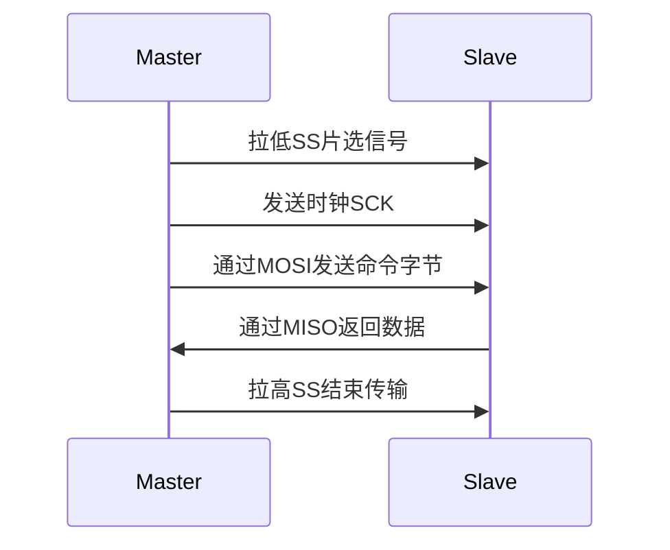
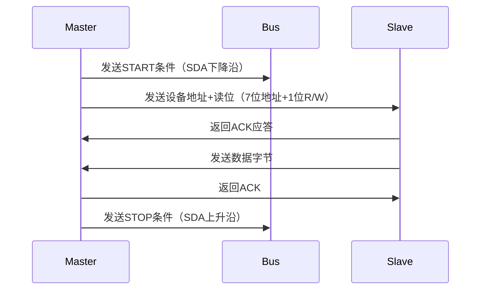
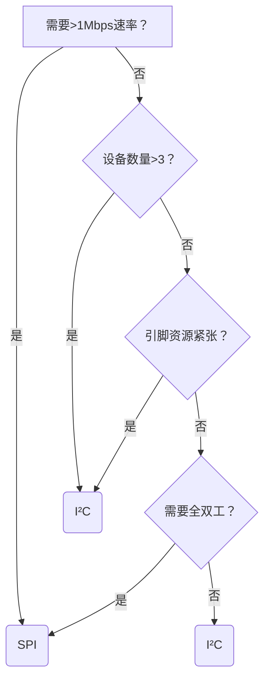

# 并行接口和串行接口优缺点

### 并行接口 vs 串行接口 全面对比

| 特性                | 并行接口                            | 串行接口                            |
|---------------------|-----------------------------------|-----------------------------------|
| **基本原理**        | 多根数据线同时传输数据位             | 单根数据线顺序传输数据位             |
| **典型代表**        | ISA, PCI, PATA, LPT(打印机接口)     | USB, SATA, PCIe, I2C, SPI, UART    |
| **数据线数量**      | 多(8/16/32/64根) + 控制线           | 少(1-4对差分线) + 时钟线(可选)       |
| **传输速度**        | ⭐ 单周期传输多位(理论带宽高)         | ⭐⭐ 通过高频率补偿(现代应用实际速度更快) |
| **传输距离**        | ⚠️ 短距离(<0.5m)，易受干扰          | ✅ 长距离(USB3.0可达3m，光纤千米级)    |
| **布线复杂度**      | ⚠️ 高(线束粗大，PCB走线复杂)         | ✅ 低(线缆细，连接简单)              |
| **成本**            | ⚠️ 高(更多引脚/连接器)               | ✅ 低(简化硬件设计)                  |
| **时钟同步**        | 需要严格同步(时钟偏斜问题)           | 内嵌时钟/异步传输(更灵活)            |
| **抗干扰能力**      | ⚠️ 差(多线间串扰)                   | ✅ 强(差分信号+编码技术)             |
| **功耗**            | ⚠️ 高(多驱动器同时工作)              | ✅ 低(简化电路)                     |
| **扩展性**          | ⚠️ 有限(引脚数量限制)                | ✅ 高(总线式/菊花链拓扑)             |
| **热插拔支持**      | ⚠️ 通常不支持                      | ✅ 普遍支持(如USB, Thunderbolt)      |

---

### 并行接口详细分析
**优点：**
1. **瞬时带宽高**：单时钟周期传输多个数据位
2. **协议简单**：直接映射到内存地址，编程直观
3. **低延迟**：适合实时控制系统

**缺点：**
1. **时钟偏斜(Clock Skew)**：长距离传输时各数据位到达时间不一致
2. **信号串扰**：相邻线路电磁干扰严重
3. **物理限制**：连接器庞大（如PATA 40针接口）
4. **升级困难**：增加位宽需重新设计硬件

**典型应用：**
- 早期计算机内部总线（ISA, PCI）
- 打印机端口（LPT）
- 单片机与片外RAM连接（如8051的XDATA总线）

---

### 串行接口详细分析
**优点：**
1. **高频率优势**：PCIe 5.0可达32GT/s（千兆传输/秒）
2. **抗干扰设计**：
   - 差分信号（如USB的D+/D-）
   - 8b/10b等编码技术
3. **拓扑灵活**：支持星型、菊花链、树状等连接
4. **功耗优化**：链路电源管理（如USB挂起模式）

**缺点：**
1. **协议复杂度**：需要串并转换和编解码
2. **传输开销**：添加包头/包尾等控制信息
3. **初始延迟**：建立连接需要握手过程

**速度演进示例（存储接口）：**
1. 并行PATA (133 MB/s) → 
2. 串行SATA I (150 MB/s) → 
3. SATA III (600 MB/s) → 
4. NVMe over PCIe 4.0 (8 GB/s)

---

### 技术发展趋势
1. **并行→串行转型**：
   - PCI → PCIe
   - PATA → SATA
   - LPT → USB

2. **串行技术优化**：
   - **通道聚合**：PCIe x16 = 16条串行通道并行
   - **编码升级**：从8b/10b到128b/130b（PCIe）
   - **信号增强**：PAM4（四级脉冲幅度调制）

3. **混合技术**：
   - DDR内存：内部并行（64位），对外串行（通过SerDes）
   - GDDR6X：采用PAM4技术的显存接口

---

### 选型建议
**选择并行接口当：**
- 极低延迟要求（纳秒级响应）
- 短距离板级连接（<10cm）
- 简单嵌入式系统（如8051扩展RAM）

**选择串行接口当：**
- 需要高速数据传输（>1Gbps）
- 长距离连接（>0.5m）
- 多设备连接（USB集线器）
- 空间受限应用（移动设备）

> **行业现状**：现代计算机系统中，串行接口已全面取代并行接口。例如：
> - CPU-Z显示：现代CPU通过PCIe x16连接GPU（串行）
> - 任务管理器：NVMe SSD使用PCIe通道（串行）
> - 外部设备：USB4/Thunderbolt 4提供40Gbps带宽

这种转型源于串行接口在物理实现、成本效益和扩展性方面的显著优势，尤其在高频领域克服了并行接口的时钟同步瓶颈。


以下是SPI（Serial Peripheral Interface）与I²C（Inter-Integrated Circuit）两种串行通信协议的详细对比分析，涵盖技术特性、应用场景和实际设计考量：

---

# SPI vs I²C 核心特性对比表
| **特性**               | **SPI**                                  | **I²C**                                  |
|------------------------|------------------------------------------|------------------------------------------|
| **通信类型**           | 全双工（同时收发）                       | 半双工（分时收发）                       |
| **信号线数量**         | 4线制：<br>SCK, MOSI, MISO, SS           | 2线制：<br>SDA（数据）, SCL（时钟）       |
| **拓扑结构**           | 主从式（点对点或菊花链）                 | 多主多从（总线式）                       |
| **最大速率**           | ⭐ 高速（可达100+ Mbps）<br>（如STM32的108MHz） | ⭐ 中速（标准模式100kbps，高速模式3.4Mbps） |
| **寻址方式**           | 硬件片选（SS引脚）                       | 软件地址（7位/10位地址码）               |
| **时钟机制**           | 同步（主设备产生时钟）                   | 同步（主设备产生时钟）                   |
| **总线仲裁**           | 不需要（片选独占）                       | 需要（多主竞争检测）                     |
| **功耗**               | ⚠️ 较高（持续时钟驱动）                  | ✅ 较低（时钟拉伸技术可暂停）             |
| **布线复杂度**         | ⚠️ 高（每新增设备需1条SS线）             | ✅ 低（所有设备挂载2条总线）              |
| **传输效率**           | ⭐ 高（无地址/ACK开销）                  | ⚠️ 中（约30%带宽用于协议开销）           |
| **抗干扰能力**         | ⚠️ 一般（单端信号）                      | ⚠️ 一般（单端信号）                      |
| **开发难度**           | ✅ 简单（寄存器直接读写）                 | ⚠️ 中等（需处理协议状态机）              |
| **典型应用场景**       | 高速Flash、显示屏、ADC                   | 传感器、EEPROM、低速外设                 |

---

### 工作原理深度解析

#### **SPI工作流程**（以读取为例）：


#### **I²C工作流程**（以读取为例）：


---

### 关键差异详解

1. **总线竞争处理**
   - **SPI**：硬件片选避免冲突，但需要更多IO引脚
   - **I²C**：多主竞争时通过SDA仲裁（先发0的设备获胜）

2. **时钟控制**
   - **SPI**：时钟始终由主设备控制，从设备必须实时响应
   - **I²C**：支持时钟拉伸（从设备可拉低SCL暂停传输）

3. **错误检测**
   - **SPI**：无硬件错误检测机制
   - **I²C**：每字节后带ACK/NACK应答

4. **传输效率案例**
   - 传输1024字节数据：
     - **SPI**：仅需1024×8个时钟周期
     - **I²C**：额外消耗约300个周期（地址+ACK+STOP）

---

### 实际应用场景对比

| **应用类型**       | **推荐协议** | **理由**                                                                 |
|--------------------|--------------|--------------------------------------------------------------------------|
| 高速ADC采集        | SPI          | 需要>1MHz采样率（如ADS131M08）                                           |
| OLED显示屏         | SPI          | 刷屏速度敏感（SSD1306支持SPI 10MHz模式）                                 |
| 温度传感器         | I²C          | 低速足够（BMP280典型更新率1Hz）                                         |
| RTC时钟模块        | I²C          | 低功耗需求（DS3231支持I²C待机<200nA）                                   |
| 多设备系统         | I²C          | 节省引脚（如树莓派连接10个传感器只需2个GPIO）                            |
| 长距离通信         | SPI          | I²C总线电容限制<400pF（SPI可通过驱动器延长）                             |

---

### 选型决策树


---

### 性能优化技巧

#### **SPI加速方案**：
1. 使用DMA传输减少CPU开销
2. 选择支持四线模式(QSPI)的芯片（如W25Q128）
3. 提高时钟频率（注意信号完整性）

#### **I²C提速方案**：
1. 启用高速模式(3.4Mbps)
2. 减少总线电容（短布线+屏蔽）
3. 使用I²C多路复用器（如TCA9548A）分割总线

---

### 行业趋势
1. **SPI演化**：
   - **OSPI**：八通道SPI（用于Xccela Flash）
   - **RFFE**：基于SPI的射频前端控制接口

2. **I²C演进**：
   - **I3C**：融合SPI/I²C优点（12.5Mbps+带内中断）
   - **PMBus**：基于I²C的电源管理总线

> **现代SoC设计**：通常集成多组SPI/I²C控制器，如：
> - STM32H7：4x SPI (150MHz) + 4x I²C (1MHz)
> - ESP32：4x SPI (80MHz) + 2x I²C (1MHz)

---

### 总结建议
- **选择SPI当**：需要高速传输、实时控制、点对点连接（如Flash存储器）
- **选择I²C当**：多设备管理、低功耗设计、引脚受限（如传感器网络）
- **混合使用**：复杂系统中常组合使用（如MCU通过I²C管理传感器，SPI驱动显示屏）


# 动态显示与静态显示技术对比详解

### 静态显示技术
**工作原理**：  
每个显示单元（如LED数码管、像素点）独占驱动电路，**持续保持显示状态**。

**实现方式**：  
```c
// 静态LED驱动示例（4位数码管）
#define DIG1 P2_0  // 位选1
#define DIG2 P2_1  // 位选2
#define DIG3 P2_2  // 位选3
#define DIG4 P2_3  // 位选4

void static_display(){
    DIG1 = 1; DIG2=1; DIG3=1; DIG4=1; // 关闭所有位选
    P0 = segCode[data1];  // 输出第1位段码
    DIG1 = 0;             // 开启第1位（持续点亮）
    // 其他位同理...
}
```

**核心特点**：
- 每时刻所有显示单元**同时点亮**
- 需要大量驱动电路（N个单元需N组驱动）
- 无刷新过程，显示稳定无闪烁

**优点**：
1. 亮度高且均匀（100%占空比）
2. 无视觉闪烁（适合精密仪器）
3. 编程简单（无需扫描代码）

**缺点**：
1. 硬件成本高（每像素独立驱动）
2. 功耗大（所有单元持续工作）
3. 扩展性差（新增设备需增加电路）

**典型应用**：
- 工业仪表盘（如压力表头）
- 高端计算器显示屏
- 交通信号灯控制

---

### 动态显示技术
**工作原理**：  
采用**分时复用**机制，按顺序快速刷新每个显示单元，利用人眼视觉暂留效应形成稳定图像。

**实现方式**：
```c
// 动态扫描示例（8位数码管）
uchar digits[8] = {1,2,3,4,5,6,7,8}; // 显示数据

void dynamic_scan(){
    static uchar pos = 0;
    P2 = 1 << pos;          // 位选：选择当前数码管
    P0 = segCode[digits[pos]]; // 段码：输出对应数字
    pos = (pos+1) % 8;      // 移至下一位
    delay_ms(2);            // 每位数码管显示2ms
}
```

**核心特点**：
- 多显示单元**共享驱动电路**
- 依赖快速循环刷新（通常50-200Hz）
- 存在视觉暂留效应（Persistence of Vision）

**优点**：
1. 大幅减少硬件成本（8位数码管仅需9线 vs 静态需64线）
2. 功耗降低60%以上（单位时间仅部分工作）
3. 扩展性强（可轻松增加显示单元）

**缺点**：
1. 亮度较低（占空比=1/N，N为单元数）
2. 可能产生闪烁（刷新率不足时）
3. 编程复杂度高（需精确时序控制）

**典型应用**：
- LED点阵显示屏（体育场馆大屏）
- 数码管显示模块（电子时钟）
- OLED手机屏幕（主动矩阵驱动）

---

### 关键技术对比表
| **特性**         | **静态显示**                  | **动态显示**                  |
|------------------|-----------------------------|------------------------------|
| 驱动方式         | 独立恒流驱动                | 分时扫描驱动                |
| 硬件复杂度       | ⚠️ 高（1:1驱动电路）        | ✅ 低（1:N共享电路）         |
| 功耗             | ⚠️ 高（持续满功率）         | ✅ 低（按比例分配）          |
| 亮度             | ✅ 高（100%占空比）         | ⚠️ 低（1/N占空比）          |
| 刷新率           | 无刷新概念                  | 关键指标（>60Hz防闪烁）     |
| 显示稳定性       | ✅ 绝对稳定                | ⚠️ 依赖刷新控制            |
| 最大支持单元数   | ⚠️ 少（受限于引脚资源）     | ✅ 多（理论无上限）          |
| 成本             | ⚠️ 高（每单元$0.5-$1）      | ✅ 低（每单元<$0.1）         |
| 典型系统         | 交通信号灯                  | 手机屏幕/LED广告牌          |

---

### 技术演进与创新
1. **混合驱动技术**：
   - 区域静态+全局动态（如AMOLED的局部刷新）
   - 案例：Apple Watch的LTPO屏幕（1-120Hz可变刷新）

2. **动态优化方案**：
   ```c
   // 自适应亮度补偿算法
   void adaptive_brightness(){
       uint8_t duty = 100 / active_digits; // 根据点亮位数调整占空比
       set_pwm(duty); // 动态调节驱动电流
   }
   ```

3. **消除闪烁技术**：
   - 双重缓冲（写入完成后再切换显示）
   - 插黑帧（插入全黑帧减少拖影）

4. **现代应用趋势**：
   - 微型LED动态扫描（Meta VR眼镜每帧扫描>1000次）
   - 激光雷达显示（MEMS动态镜面扫描）

> **行业现状**：2023年全球显示市场中，动态显示技术占比已达82%（Omdia数据），主要得益于：
> - 手机/电视全面采用主动矩阵OLED/LCD
> - LED大屏成本降至$500/平米
> - 静态显示仅保留在特殊领域（航空航天仪表）


# 