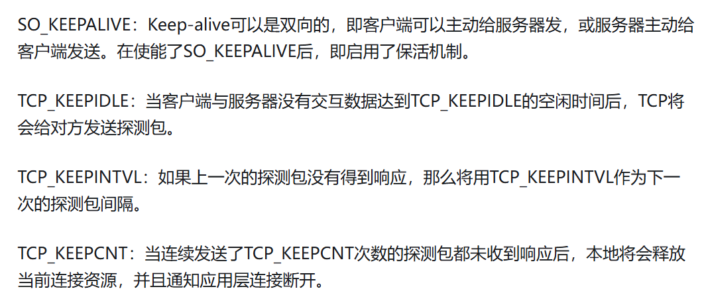

# 知识零碎
TCP/IP :  传输控制协议/网际协议
谁发起连接，谁就是客户端，谁被动监听，谁就是服务端      

## 特有名词
- NAT：网络地址转换
### 端口

# 互联网设备
## 路由器
主要功能：提供WIFI信号
连接不同的网络，如家庭局域网和互联网    
其他功能：
>路由选择
>NAT(网络地址转换)
>防火墙功能
>DHCP服务

### 定义
工作在网络层    
基于IP地址进行寻址转发

## 网关
一个功能角色，指的是连接两个不同协议或体系结构的网络时，进行协议转换的设备

## 交换机
基于MAC地址进行数据转发     

### 作用
扩展局域网

### 定义
工作在数据链路层
只关心IP地址    

## 协议

### 三次握手，四次挥手

#### 三次握手流程
| 步骤 | 发送方 | 报文类型 | 核心目的 |
|------|--------|----------|----------|
| 1    | 客户端C | SYN（同步请求） | 1. 向S发起“建立连接请求”； 2. 告诉S：“我的初始序列号是ISN_C”（后续发数据从ISN_C+1开始）。 |
| 2    | 服务器S | SYN+ACK（同步+确认） | 1. 用ACK确认：“我收到你的SYN了，也知道你的ISN是ISN_C”； 2. 用SYN告诉C：“我的初始序列号是ISN_S”（后续发数据从ISN_S+1开始）； 3. 向C发起“我的同步请求”。 |
| 3    | 客户端C | ACK（确认） | 1. 用ACK确认：“我收到你的SYN了，也知道你的ISN是ISN_S”； 2. 告诉S：“现在我能发数据，也能收你的数据，连接可以正式用了”。 |

#### 为什么三次

“三次握手”的核心目标是：**让通信双方（客户端/服务器）互相确认“对方能发、也能收”，同时同步双方的“初始序列号（ISN）”**（TCP靠序列号实现可靠传输，需先约定起始值）。少一次会导致“双向可靠性无法确认”，多一次则冗余。

第二次握手时，服务器S可以将“确认C的SYN（ACK）”和“自己的SYN请求”合并成一个“SYN+ACK”报文发送，无需拆分两次（一次ACK、一次SYN）。因此三次握手已是“最小且可靠”的次数。

为什么不能是“两次握手”？—— 避免“无效连接”浪费资源
如果只握手两次（C发SYN → S发SYN+ACK，之后不发第三次ACK），会出现致命问题：  
- 服务器S发送SYN+ACK后，无法确认“客户端C是否收到了自己的SYN”。若C因网络故障没收到，会认为“连接没建立”，但S会误以为“连接已建立”，一直为这个“无效连接”分配资源（如缓存、端口），最终导致资源浪费。  
- 三次握手的关键：**第三次ACK让S确认“C能收”**，至此双方都明确“对方既能发、也能收”，连接才具备可靠传输的基础。

- **三次握手**是“互相确认能通，约定起始序号”，少一次不可靠，多一次没必要；  
- 

#### 四次挥手流程
| 步骤 | 发送方 | 报文类型 | 核心目的 |
|------|--------|----------|----------|
| 1    | 客户端C | FIN（结束请求） | 1. 告诉S：“我这边数据全发完了，要关闭我的发送端（之后不再发数据给你）”； 2. 但C仍能接收S发来的数据（全双工特性）。 |
| 2    | 服务器S | ACK（确认） | 1. 用ACK确认：“我收到你的FIN了，知道你不发数据了”； 2. 此时S可能还有未发完的数据（如剩余的响应内容），所以暂不关闭自己的发送端，先继续发数据。 |
| 3    | 服务器S | FIN（结束请求） | 1. 等S把所有数据发完后，告诉C：“我这边数据也发完了，要关闭我的发送端（之后不再发数据给你）”； 2. 此时S仍能接收C发来的确认。 |
| 4    | 客户端C | ACK（确认） | 1. 用ACK确认：“我收到你的FIN了，知道你不发数据了”； 2. C会等待“2MSL（报文最大生存时间）”后再彻底释放连接（防止最后一个ACK丢失，S重发FIN时C能再次响应）。 |

#### 为什么四次
| 对比维度 | 三次握手（建立连接） | 四次挥手（关闭连接） |
|----------|----------------------|----------------------|
| 核心目标 | 双向确认“收发能力”+同步初始序列号 | 双向关闭“发送通道”+确保数据传完 |
| 关键差异 | 服务器可合并“ACK+SYN”（一次报文） | 服务器无法合并“ACK+FIN”（需分两次，等数据发完） |
| 次数原因 | 最小可靠次数（两次无法双向确认） | 全双工特性导致关闭动作需拆分（三次会丢数据） |

TCP是全双工（C和S可同时发数据），因此关闭连接时，双方需分别关闭“自己的发送端”，每一步都对应“关闭请求”或“确认关闭”：

为什么不能是“三次挥手”？—— 全双工下“关闭动作无法合并”
关键矛盾在“第二次和第三次挥手”：  
- 服务器S收到C的FIN后，不能立刻把“ACK（确认C的FIN）”和“自己的FIN（关闭S的发送端）”合并成一个报文——因为S可能还有未发完的数据，必须先确认C的FIN（发ACK），等数据发完后再发自己的FIN。  
- 若强行三次挥手（C发FIN → S发FIN+ACK → C发ACK），会导致S在数据没发完时就关闭发送端，造成数据丢失，违背“可靠传输”原则。  
- 四次挥手的本质：**用两次独立的“FIN+ACK”，分别处理“C关闭发送端”和“S关闭发送端”，确保双方都能传完所有数据**。

- **四次挥手**是“各自关闭发送端，确保数据发完”，因全双工无法合并步骤，必须多一次。

### 可靠传输
IP层是尽最大努力服务，不是可靠传输，所以TCP需要协议进行可靠传输

#### 停止等待协议
**实际使用要复杂的多**
- 无差错情况
- 出现差错
  - 超时重传
  - 发送方会暂时保存发送的副本，收到确认后再删除
- 确认丢失和确认迟到
  - 

#### 连续ARQ协议 
ARQ : 自动重传请求(没收到确认就不断重传分组)        

滑动窗口：
连续ARQ协议规定，发送方每次收到一个确认，就把发送窗口向前滑动一个分组的位置     
接受方一般采用累计确认的方式，在收到几个分组后，对按序到达的最后一个分组发送确认        

### 传输机制

#### 重传机制

- 超时重传
- 快速重传

- RTT 往返时间        
- RTO 超时时间

#### 滑动窗口

用来实现流量控制和提高传输效率的核心机制

- 可靠性 - 确保数据包按序抵达
- 性能 - 如果每个包都要ACK,效率低下

使用动态窗口允许发送方在无需等待每个数据包确认的ACK的情况下，连续发送多组数据

窗口可以理解为发送方当前连续发送的数据范围。        

滑动窗口大小随着接受方缓存状态和网络拥堵情况实时调整        

窗口分为两部分：
- 已发送已确认  发送方知道接收方成功接收的数据      
- 已发送未确认  发送方已发送但未收到ACK
- 可发送未发送 窗口内的数据
- 不可发送 窗口之外的数据

**流量控制**    

让发送方的发送速率不要太快，要让接收方来得及接收        

#### keep-alive 链路异常检测

### 拥塞控制算法

#### 慢开始

#### 拥塞避免

#### 快重传

#### 快恢复

    

