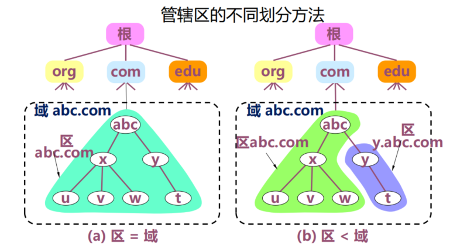
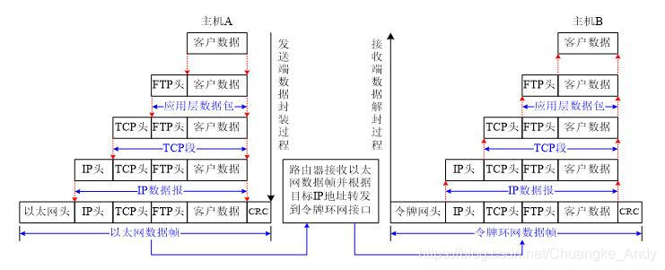

# 概述

## 名词解释

- internet 互连网，泛指由多个计算机网络互联而成的计算机网络     
- Internet 互联网，或因特网 指当前全球的由众多网络相互连接而成的特定互连网，采用TCP/IP协议族作为通信的规则


## 协议与分层

### OSI的应用体系

- 应用层
- 表示层
- 会话层
- 运输层
- 网络层
- 数据链路层 -- MAC层
- 物理层  -- PHY层

### TCP/IP的体系结构

- 应用层  各种应用层协议(DNS,HTTP,SMTP,MODEBUS)
- 运输层 （TCP或UDP）
- 网际层  IP
- 链路层 （网络接口层）

# 应用层

## DNS域名系统  
**向所有需要域名解析的应用提供服务，主要负责将可读性好的域名映射成IP地址**  

Internet采用层次结构的命名树作为主机的名字

### 域名系统层次划分

### 域名服务器
域名 -> 域名解析 -> IP地址
IP地址  -> 域名反解析 -> 域名


### 域名的解析
- 将域名放在DNS请求报文（UDP数据报，端口号为53，使用UDP是为了减少开销）
- 发给递归服务器
- 递归服务器得到查询结果后，将对应IP地址放在应答报文中返回给应用进程

域名解析有**递归查询**和**迭代查询**两种    
- 主机向递归解析器/本地域名字服务器的查询一般采用递归查询
- 本地域名字服务器向根服务器可以采用递归查询，但一般优先采用迭代查询




#### 递归查询
当收到查询请求报文的域名服务器不知被查询域的IP地址时，  
该域名服务器就以DNS客户的身份向下一步应查询的域名服务器发出查询请求，即替递归服务器继续查询     
较少使用

#### 迭代查询
当收到查询请求报文的域名服务器不知道被查询域名的IP地址时，就把自己知道的下一步应查询的域名服务器IP地址  
告诉本地域名字服务器， 由本地域名字服务器继续向该域名服务器查询，直到得到所要解析的域名的IP地址，或者查询不到所要解析的域名的IP地址 
通常使用；

## 动态主机配置协议
DHCP:动态主机配置协议
- 当主机加入IP网络，允许主机从DHCP服务器动态获取IP地址
- 可以有效理由IP地址，方便移动主机的地址获取
- 提供了即插即用联网的机制
- 配置项目：IP地址 子网掩码 默认路由器IP地址 域名服务器的IP地址

# 运输层

## 传输控制协议 TCP

面相连接的、可靠的数据传输服务，其数据传输的单位是**报文段**    


## 用户数据报协议 UDP

提供无连接的尽最大努力的数据传输服务（不保证数据传输的可靠性），其数据传输的单位是用户数据段


# 网络层/网际层

## 任务
- 通过一定的算法，在互联网中的每一个路由器上生成一个用来转发分组的转发表。  
- 每一个路由器在接收到一个分组时，依据转发表中指明的路径把分组转发到下一个路由器（这样就可以使源主机运输层所传下来的分组，能够通过合适的路由最终到达目的的主机）    

## IP

### 配套协议

#### 地址解析协议 **ARP**

已知IP地址，需要找出对应的MAC地址。 
方式:       

在主机的ARP高速缓冲（APR cache）中存放一个从IP地址到MAC地址的映射表，并且这个映射表还经常动态更新（新增或者超时删除）     

- ARP对保存在高速缓存中的每一个映射项目都设置一个生存时间

#### 网际控制报文协议 ICMP


确认IP包是否送达目标地址，通知在发送过程中IP包被废弃的具体原因，改善网络设置等

- 通知出错原因的错误消息
- 用于诊断的查询消息

#### 网际组管理协议 IGMP

### 无分类编址CIDR

斜线记法。IP地址后加上斜线"/",斜线后是网络前缀所占的位数、      
128.14.35.7/20  
表示前20位是网络前缀        

地址掩码（子网掩码）即网络中网络前缀的二进制表述。      
网络前缀是逻辑概念，指明网络位的长度；子网掩码是实际工具，用于计算网络地址。    


路由器根据目的主机所连接的网络前缀（地址块）来转发分组。


**一个网络或子网指的是拥有相同网络前缀的主机的集合。**      
用转发器或交换机连接起来的若干个局域网任为一个网络      


### IP地址与MAC地址

MAC地址:
- 固化在网卡上的ROM中
- 称为硬件地址或物理地址
- 数据链路层使用
  

IP地址：
- 虚拟/逻辑/软件地址
- 网络层及以上使用


## 相关计算

### 子网掩码
用于确认IP地址中的网络部分和主机部分        
网络地址 = IP地址 AND 子网掩码
```
IP:   11000000.10101000.00000001.01100100 (192.168.1.100)
掩码: 11111111.11111111.11111111.00000000 (255.255.255.0)
AND:  11000000.10101000.00000001.00000000 (192.168.1.0)
```
广播地址 = 网络地址 OR(NOT 子网掩码)
```
网络: 11000000.10101000.00000001.00000000 (192.168.1.0)
NOT掩码: 00000000.00000000.00000000.11111111 (0.0.0.255)
OR:  11000000.10101000.00000001.11111111 (192.168.1.255)
```
可用主机范围 = 网络地址 +1 到广播地址 - 1


    
# 数据链路层 

以太网规定 ：一组电信号构成一个数据包，叫做帧，每一帧分成三个部分，以太网首部，数据及以太网尾部

|首部|数据|尾部|
|-|-|-|
|发送者 接受者 数据类型...|数据的具体内容|CRC校验码|
|固定14字节|最短46字节 最长1500字节|固定4字节|   


帧最长64字节，最短1518字节      

每个网卡出厂后都有唯一的MAC地址     


# 补充


## 长连接和短连接


# 总结


##  数据称呼
传输层叫做 数据段 segment       
网络层叫做 数据报 datagram
链路层叫做 数据帧 frame

