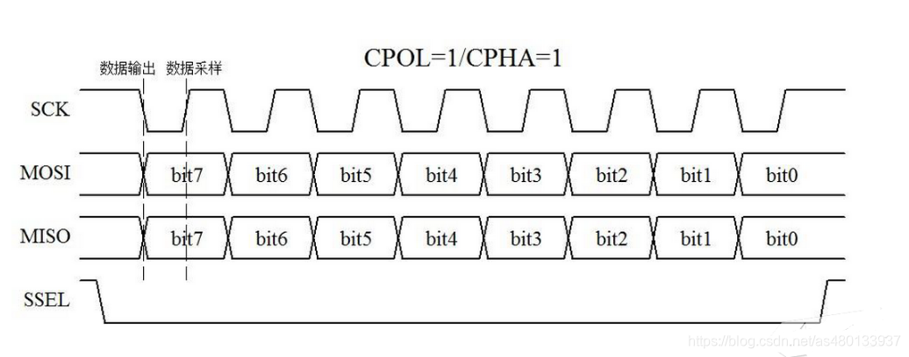
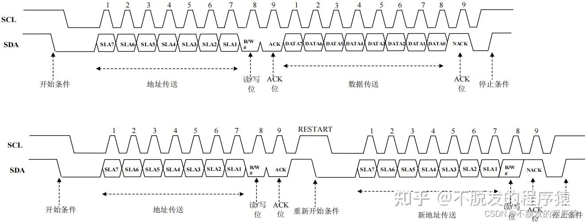

# 通信
## 简述SPI通信流程

### 硬件/配置
- SCLK 串行时钟（时钟由主机产生）
- MOSI 主机数据输出，从机数据输入
- MISO 主机数据输入，从机数据输出
- CS/SS 从设备片选（主设备控制，低电平有效）

#### 配置
CPOL: 时钟极性，01表示高空闲时候SCK高低电平     
CPHA: 时钟相位，01表示第1还是第2个采样边沿

      
       

### SPI时序

1. 主设备发起通信，SS选中
2. 时钟同步
   - 主设备生成时钟信号SCLK,时钟极性和相位决定采样时刻
3. 全双工通信
   - 以字节为单位传输
4. 通信结束，SS/CS线拉高，释放从设备        

        

## IIC

### 硬件

SCL 时钟线  
SDA 数据线  

均设置为开漏输出模式    
分别添加一个上拉电阻，阻值一般为4.7K    

#### 上拉电阻好处

- 总线不会同时有高电平和低电平的输出状态
- 避免了引脚模式的频繁切换
- 实现线与
## IIC时序

### 起始条件
SCL高电平期间，SDA从高电平切换到低电平      

在上拉电阻作用下，两条总线都位于高电平，当主机开始收发时，先SDA产生一个下降沿，后来再拉低SCL，一方面占用总线，另外一方面方便拼接    

### 字节发送
SCL低电平时，主机依次把数据位放在SDA上(高位先行)，然后释放SCL(SCL被拉高)，从机在SCL高电平读取数据位     
SCL高电平时，SDA不允许有数据变化        

从机需要尽快读取，因为不知道时钟时间，所以一般在SCL上升沿读取       

### 字节接受
依旧高位先行，从机发数据，主机度数据，不过是SCL还是主机控制，SDA被主机释放，由从机控制      

### 发送应答
主机在接受完一个字节后，在下一个时钟发送一位数据，0表示应答，1表示非应答  （主机拉高SDA电平的瞬间被从机拉低，表示应答）      
### 接收应答
主机在发送完一个字节后，在下一位时钟接受一位数据，0表示应答，1表示非应答   （主机拉高SDA电平的瞬间被从机拉低，表示应答） 

### 终止条件
SCL高电平期间，SDA从低电平切换到高电平      

先拉高SCL,在拉高SDA     

### 完整时序
每个从设备有唯一一个7位地址，最高位固定为0剩下7位由设备厂商决定     

读写位：最低位LSB控制，0表示写入，1表示读取     表示从设备读还是从设备写        

所以设备的7位地址左移一位，再附加读写位，可以就是8位地址字节        

指定地址写  

- SDA先拉低电平，SCL接着拉低电平表示开始传输数据
- 先发送7位从机地址，再发送读写位（写）
- 应答位主机释放后，从机依据拉低
- 应答位为0后，主机继续发送数据（寄存器地址）
- 从机再次应答

指定地址读  （前面已经写了寄存器地址）
- 重复起始条件，主机重新获得总线控制权限
- 发送从机地址和读写位
- 从机应答
- 读取数据
- 主机应答
- 读取数据
- 主机非应答
- 停止条件

### 时序图
    

## 简述UART通信流程

### 硬件
TX：发送

RX：接受

默认是空闲高电平        

低位在前        

一般接线交叉        

RS232是单端输入输出 
RS422/485是差分输入输出 

### 协议
- 起始位   
  - 一位低电平   
- 数据位   
  - 5到8位，一般是8位   
- 奇偶校验位
  - 数据位加上这一位后使得1的位数为偶数   偶校验
  - 数据位加上这一位后使得1的位数为基数    奇校验1      
- 停止位      
  - 高电平（大于1位）

## 低位高位理解
### 高位在前 MSB
左边第一位被先发送      
### 低位在前 LSB
右边第一位被先发送  

### 大端模式
高字节放在低地址
符合人类阅读习惯        
符号位的判定固定为第一个字节，容易判断正负      

### 小端模式
低字节放在低地址
强制转换数据不用调整字节序        
X86,ARM使用  
STM32是小端模式   

### 时序图从左往右推进，时间轴从左往右推进

## 补充

### 波特率，比特率

#### 波特率

Baud

单位：波特（Baud）  
定义：单位时间内信号变化的次数      

表示通信信道中调制状态的变化频率    

*一次变化可能携带多个比特，取决于调制方式*      

#### 比特率

bps bit/s   
单位：比特每秒      
定义：单位时间内传输的二进制比特数量        

物理意义：表示通信系统的实际信息传输速率（有效数据吞吐量）      

# 软件

## 内存布局

| 地址方向        | 内存区域                     | 描述                                                                 |
|-----------------|------------------------------|----------------------------------------------------------------------|
| **高地址** (0x7FFFFFFFFFFFFFFF) | **内核空间**                 | ← 操作系统内核（用户程序不可访问）                                   |
| ↓               | **栈 (Stack)**               | ← **向下增长** - 函数调用栈帧 - 局部变量 - 函数参数 - 返回地址 |
| ↓               | **内存映射段**               | - 共享库 (libc.so 等) - 动态加载模块 - mmap 分配的内存         |
| ↓               | **堆 (Heap)**                | ← **向上增长** - 动态分配的内存 (malloc, new 等)                  |
| ↓               | **BSS 段** (未初始化数据) | - 未初始化的全局/静态变量 （初始化为零）                          |
| ↓               | **数据段** (Data Segment) | - 已初始化的全局/静态变量 - 常量（部分）                          |
| ↓               | **只读数据段** (RODATA)   | - 字符串常量 - const 全局常量                                     |
| **低地址** (0x0000000000400000) | **代码段** (Text Segment) | ← 程序入口点 - 可执行机器指令                                

### 代码段(Text Segment)
- 位置: 最低可执行地址附近
- 内容:
    编译后的机器指令
    函数实现代码
- 权限: 只读可执行 (r-x)
- 特性:
    程序启动时从可执行文件加载
    多个进程可共享同一代码段副本
    大小固定，运行时不会改变
- 示例地址范围: 0x400000-0x401000
### 只读数据段(RODATA)
- 位置: 紧邻代码段上方
- 内容:
    字符串常量 ("Hello World")
    const全局常量
    编译时确定的常量表
- 权限: 只读 (r--)
- 特性:
    任何写入尝试会导致段错误
    可被多个进程共享
### 数据段(Data Segment)
- 位置: RODATA段上方
- 内容:
    已初始化的全局变量
    已初始化的静态变量
- 权限: 读写 (rw-)
- 特性:
    程序启动时从可执行文件初始化
    生命周期与程序相同
### BSS段(Block Started by Symbol)
- 位置: 数据段上方
- 内容:
    未初始化的全局变量
    未初始化的静态变量
- 权限: 读写 (rw-)
- 特性:
    在磁盘上的可执行文件中不占空间
    加载时由系统初始化为零
    名称来源于旧式汇编指令"Block Started by Symbol"
### 堆(Heap)
- 内容:
    动态分配的内存(malloc, calloc, new等)
- 权限: 读写 (rw-)
- 特性:
    向高地址方向增长
    大小受系统资源限制
    需要手动管理（分配/释放）
    分配接口：
        brk/sbrk：调整program break位置
        mmap：大块内存分配
### 内存映射区(Memory Mapping Segment)
- 内容:
    动态加载的共享库(libc.so, libm.so等)
    mmap创建的文件映射
    匿名映射内存
- 权限: 多样(通常r-x或rw-)
- 特性:
    可按需加载库函数
    支持高效的文件I/O
    共享库可被多个进程使用
### 栈(Stack)
- 位置: 用户空间最高区域下方
- 内容:
    函数调用栈帧
    局部变量
    函数参数
    返回地址
- 权限: 读写 (rw-)
- 特性:
    向低地址方向增长
    自动管理（函数进入/退出时自动调整）
    大小有限（默认8MB，可通过ulimit调整）
### 内核空间
- 位置: 最高地址区域
- 内容:
    操作系统内核代码
    内核数据结构
    设备驱动
- 权限: 用户程序不可访问
- 特性:
    所有进程共享同一内核空间
    用户程序通过系统调用接口访问
### size_t
表示对象大小或者数组索引的无符号整数类型        

可以避免溢出        

在32位系统中为4字节         
在64位系统中为8字节     

适用size_t可以：
便于移植        
为无符号数  
与内存模型匹配      

### 字节-字-比特

|单位|符号|大小|
|:--:|:--:|:--:|
|字节|B|8bit|
|字||CPU架构决定|
|比特|b|1bit|

字长由CPU架构决定，如32位CPU字长 = 4字节    

## 状态机设计方法

## 什么是面向对象的编程，怎么设计

### 空指针的使用

## 进程和线程

## 同步，互斥，原子操作

## 缓存命中率
### 解释
指的是CPU缓冲命中率     

cache:CPU缓存       
CPU缓存是位于CPU内部的或靠近CPU的告诉静态存储器SRAM 

### cache结构
- 缓存行： cache管理数据的基本单位，常见128字节。   CPU访问内存时，即是只读一个字节，也会把该字节所在的整个缓存行从内存加载到cache中
- 物理地址：cache看到的是经过MMU转换后的物理地址（RAM上的实际位置），虚拟地址对于cache是透明的
- 映射目标：
  - 直接映射
  - 全相连映射
  - **组相连映射**
  

多级缓存：      
现代经典缓存为3级缓存       
L1 L2 L3三级缓存，L1离CPU最近    

#### 多级缓冲工作机制
CPU访问数据的时候，逐级查找，遍历L1,L2,L3,找到即返回，未加载则去主内存（DRAM）中加载数据，并且把数据放在cache中     

### 优化
链表在内存中分散加载，数组或内存紧凑的数据结构通常更好  

# BASE MCU
## 介绍一下ADC/DAC

## 介绍一下DMA
- 正常模式 传输后通道自动停止
- 循环模式 传输完成后自动重启
- 内存到内存模式 M2M使能后，DMA可由软件触发，在内存间传输数据，无需外设请求
### DMA描述符
优势：  
- 零拷贝
- 极高的效率，设置一次描述符数组就可以处理大量数据的传输
- 减少中断

工作流
- 初始化   分配空间作为描述符数组，并将每个描述符的目标地址设置为预备接受数据包的内存缓冲区
- 执行DMA
- 执行完可以触发中断，然后移动指针到数组下一个描述符
- 

## 如何进行功耗控制

## 什么是RTOS,常见内核有哪些调度
real time operatorion system实时操作系统

## OTA的实现与原理

# BASE LINUX

## 什么是虚拟内存

# 外设

## 使用到的一些存储装置
RAM
- SRAM
  - 一般用来作为cache
  - 读取快
  - 容量小
  - 成本高
- DRAM
  - 主内存
  - 读取慢
  - 容量大
  - 成本高

## 读写速度

1. 寄存器
2. cache(缓存)
   1. L1
   2. L2
   3. L3
3. RAM   闪存
   1. 一般是DRAM
4. Flash/ROM